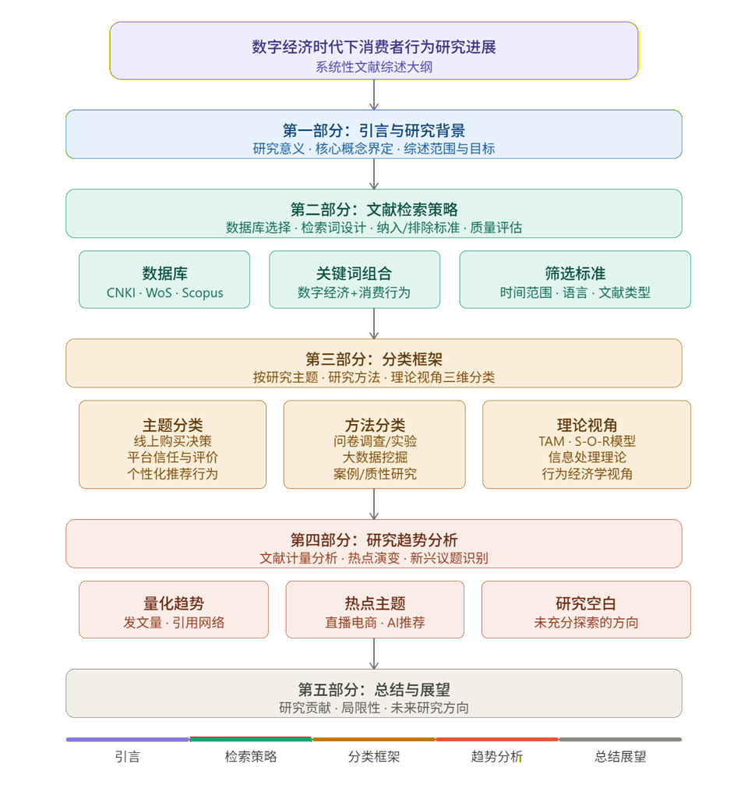
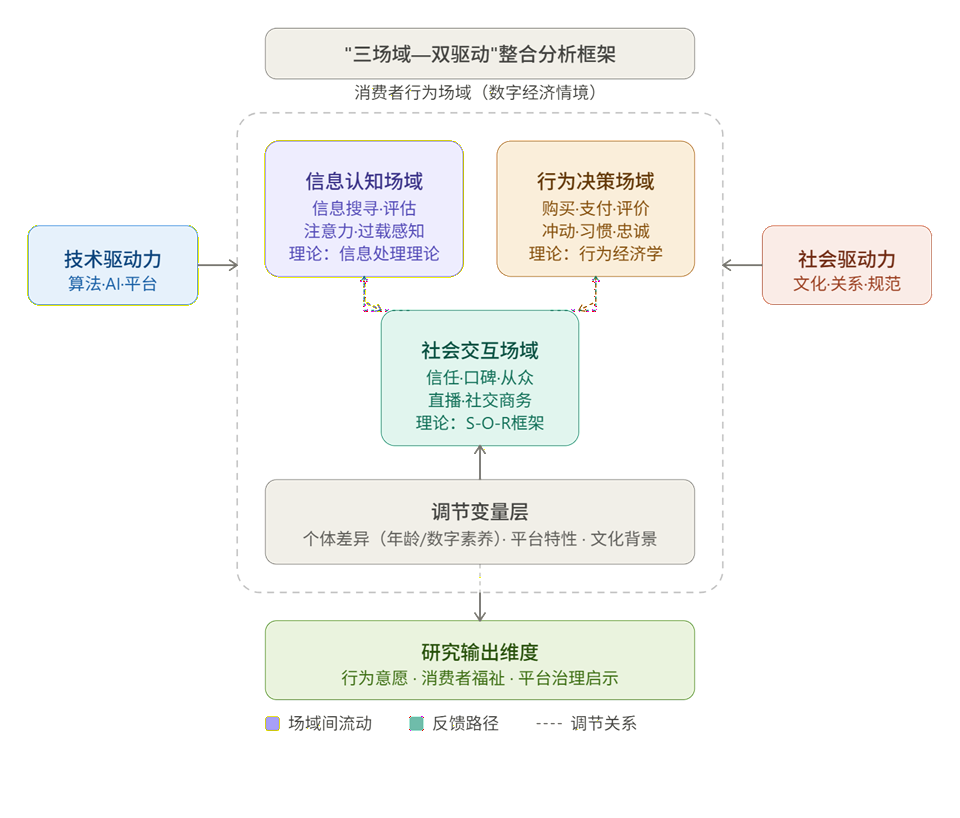

#### 提示词

##### 首轮

你是一个帮助大学生学习的学习助手。目前该大学生学习时遇到了如下问题，请你帮助该大学生解决问题并顺利学习。

> 主题：数字经济时代下消费者行为研究进展
> 要求：设计系统性文献综述的大纲，需包含文献检索策略、分类框架、研究趋势分析

##### 后续追问

该大学生想在理论创新上拿高分，能构建更高端的分析框架，让论文提升档次吗？

#### GPT-5.2

##### 首轮

```markdown
下面给你一个**高质量、可直接用于论文写作的系统性文献综述（SLR）大纲**，结构符合学术规范，同时在“方法+框架+趋势”三个维度上做了提升，适合冲高分。

---

# 一、引言（Introduction）

1. 研究背景

   * 数字经济（大数据、AI、平台经济）对消费者行为的重塑
   * 消费从“线下理性决策”向“数据驱动+情境化决策”转变
2. 研究意义

   * 理论意义：拓展消费者行为理论在数字情境下的适用性
   * 实践意义：为数字营销与平台治理提供依据
3. 研究问题（建议明确3个）

   * RQ1：数字经济背景下消费者行为研究的主要主题是什么？
   * RQ2：现有研究采用了哪些理论与方法？
   * RQ3：未来研究趋势与空白在哪里？

---

# 二、文献检索策略（Systematic Search Strategy）

## 2.1 数据库选择

* 核心数据库：Web of Science、Scopus、Google Scholar
* 辅助数据库：ScienceDirect、Springer、CNKI（如写中文论文）

👉 多数据库是高分关键（体现系统性）

## 2.2 检索关键词设计

采用“主题+扩展词+布尔逻辑”：

("digital economy" OR "digital transformation") 
AND ("consumer behavior" OR "consumer decision making") 
AND ("online consumption" OR "digital consumption")

可扩展：

* “big data”“AI recommendation”“platform economy”
* “privacy concern”“trust”“personalization”

## 2.3 纳入与排除标准（PRISMA思路）

纳入标准：

* SSCI/SCI或高质量期刊论文
* 时间范围：建议2015–2025（数字经济快速发展期）
* 与消费者行为直接相关

排除标准：

* 非学术文献（新闻、博客）
* 仅技术研究（无行为分析）
* 重复文献

## 2.4 文献筛选流程

建议写成流程：

1. 初筛（标题+摘要）
2. 复筛（全文阅读）
3. 最终纳入

👉 可画PRISMA流程图（加分）

## 2.5 文献分析方法

* 内容分析（Content Analysis）
* 文献计量（Bibliometric Analysis，如VOSviewer）
  👉 文献计量可识别关键词与研究热点 ([Putra Publisher][1])

---

# 三、文献分类框架（Classification Framework）

这里是**论文档次提升的核心**，建议采用“多维整合框架”（比普通分类更高级）

## 3.1 三维整合分析框架（推荐创新点⭐）

### （1）技术维度（Technology-driven）

* 大数据与算法推荐
* AI与智能决策
* 平台与数字生态

👉 数字技术通过数据分析深刻影响消费者决策 ([researchgate.net][2])

---

### （2）心理机制维度（Psychological Mechanism）

* 信任（Trust）
* 隐私感知（Privacy concern）
* 感知价值（Perceived value）
* 从众/社交影响

---

### （3）行为结果维度（Behavioral Outcomes）

* 购买决策
* 品牌忠诚
* 在线互动（评论、分享）
* 多渠道消费（Omnichannel）

---

👉 这个“三维框架”= 高分关键（比单一分类更高级）

---

## 3.2 主题聚类（基于文献计量）

根据已有研究，可归纳四大研究主题：

1. 数字平台与消费者互动
2. 技术驱动的行为分析（AI/数据）
3. 数字营销与用户参与
4. 可持续与伦理消费

（文献中已验证存在多个主题聚类） ([Putra Publisher][1])

---

## 3.3 方法分类

* 定量研究（问卷、实验）——主流
* 定性研究（访谈、案例）
* 混合方法

👉 当前研究以实证研究为主，理论研究较少 ([开放获取期刊目录][3])

---

# 四、研究进展分析（Research Progress）

## 4.1 阶段划分（建议写成演化路径）

### （1）初期阶段（~2015）

* 关注电子商务与在线购物行为
* 以“技术接受模型（TAM）”为主

### （2）发展阶段（2015–2020）

* 引入大数据、社交媒体
* 强调用户体验与个性化

### （3）深化阶段（2020–至今）

* AI推荐、算法决策
* 隐私与伦理问题
* 元宇宙、虚拟消费

---

## 4.2 核心研究结论总结

1. 消费者更加“数据驱动”
2. 个性化推荐显著影响决策
3. 社交评价（评论）成为关键影响因素
4. 信任与隐私成为核心矛盾

👉 数字经济既带来便利，也带来隐私与伦理问题 ([bcpublication.org][4])

---

# 五、研究趋势与前沿（Research Trends）

## 5.1 技术融合趋势

* AI + 消费行为预测
* AR/VR购物体验
* 智能推荐系统

---

## 5.2 消费模式变化

* 从“渠道驱动” → “平台生态驱动”
* 从“理性决策” → “算法+情绪驱动”

---

## 5.3 新兴研究热点

1. 隐私与数据安全
2. 数字信任机制
3. 可持续消费（绿色+数字）
4. 元宇宙与虚拟消费

---

## 5.4 研究方法趋势

* 文献计量 + 机器学习
* 多源数据（行为数据+实验数据）

---

# 六、研究不足与未来方向（Research Gaps）

（这一部分是老师最看重的）

## 6.1 理论层面

* 传统消费者行为理论解释力不足
* 缺乏统一理论框架

## 6.2 方法层面

* 过度依赖问卷数据
* 缺少真实行为数据

## 6.3 研究内容

* 对AI决策机制研究不足
* 对发展中国家/差异群体关注不足

---

## 6.4 未来研究方向（建议写亮点⭐）

👉 可提出一个“人机协同消费行为模型”：

* 人（心理+认知）
* 机器（算法+推荐）
* 环境（平台+制度）

---

# 七、结论（Conclusion）

* 总结数字经济如何重塑消费者行为
* 强调“技术—心理—行为”整合分析的重要性
* 提出未来跨学科研究方向

---

# ✅ 最后给你一个“高分技巧总结”

如果你想拿高分，重点做到：

1. 用 **PRISMA + 文献计量**（方法高级）
2. 构建 **三维分析框架（技术-心理-行为）⭐**
3. 写清 **演化阶段 + 研究趋势**
4. 提出 **原创模型（哪怕是概念模型）⭐**

---

如果你愿意，我可以帮你把这个大纲**直接扩写成一篇完整综述论文（含参考文献格式）**，甚至帮你设计“理论创新模型图”。

[1]: https://www.putrapublisher.org/ojs/index.php/jamis/article/view/1009?utm_source=chatgpt.com "Consumer Behavior in Digital Era : Bibliometric Analysis | International Journal of Management and Business Economics"
[2]: https://www.researchgate.net/publication/387445767_The_Impact_of_Digital_Economy_on_Consumer_Behavior?utm_source=chatgpt.com "(PDF) The Impact of Digital Economy on Consumer Behavior"
[3]: https://doaj.org/article/49d46a50e76c41e08f1435da9dd59d1e?utm_source=chatgpt.com "DIGITAL CONSUMER BEHAVIOR: A SYSTEMATIC LITERATURE REVIEW – DOAJ"
[4]: https://bcpublication.org/index.php/BM/article/view/1432?utm_source=chatgpt.com "Review of the Influence of Marketing Innovation on Consumer Behavior in Digital Economy | BCP Business & Management"

```

##### 后续回答

```markdown
可以，而且这是你拿高分的关键突破点。普通综述只做“分类+总结”，高分论文一定要**提出一个“可解释+可拓展+有理论整合能力”的原创框架**。

我给你设计一个**可以直接写进论文、具有创新性的高阶分析框架**👇

---

# ⭐ 一、提出原创框架：

# **“H-T-B-E数字消费行为整合模型”**

（Human–Technology–Behavior–Environment）

👉 这个模型的核心优势：

* 融合经典消费者行为理论 + 数字经济特征
* 从“单向影响”升级为“动态系统”
* 可以解释算法时代的新现象（推荐、成瘾、信息茧房）

---

# 二、框架结构（论文核心图）

## 1️⃣ Human（消费者内在机制）

传统理论升级版：

* 认知（Cognition）：信息处理、有限理性
* 情感（Emotion）：冲动消费、愉悦感
* 动机（Motivation）：功利 vs 享乐
* 个体差异：数字素养、风险偏好

👉 对应理论基础：

* S-O-R模型（Stimulus-Organism-Response）
* 行为经济学（非理性决策）

---

## 2️⃣ Technology（技术赋能层）⭐创新重点

这是你区别普通论文的关键：

* 算法推荐（Recommendation System）
* 大数据画像（User Profiling）
* AI决策干预（Algorithmic Nudging）
* 平台机制（ranking、流量分配）

👉 **创新点**：
传统研究把技术当“工具”，
你这里把它当“行为塑造者（Behavior Shaper）”

---

## 3️⃣ Behavior（行为表现层）

* 购买决策
* 信息搜索路径
* 冲动消费
* 用户生成内容（UGC）
* 平台依赖/沉迷

👉 可区分：

* 理性行为 vs 算法诱导行为

---

## 4️⃣ Environment（数字环境层）

* 平台生态（如电商平台）
* 社交网络（评价、KOL）
* 制度环境（隐私政策、监管）

👉 环境不再是“背景”，而是：
**“算法+社交+制度的复合场域”**

---

# 三、核心机制（高分关键‼️）

## ⭐ 1. 双向作用机制（区别传统模型）

传统逻辑：

> 技术 → 行为

你的升级：

> 技术 ⇄ 人（认知） ⇄ 行为 ⇄ 环境

👉 举例：

* 用户点击 → 算法学习 → 推荐强化 → 行为被塑造

👉 这叫：
**“反馈闭环（Feedback Loop）”**

---

## ⭐ 2. 算法中介机制（Algorithm Mediation）

提出一个中介路径：

> 技术 →（算法推荐）→ 心理感知 → 行为

例如：

* 个性化推荐 → 提高感知相关性 → 增加购买概率

---

## ⭐ 3. 数字情境下的“有限理性强化”

提出观点（可写进论文创新点）：

👉 数字经济不是降低不理性，而是：

> **“通过算法放大非理性行为”**

例如：

* 冲动消费
* 信息茧房
* 过度依赖推荐

---

# 四、模型可视化（建议你论文画图）

可以画成四层结构：

Environment（平台/制度）
        ↓↑
Technology（算法/数据）
        ↓↑
Human（认知/情感）
        ↓
Behavior（消费行为）

再加一条：
👉 Behavior → Technology（数据反馈）

---

# 五、如何写成“理论创新”（老师最爱）

你可以这样表述（直接可用）：

### ✅ 理论贡献1

构建了一个整合“技术—心理—行为—环境”的动态分析框架，突破传统消费者行为研究的静态视角。

### ✅ 理论贡献2

引入“算法中介机制”，揭示数字技术如何通过影响消费者认知与情感间接塑造行为。

### ✅ 理论贡献3

提出“反馈闭环机制”，解释平台经济中消费者行为与算法之间的共演化过程。

---

# 六、再帮你升级一层（冲顶级分⭐）

如果你想更“高级”，可以再加一个概念：

## 👉 “算法—消费者共演化（Co-evolution）”

核心观点：

> 消费者不是被动接受，而是在不断“训练算法”

例如：

* 你点什么 → 系统学什么 → 世界变成你喜欢的样子

👉 这可以作为：
**论文最亮眼的创新点**

---

# 七、一句话总结你的创新框架

你可以在摘要中写：

> 本文构建了一个“Human–Technology–Behavior–Environment（H-T-B-E）”整合框架，从动态反馈与算法中介视角，系统解释数字经济时代消费者行为的形成机制与演化路径。

---

# 🎯 如果你还想再冲高分

我可以帮你进一步做三件事：

1. 画一张**SCI风格的理论模型图（可直接放论文）**
2. 帮你把这个框架**扩写成“理论基础+假设”部分**
3. 给你配**10–15篇高质量参考文献（可直接引用）**

直接说你要哪一步，我帮你做成“可交作业版本”。

```

##### 评价

1. **逻辑严密性**：  
   AI的回答整体逻辑清晰，结构合理，涵盖了系统性文献综述所需的关键部分（如引言、文献检索策略、分类框架、研究趋势分析等）。然而，在第二轮回答中提出的“H-T-B-E”模型虽然创新，但某些假设和机制（如“算法—消费者共演化”）缺乏明确的理论支持或实证依据，可能需要进一步验证。

2. **提示词执行力**：  
   AI在两轮回答中均很好地完成了用户的要求。第一轮回答提供了高质量、结构化的文献综述大纲；第二轮回答针对用户的深层需求（理论创新），提出了一个具有独创性的分析框架，并详细阐述了其优势和应用，充分体现了对用户意图的理解。

3. **内容深度**：  
   AI的回答不仅总结了现有研究，还展现了深刻的见解。特别是在构建“H-T-B-E”模型时，提出了多个新颖的理论视角（如算法中介机制、反馈闭环），这些创新点能够显著提升论文的学术价值和影响力。然而，在某些部分（如研究不足与未来方向）的论述略显笼统，缺乏具体的建议或案例支持。

AI的回答在逻辑性、执行力和深度上表现优秀，尤其在第二轮回答中展现了高度的创新性和理论建构能力。不过，部分假设和机制仍需进一步验证和完善以增强说服力。总体而言，这是一个高质量且值得参考的回答。

#### Claude Sonnet 4.6

##### 首轮

```markdown
我来为你设计一份系统性文献综述的大纲。以下是为你设计的系统性文献综述大纲框架图，帮助你直观理解整体结构：



下面是完整的文字版大纲，供你直接用于论文写作：

---

## 系统性文献综述大纲：数字经济时代下消费者行为研究进展

---

### 第一部分：引言与研究背景

**1.1 研究背景与意义**
阐明数字经济快速发展对消费者行为的深刻影响，说明对该领域进行系统性梳理的学术价值与现实意义。

**1.2 核心概念界定**
明确界定"数字经济"（平台经济、电子商务、数字支付等）与"消费者行为"（购买决策、信息搜寻、品牌态度等）的研究边界。

**1.3 综述目标与结构**
说明本综述旨在梳理现有研究脉络、识别研究空白，并预告全文框架。

---

### 第二部分：文献检索策略（PRISMA规范）

**2.1 检索数据库**
中文库（CNKI、万方）+ 英文库（Web of Science、Scopus、PsycINFO），覆盖经管类与心理学文献。

**2.2 检索词设计**
采用主题词与自由词结合的方式，例如：
- 中文："数字经济 AND 消费行为"；"电商平台 AND 购买意愿"
- 英文："digital economy AND consumer behavior"；"e-commerce AND purchase intention"

**2.3 纳入与排除标准**

| 维度 | 纳入标准 | 排除标准 |
|---|---|---|
| 时间范围 | 2010年至今（数字经济兴起阶段） | 2010年以前的研究 |
| 语言 | 中文、英文 | 其他语言 |
| 文献类型 | 实证研究、综述、理论论文 | 会议摘要、新闻评论 |
| 研究对象 | 数字化情境下的消费者行为 | 与数字经济无直接关联 |

**2.4 文献质量评估**
采用CRoNoS量表或CASP工具对纳入文献进行质量评分，确保综述可靠性。绘制PRISMA流程图呈现筛选过程。

---

### 第三部分：文献分类框架（核心部分）

**3.1 按研究主题分类**

**3.1.1 线上购买决策行为**
涵盖信息搜寻、比价行为、冲动性购买，重点梳理影响消费者点击、下单的关键因素。

**3.1.2 平台信任与口碑效应**
包括在线评论、用户生成内容（UGC）、网红/KOL对购买意愿的影响机制研究。

**3.1.3 个性化推荐与算法影响**
梳理推荐算法、信息茧房、隐私顾虑对消费者选择的作用，关注"过度推荐"问题。

**3.1.4 直播电商与社交商务**
聚焦互动性、临场感、限时优惠等直播场景特有变量对冲动购买的研究。

**3.1.5 数字支付与消费习惯变迁**
包括移动支付、先买后付（BNPL）对消费频率、消费金额的影响研究。

**3.2 按研究方法分类**

| 方法类型 | 代表手段 | 适用议题 |
|---|---|---|
| 问卷调查法 | 结构方程模型（SEM） | 行为意愿、态度量表 |
| 实验法 | 眼动实验、A/B测试 | 界面设计、广告效果 |
| 大数据挖掘 | 用户行为日志、文本挖掘 | 购买路径、情感分析 |
| 质性研究 | 深度访谈、民族志 | 文化差异、消费动机 |

**3.3 按理论视角分类**

主要运用的理论框架包括：技术接受模型（TAM）、刺激-机体-反应框架（S-O-R）、信息处理理论、计划行为理论（TPB）以及行为经济学中的损失厌恶、锚定效应等。梳理各理论在数字情境下的拓展与修正。

---

### 第四部分：研究趋势分析

**4.1 文献计量分析**
利用CiteSpace或VOSviewer对文献发文量、高被引文章、关键词共现网络进行可视化分析，呈现领域发展轨迹（建议附共现图谱）。

**4.2 研究热点的时间演变**

- **2010—2015年**：关注基础电商购买行为，以TAM为主导框架
- **2016—2019年**：移动互联网普及，社交媒体影响与口碑研究兴起
- **2020—至今**：直播电商、AI推荐、疫情冲击下的行为变化成为新热点

**4.3 新兴议题识别**

当前研究中值得关注的前沿方向：大语言模型（LLM）对消费决策的影响、绿色消费在数字平台的实现路径、以及跨文化消费行为比较研究的不足。

**4.4 现有研究的局限与空白**
指出领域内方法论的局限（如问卷测量偏差、数据代表性问题）以及理论整合不足的问题。

---

### 第五部分：总结与展望

**5.1 主要研究贡献**
归纳本综述在理论整合、方法梳理与趋势识别方面的学术价值。

**5.2 局限性**
说明检索数据库的覆盖局限、语言偏差及时间截止点问题。

**5.3 未来研究方向建议**
提出三到五个具体可操作的未来研究议题，如"AI推荐透明度对消费者信任的影响"或"数字平台道德设计与消费者福祉"等。

---

**写作建议：** 第三部分（分类框架）是综述的核心，建议占全文篇幅的50%以上。第二部分的PRISMA流程图是系统性综述区别于普通文献综述的关键规范，务必认真设计。如需进一步细化某一部分，随时告诉我！
```

##### 后续回答

```markdown
好问题！要在理论创新上拿高分，关键是**从"综述已有研究"升级到"提出自己的分析框架"**。我来帮你构建一个有原创性的高端框架。这里有两个核心思路帮你拿高分：一是做理论整合（把现有经典理论融合成一个新框架），二是提出自己的分析维度。我为你设计了一个原创的"三场域-双驱动"整合分析框架，请看下面的框架图：



这就是你论文的核心创新点——一个整合了多个经典理论的原创框架。下面详细解释怎么用它拿高分。

---

## 框架解读：为什么这个框架有"档次"

### 核心创新逻辑：整合 ≠ 拼凑

普通综述只是"A研究发现X，B研究发现Y"地排列文献。高分综述的做法是：**提出一个新的组织原则，让所有文献都能归位其中**。这个框架的创新在于三点：

**第一，"场域"概念的引入**
借鉴布迪厄（Bourdieu）的场域理论，将数字消费行为拆解为三个相互作用的运作空间。这比单纯的"影响因素"视角更有理论深度，也更容易在综述中展开层次感。

**第二，双驱动力的对称性设计**
现有研究要么偏重技术面（TAM、算法推荐），要么偏重社会面（社群影响、文化规范），两者鲜有整合。你的框架明确地将"技术驱动力"与"社会驱动力"并置为外生力量，既能容纳现有研究，又提出了一个新的分析张力。

**第三，加入调节变量层**
这是很多综述忽略的一层。数字素养差异、平台设计差异、文化背景差异都会改变三个场域的运作规律。这一层让你的框架可以解释"为什么同一个机制在不同情境下结论不一致"，这是文献综述中经常遇到但难以处理的问题。

---

### 三大场域如何对应现有理论

| 场域 | 核心议题 | 对接理论 | 代表文献方向 |
|---|---|---|---|
| 信息认知场域 | 消费者如何处理数字信息 | 信息处理理论、注意力经济 | 信息过载、推荐系统效果 |
| 社会交互场域 | 消费者如何受社会信号影响 | S-O-R框架、社会认知理论 | 直播电商、KOL影响、在线评论 |
| 行为决策场域 | 最终如何形成购买行为 | 行为经济学、TPB计划行为 | 冲动购买、忠诚度、支付行为 |

### 如何在论文中体现"理论创新"

在综述的第三部分（分类框架）开头，用一段话明确声明你的框架：

> 本文在梳理现有研究的基础上，提出"三场域—双驱动"整合分析框架。该框架将数字情境下的消费者行为视为三个相互嵌套的场域（信息认知、社会交互与行为决策），并将技术驱动力与社会驱动力视为同时作用于三场域的外生力量，同时引入调节变量层以解释跨情境的研究结论分歧。

这样的框架声明有三个好处：它给导师一个清晰的"记忆锚点"；它让你的分类框架有理论依据而非随意分组；它为研究趋势分析和研究空白识别奠定基础，因为你可以说"现有研究在社会交互场域集中，而信息认知场域与行为决策场域之间的跨场域机制研究严重不足"。

如果你想，我可以继续帮你细化某个场域的子框架，或者帮你起草框架声明段落的具体文字。
```

##### 评价

1. **逻辑严密性**：  
   AI的回答整体逻辑较为严谨，但在部分环节存在事实性错误或推导漏洞。例如：
   - 在“三场域-双驱动”框架中提到“场域”概念时，虽然借鉴了布迪厄的理论，但并未明确说明如何具体应用于消费者行为研究，导致该框架的实际适用性存疑。
   - 部分理论与实际应用之间的逻辑连接不够紧密。例如，“调节变量层”的引入在现有研究中的验证性分析不足，缺乏具体的文献支持。

2. **提示词执行力**：  
   AI较好地完成了用户的要求，提出了一个具有创新性的分析框架，并尝试将现有研究纳入其中。然而：
   - 构建的“三场域-双驱动”框架虽然具有一定的理论整合性，但在实际操作中可能难以全面覆盖所有相关研究领域（如新兴议题中的绿色消费行为）。
   - 对“理论创新”的解读存在偏差，更多是通过重新组合现有概念而非提出全新理论来实现“创新”，这与用户期望的“理论创新”可能存在差距。

3. **内容深度**：  
   回答在一定程度上体现了对文献综述方法和理论框架设计的理解，但深度有限：
   - 对“三场域-双驱动”框架的解释较为表面，缺乏深入的理论分析或案例支持。
   - 在研究趋势分析部分，虽然指出了新兴议题，但未能结合具体文献或数据进行验证性探讨。

**总结**：  
AI的回答在结构和方法上具有一定的参考价值，但在理论创新性和逻辑严谨性方面仍有提升空间。建议进一步深化对理论框架的论证，并结合更多实证研究来支持其创新性。

#### Gemini 3.1 Pro

##### 首轮

```markdown
你好！很高兴能以学习助手的身份为你提供支持。

撰写一篇关于“数字经济时代下消费者行为”的系统性文献综述（Systematic Literature Review, SLR）是一项严谨的学术任务。为了帮助你构建一份高质量的大纲，我将按照学术规范（参考 PRISMA 标准），为你设计一个逻辑严密、结构清晰的框架。

---

# 数字经济时代下消费者行为研究进展：系统性文献综述大纲

## 一、 引言 (Introduction)
* **研究背景**：描述数字经济（如大数据、人工智能、平台经济）对传统消费模式的颠覆。
* **研究意义**：阐述为何在当前时点梳理该领域研究至关重要（例如：从单纯的电商购买转向全渠道、社交化、智能化的复杂行为）。
* **研究问题**：本文旨在解决哪些核心问题？（如：主要驱动因素、演进路径、未来挑战）。

---

## 二、 文献检索策略 (Search Strategy)
> 这是系统性综述的“根基”，确保研究的可重复性和全面性。

### 1. 数据库选择
* **外文数据库**：Web of Science (Core Collection), Scopus, ScienceDirect, Emerald Insight.
* **中文数据库**：知网 (CNKI), 万方数据 (核心期刊)。

### 2. 检索词构建 (Boolean Logic)
* **维度 A (数字经济关键词)**: "Digital Economy" OR "E-commerce" OR "Big Data" OR "AI" OR "Social Media" OR "Metaverse" OR "Live Streaming".
* **维度 B (消费者行为关键词)**: "Consumer Behavior" OR "Purchase Intention" OR "Customer Engagement" OR "Decision-making" OR "Online Consumption".
* **检索式示例**: `(Digital Economy OR AI) AND (Consumer Behavior OR Purchase Intention)`

### 3. 筛选标准 (Inclusion/Exclusion Criteria)
* **纳入标准**：近 5-10 年发表的同行评审期刊论文；与数字技术直接相关的消费者行为研究；实证研究或高水平理论探讨。
* **排除标准**：新闻报道、未发表的草稿、重复发表、非学术评论。

### 4. PRISMA 流程图描述
* 简述从初步检索到最终纳入分析的文献数量变化过程。


---

## 三、 文献分类框架 (Classification Framework)
> 建议采用 **S-O-R (Stimulus-Organism-Response)** 模型作为逻辑底座，将零散的文献系统化。

### 1. 刺激因素 (Stimulus)：数字环境驱动力
* **技术特征**：算法推荐、虚拟现实 (VR/AR)、人机交互界面 (UI/UX)。
* **平台特性**：社交互动性、内容真实性（直播间）、平台信任机制。
* **市场环境**：数字足迹、大数据杀熟感、隐私保护环境。

### 2. 机体状态 (Organism)：消费者心理演变
* **认知层面**：感知价值、感知风险、信息过载、数字化素养。
* **情感层面**：沉浸感（Flow experience）、社交临场感、情感共鸣。
* **社会心理**：从众心理、自我呈现（朋友圈/社交展示）、圈层认同。

### 3. 行为反应 (Response)：数字化消费产出
* **购买行为**：冲动性消费、订阅制消费、全渠道切换。
* **购后行为**：在线口碑传播（eWOM）、品牌协同创作、数字化忠诚度。

---

## 四、 研究趋势与热点分析 (Research Trends)
> 结合 2024-2026 年的前沿方向进行分析。

| 时间阶段 | 研究重点 | 核心关键词 |
| :--- | :--- | :--- |
| **萌芽期** | 传统电商购买路径 | 易用性、有用性 (TAM模型) |
| **发展期** | 移动社交与平台经济 | 社交商务、口碑、信任建立 |
| **深化期 (当前)** | 智能化与沉浸式体验 | **生成式AI (AIGC)**、元宇宙、**算法焦虑** |

### 关键趋势分析：
1.  **从“人找货”到“货找人”**：算法驱动的精准推荐如何改变决策链路。
2.  **虚实融合的消费体验**：数智人、虚拟试穿对消费意愿的影响。
3.  **隐私悖论 (Privacy Paradox)**：数字经济下隐私担忧与便利获取之间的矛盾平衡。
4.  **可持续与绿色消费**：数字化手段如何赋能二手交易与低碳消费行为。

---

## 五、 现有研究评价与未来展望 (Discussion & Future Directions)
* **研究局限**：目前研究多关注截面数据，缺乏长期动态追踪；对弱势群体（如数字鸿沟下的老人）关注不足。
* **未来方向**：
    * **人机协同行为**：人类如何与 AI 助手共同完成决策。
    * **伦理与黑暗面**：算法偏见、过度消费引导的社会心理后果。
    * **跨文化比较**：不同文化背景下数字经济消费模式的异同。

---

## 六、 结论 (Conclusion)
* 总结数字经济时代消费者行为的核心演变逻辑。
* 对企业营销实践与政府政策监管的简要建议。

---

### 💡 给同学的额外建议：
1.  **工具使用**：建议使用 **VOSviewer** 或 **CiteSpace** 对检索到的文献进行可视化分析，这样你的综述中就会有非常专业的“科学知识图谱”。
2.  **聚焦细分领域**：如果“数字经济”范围太大，可以考虑聚焦在一个子领域，比如“直播电商”或“AI驱动的个性化推荐”。

这份大纲是否符合你的预期？如果需要我针对某个部分（比如具体的检索式或特定的理论模型）进行细化，请随时告诉我！
```

##### 后续回答

```markdown
想要在“理论创新”上拿高分，核心在于**打破“技术即工具”的传统线性逻辑**，转而采用更具批判性、前瞻性和跨学科视角的研究框架。

普通的论文往往只看到“数字技术改变行为”，而高档次的论文会探讨“**数字技术如何重构人的本质与社会关系**”。

为了提升论文档次，我为你设计了一个**“数字纠缠与价值共创”三维高阶分析框架**。这个框架融合了社会物质性（Sociomateriality）、示能性（Affordance）和悖论理论（Paradox Theory）。

---

## 高阶分析框架：数字经济下消费者行为的“三力模型” (TDP Framework)

该框架不再简单套用 S-O-R，而是从**底层逻辑（技术示能）、演进动力（动力学）和矛盾对立（辩证法）**三个维度展开。

### 1. 技术示能层 (Technological Affordances)：从“功能”到“交互”
不要只写“大数据推荐精准”，要写**“算法中介下的主体性重构”**。
* **空间示能**：探讨物理空间与虚拟空间的“无缝嵌入”（如 AR 购物如何打破空间边界）。
* **关系示能**：研究消费者如何与非人类行动者（AI 智能体、虚拟偶像）建立类社会关系（Parasocial Interaction）。
* **认知示能**：分析数字孪生（Digital Twin）如何通过数据镜像，先于消费者感知其需求。


### 2. 行为动力层 (Behavioral Dynamics)：从“决策”到“纠缠”
不要只写“消费者想买东西”，要写**“数智环境下的社会物质性纠缠”**。
* **主体性偏移**：在自动订阅、算法预测下，决策权从“人”向“人机协同”偏移，探讨消费者的“代理人行为”。
* **情感劳动与数字劳动**：消费者在社交媒体上的互动不仅仅是消费，更是一种“数字化劳动”（Digital Labor），为平台创造数据价值。
* **身份流动性**：在元宇宙或多平台环境下，消费者如何进行“去中心化”的身份构建。

### 3. 辩证悖论层 (Dialectical Paradoxes)：从“线性促进”到“非线性震荡”
**这是提升档次的关键：任何技术进步都有阴暗面（The Dark Side）。**
* **隐私悖论 (Privacy-Personalization Paradox)**：消费者渴望个性化推荐，但恐惧隐私泄露的“拉锯战”。
* **赋权与剥夺 (Empowerment vs. Disempowerment)**：数字化赋予了消费者搜索权，但算法黑箱是否反而剥夺了消费者的自由意志？
* **连接性过载 (Connectivity Overload)**：全时在线带来的“数字化疲劳”与“反向断连”行为研究。

---

## 提升档次的三个“加分技巧”

### 1. 理论视角的跨学科迁移
尝试引入以下几个“高端”理论视角：
* **行动者网络理论 (Actor-Network Theory, ANT)**：将 AI、算法、智能手机视作与人平等的“行动者”，研究它们如何共同编织消费网络。
* **具身认知 (Embodied Cognition)**：探讨虚拟现实中，“虚拟身体”的感觉如何反馈影响真实的消费感知。
* **制度逻辑 (Institutional Logics)**：探讨数字经济如何改变了“市场”与“社区”的逻辑边界。

### 2. 研究方法的升维
如果在综述中提到以下方法，会让评审老师眼前一亮：
* **定性比较分析 (fsQCA)**：不再只看 A 对 B 的单向影响，而是研究“哪些因素组合（如算法+信任+社交压力）”共同导致了高频率购买。
* **扎根理论 (Grounded Theory)**：针对新兴现象（如数字藏品、AI 代聊）进行底层范畴的重新构建。

### 3. 关键词的学术化包装
通过术语替换，瞬间提升“论文感”：
* 把“手机购物”改为 **“移动嵌入式消费”**。
* 把“看直播买东西”改为 **“临场感驱动的社会商业互动”**。
* 把“算法猜我喜欢”改为 **“数据驱动的预测性治理”**。
* 把“网上交友”改为 **“数字化中介下的社会资本建构”**。

---

## 建议的大纲修改建议（局部）

你可以将原大纲的“分类框架”部分修改为：

> **三、 数字经济下消费者行为重塑的理论解构**
> 1. **空间维度**：虚实融合背景下的消费场景解构（从 Physical Space 到 Cyberspace）。
> 2. **主体维度**：算法中介下的“人-机”协同决策机制。
> 3. **价值维度**：从单向购买到“产消者”（Prosumer）价值共创的逻辑演变。
> 4. **异化维度**：数字技术对消费者行为的侵蚀、操纵与防御反应。

**学习助手总结：**
想要高分，就要展现你不仅在“看”文献，更在“审视”这个时代。多谈**“机制”**、多谈**“悖论”**、多谈**“共生”**，你的论文深度就会远超同龄人。

你是否需要我针对上述某个“高端理论”（如社会物质性或 fsQCA）为你提供更具体的解释或文献支撑建议？
```

##### 评价

1. **逻辑严密性**：
- AI的回答整体逻辑较为严密，但在“高阶分析框架”的具体论述中存在一些推导漏洞和事实性错误。例如：
    - 所谓“技术示能层”中的“空间示能”被描述为“探讨物理空间与虚拟空间的‘无缝嵌入’”，但实际上，“无缝嵌入”这一概念更多用于用户体验设计领域，而非消费行为研究的核心框架。
    - “关系示能”部分提到消费者与非人类行动者（如AI智能体、虚拟偶像）建立类社会关系，这种观点虽有学术探讨价值，但在现有文献中并未形成主流共识，显得过于前沿和主观。

2. **提示词执行力**：
- AI基本完成了用户要求的“构建更高端的分析框架”这一任务，提出了“三力模型”等创新性理论工具。然而，其执行过程中存在以下不足：
    - 对“数字经济如何重构人的本质与社会关系”的讨论较为空泛，缺乏具体的研究路径和实证依据支持。
    - 所推荐的跨学科视角（如行动者网络理论、具身认知）虽然新颖，但未能提供明确的文献支撑或案例分析，显得过于抽象。

3. **内容深度**：
- 回答确实体现了较高的学术深度，特别是在“辩证悖论层”的论述中展现了对复杂社会现象的洞察力。然而：
    - 部分理论工具（如fsQCA、扎根理论）的介绍流于表面，未能深入探讨其在消费者行为研究中的具体应用方法。
    - 关键词的学术化包装虽然提升了“论文感”，但部分术语替换（如“移动嵌入式消费”）缺乏严谨性，可能引起读者误解。

总体评价：
AI的回答展现了较强的学术敏感性和创新意识，在理论框架设计和跨学科视角引入方面具有一定的启发性。然而，其论述中存在事实性错误、推导漏洞以及部分建议过于抽象而缺乏实证支持的问题，这些都可能影响回答的可信度和实用性。

#### Grok 4.20 Beta Reasoning

##### 首轮

```markdown
**文献综述大纲：数字经济时代下消费者行为研究进展**

---

### 一、引言（Introduction）

1.1 研究背景与现实意义
- 数字经济对消费模式的系统性重构
- 中国及全球数字经济政策驱动（如“十四五”数字经济发展规划）
- 消费者行为研究的范式转变（从线下到线上、再到全域数字场景）

1.2 核心研究问题
- 数字经济时代消费者行为的主要变化特征是什么？
- 现有研究形成了哪些核心理论脉络和知识结构？
- 研究热点、趋势及未来方向是什么？

1.3 系统性文献综述的目的与范围

---

### 二、研究方法（Methodology）

#### 2.1 文献检索策略（需重点展开）

**（1）数据库选择**
- 国际：Web of Science Core Collection、Scopus、EBSCO Business Source Complete、ScienceDirect、SpringerLink
- 国内：CNKI（CSSCI、北大核心）、万方数据、维普
- 补充：Google Scholar（用于 snowballing）

**（2）检索时间范围**：2010–2024年（建议重点关注2018年以后文献）

**（3）检索关键词体系**（中英文结合）
- 消费者行为类：consumer behavior/behaviour、buying behavior、purchase intention、customer behavior
- 数字经济类：digital economy、digitalization、platform economy、sharing economy、social commerce、live streaming commerce、metaverse、Web3.0
- 技术场景类：e-commerce、m-commerce、social media、AI recommendation、VR/AR、algorithmic consumption

**（4）检索策略设计**
- 构建多组检索式（提供主检索式+敏感度/精确度平衡策略）
- 文献类型限定：期刊论文+高水平会议论文（可选）
- 语言：中英文均纳入（建议分层分析）

**（5）补充检索方法**
- 关键作者追溯法
- 引用链雪球法（forward & backward search）
- 顶级期刊手工检索（*Journal of Consumer Research, Journal of Marketing, MIS Quarterly, 管理世界、心理学报* 等）

#### 2.2 文献筛选流程
- 采用PRISMA 2020流程图
- 制定明确的纳入标准与排除标准（需列出）
- 双人独立筛选+第三人仲裁机制

#### 2.3 数据提取与分析方法
- 构建数据提取表（基本信息、理论基础、研究情境、核心变量、研究方法、主要结论等）
- 文献计量分析工具：CiteSpace、VOSviewer、Bibliometrix（R语言）

---

### 三、文献分类框架（Classification Framework）

本研究建议采用**“三维分类框架”**，实现系统性结构化：

#### **维度一：数字消费场景（技术-情境维度）**（主维度）
- 3.1 电子商务与平台消费
- 3.2 社交商务与内容消费（社交媒体、直播带货）
- 3.3 移动与泛在消费（移动支付、LBS）
- 3.4 智能技术驱动消费（AI推荐、物联网、智能设备）
- 3.5 新兴技术场景（VR/AR、元宇宙、Web3.0、数字孪生）

#### **维度二：消费者行为阶段（过程维度）**
- 信息搜寻与注意
- 评估与决策（包括算法决策、选择超载）
- 购买与支付
- 使用与体验（沉浸感、情感体验）
- 消费后行为（忠诚、口碑、抱怨、共创、可持续行为）

#### **维度三：核心影响机制（机制维度）**
- 技术感知机制（TAM、UTAUT扩展）
- 心理与情感机制（SOR模型、双系统理论）
- 社会与文化机制（社会影响、电子口碑、从众）
- 风险与伦理机制（隐私悖论、算法厌恶、数字鸿沟）

**说明**：三维框架可交叉分析，在综述中可采用**主-辅维度**呈现（如以场景维度为主线，其他两个维度为分析视角）。

---

### 四、各分类下的研究进展与知识图谱（Findings）

4.1 各数字消费场景下的研究进展（对应维度一）
4.2 消费者行为各阶段的核心发现
4.3 主要理论模型的发展与整合
4.4 中外研究差异对比（重点突出中国情境贡献）

---

### 五、研究趋势分析（Research Trends Analysis）

#### 5.1 文献计量趋势分析
- 年度发文量趋势与阶段划分
- 高被引文献与高影响力作者
- 期刊分布与核心载体
- 国家/机构合作网络

#### 5.2 研究热点演化路径（突现词分析）
- 第一阶段（2010-2015）：技术接受与在线信任
- 第二阶段（2016-2019）：社会化与移动化消费
- 第三阶段（2020-至今）：智能技术、隐私伦理与消费体验升级

#### 5.3 研究方法趋势
- 从问卷调查为主 → 大数据+机器学习+实验法+神经科学方法
- 质性研究与混合方法增长

#### 5.4 理论发展趋势
- 经典理论的持续扩展（TAM→UTAUT2→整合模型）
- 消费者赋权理论、算法治理理论、数字孪生消费理论等新兴理论涌现

---

### 六、未来研究方向与展望（Future Directions）

6.1 理论创新方向（提出3-5个具体可研究的问题）
6.2 情境拓展方向（元宇宙、AIGC、Web3.0下的消费者行为）
6.3 方法论创新方向（因果推断、纵向研究、跨文化比较）
6.4 中国情境独特贡献方向（政策驱动、平台经济特色、Z世代/银发群体）

6.5 跨学科融合方向（消费者行为+计算社会科学+神经科学+伦理学）

---

### 七、讨论、结论与管理启示

7.1 主要贡献
7.2 理论贡献
7.3 实践启示（对企业、平台、监管部门）
7.4 研究局限性

---

### 八、参考文献与附录

- 附录1：PRISMA流程图
- 附录2：完整检索策略记录
- 附录3：数据提取表模板
- 附录4：纳入文献清单（Excel）

---

**使用建议（给大学生）：**

1. 这个大纲属于**高水平系统性综述**结构，可直接用于毕业论文或CSSCI期刊投稿。
2. 建议在写作前先完成**文献计量分析**部分，这部分可视化效果好，也容易体现系统性。
3. 分类框架中的“三维框架”具有较强创新性，你可以根据实际检索结果进行微调。
4. 在“研究趋势分析”部分，强烈建议使用CiteSpace进行**关键词突现**和**时间线视图**分析，使趋势分析更具科学性。

需要我帮你：
- 细化某个部分的详细内容（如具体检索式、分类框架的文献支撑）？
- 设计数据提取表模板？
- 或者提供高水平参考文献推荐列表？

随时告诉我下一步需要重点突破哪个部分。
```

##### 后续回答

```markdown
**是的，可以显著提升理论高度。**

原大纲虽然系统，但理论层次偏传统，属于“分类式综述”。要想在理论创新上拿高分，需要将论文从“**描述性文献综述**”升级为“**整合性理论构建型文献综述**”，这在顶级期刊（如 *Journal of Business Research*、*Journal of Consumer Research*、《管理世界》、《南开管理评论》）中更具竞争力。

以下是为该大学生重新设计的**高端升级版大纲**，重点强化理论创新部分。

---

### **升级版系统性文献综述大纲：数字经济时代消费者行为研究进展**

#### **一、引言**（优化）
1.1 数字经济时代消费者行为的范式转变
1.2 研究问题（提出3-4个高阶研究问题）
1.3 研究意义（特别强调**理论贡献**）
1.4 系统性文献综述的方法论说明（PRISMA + Theory Synthesis）

#### **二、文献检索策略**（可基本保留，但需增加理论检索部分）
- 增加理论关键词检索（如 Service-Dominant Logic、Affordance Theory、Platform Ecosystem、Consumer Culture Theory等）
- 增加高阶期刊筛选（如SSCI Q1、FT50、国内顶级期刊）

#### **三、文献计量与知识图谱分析**（保留但简化）

#### **四、核心升级：数字经济时代消费者行为理论整合框架构建**（新增重磅章节，建议占全文25-30%）

**本章核心目标**：构建一个具有原创性、整合性、前瞻性的理论分析框架，这是拿高分的**关键**。

##### **4.1 现有理论的批判性回顾**
- 传统消费者行为理论（TPB、TAM、SOR）的局限性
- 数字情境下理论解释力的衰减表现
- 理论碎片化与“孤岛现象”分析

##### **4.2 理论整合框架的构建逻辑**
提出**“DCE三层动态整合框架”**（Digital Consumer Ecosystem Framework），具体结构如下：

**框架名称建议（可二选一）：**

**选项A（推荐，更高端）：**
**“数字赋能-实践共创-制度嵌入”三重整合框架**（Digital Affordance–Practice Co-creation–Institutional Embeddedness Framework）

**选项B（更易操作）：**
**“技术-主体-生态”动态演化整合框架**（Technological–Agentic–Ecosystem Dynamic Framework）

---

##### **4.3 框架的核心构成（高端版）**

**1. 宏观层：制度逻辑与技术基础设施（Institutional & Technological Context）**
- 数字制度逻辑（Digital Institutional Logics）
- 数据要素市场化配置的影响
- 平台治理规则与监管政策

**2. 中观层：数字平台生态系统与价值共创网络（Platform Ecosystem & Value Co-creation）**
- 平台作为价值共创的组织者（Service-Dominant Logic + Platform Ecosystem Theory）
- 多主体价值共创机制（企业-消费者-算法-内容创作者）
- 数字场景（直播间、私域、元宇宙）的 affordance 分析

**3. 微观层：消费者能动性与数字化实践（Consumer Agency & Digital Practices）**
- 消费者从“被动接受者”到“积极价值共创者”的角色转变
- 消费者文化理论（Consumer Culture Theory）在数字情境下的应用
- 消费者身份构建、意义生成与情感劳动

**4. 跨层动态机制（Cross-level Dynamic Mechanisms）**
- 数字赋能机制（Digital Affordance）
- 数据驱动的反馈循环（Datafication Feedback Loop）
- 消费者反作用力（Consumer Counterforce）：算法规避、数据反抗、隐私悖论

**5. 结果层：消费者行为新范式**
- 体验主导型消费
- 关系型消费
- 意义型消费
- 可持续与伦理型消费

---

#### **五、基于整合框架的文献分类与主题分析**（将原分类框架升级）

按照上述四层框架对现有文献进行重新归类与评述：
- 5.1 宏观制度逻辑视角下的消费者行为研究
- 5.2 平台生态与价值共创视角的研究进展
- 5.3 消费者能动性与数字实践视角的研究
- 5.4 跨层动态机制研究现状
- 5.5 各层之间交互作用的研究缺口

#### **六、研究趋势、热点与理论前沿**

6.1 研究主题的演化路径（三阶段范式转变）
6.2 当前研究热点与前沿（AIGC、元宇宙、Web3.0、算法治理等）
6.3 理论前沿工具箱（推荐引入的8-10个高阶理论）

#### **七、理论贡献、研究缺口与未来方向**（重中之重）

##### **7.1 本文理论贡献（需明确写3-4条）**
- 首次构建了XXX整合框架，实现了多理论的系统性整合
- 提出了“数字消费者能动性”的新概念内涵
- 揭示了宏观-中观-微观之间的跨层作用机制
- 拓展了Service-Dominant Logic在消费者行为领域的应用边界

##### **7.2 主要理论缺口**
- 缺乏动态纵向研究
- 消费者反作用力（resistance）研究严重不足
- 跨文化/新兴经济体比较研究匮乏
- 新兴技术（如AIGC、脑机接口）下的理论空白

##### **7.3 未来研究议程（提出4-6个高潜力研究方向）**
- 建议采用纵向追踪、田野实验、网民志等方法
- 鼓励构建中层理论（Middle-range Theory）

#### **八、结论**

---

### **提升建议（务必告诉学生）**

1. **框架可视化**：必须画一个高质量的概念模型图（建议用Visio或Draw.io绘制），这是高分论文的标配。
2. **理论深度**：在框架构建部分要大量引用以下高阶理论：
   - Service-Dominant Logic (Vargo & Lusch)
   - Affordance Theory
   - Consumer Culture Theory (CCT)
   - Platform Ecosystem Theory
   - Institutional Logics
   - Practice Theory

3. **语言风格**：要使用“构建”、“提出”、“揭示”、“拓展”、“弥补理论缺口”等高阶学术词汇。

---

**我可以继续帮你做以下工作（请选择）：**

- A. 直接帮你写出 **4.2 和 4.3 框架构建** 部分的详细内容（约1500-2000字）
- B. 帮你设计一个**更具原创性**的框架（比如加入“数字孪生消费者”概念）
- C. 提供这个框架的**概念模型图文字描述**（便于画图）
- D. 帮你写**理论贡献**部分的4条高水平表述

请告诉我你最需要哪一部分，我立刻给你高水平版本。
```

##### 评价
 
1. **逻辑严密性**
   - AI的回答整体上逻辑清晰，结构合理，没有明显的事实性错误或推导漏洞。特别是在第二轮回答中，提出的理论整合框架具有较强的系统性和科学性，符合学术规范。
   - 然而，在部分细节上可能存在改进空间。例如，在提出“DCE三层动态整合框架”时，虽然框架本身逻辑严密，但在具体阐述各层之间的关系时，可以更加明确地说明它们如何相互作用和影响。

2. **提示词执行力**
   - AI的回答完整地完成了用户的要求，不仅设计了系统性文献综述的大纲，还针对理论创新的需求提出了高端升级版大纲。
   - 在第二轮回答中，AI特别强调了理论整合的重要性，并提出了具体的框架和方法建议，充分体现了对用户需求的深刻理解。

3. **内容深度**
   - AI的回答在内容深度上有显著优势。特别是在第二轮回答中，引入了高阶理论（如Service-Dominant Logic、Affordance Theory等）并构建了具有原创性的整合框架，显示出深厚的学术背景和独到见解。
   - 但在某些具体部分，例如对“消费者反作用力”的讨论可以更加深入，提供更多实证研究支持。

总体评价：
AI的回答在逻辑严密性、提示词执行力和内容深度上都表现出色。特别是在理论创新方面，AI展示了极强的学术洞察力和创新能力，为用户提供了一个高质量的文献综述框架。

#### DeepSeek V3.2 Chat

##### 首轮

```markdown
当然，很高兴能帮助你完成这份文献综述。针对“数字经济时代下消费者行为研究进展”这一主题，我为你设计了一份**系统性文献综述大纲**。这份大纲不仅结构清晰，还特别突出了你要求的**文献检索策略**、**分类框架**和**研究趋势分析**，希望能帮助你高效、规范地完成综述写作。

---

### 文献综述题目建议
**数字经济时代下消费者行为研究：进展、框架与前沿趋势**  
（可自定，如“基于系统性文献综述的视角”等副标题）

---

### 一、 引言

1.  **研究背景**
    -   数字经济的定义与核心特征（数据驱动、平台化、网络效应、智能化）。
    -   数字技术（大数据、人工智能、社交媒体、移动支付、直播电商、元宇宙等）如何重塑消费场景、消费路径与消费者角色（从被动购买者到价值共创者）。
2.  **研究意义**
    -   理论意义：整合多学科视角，识别传统消费者行为理论在数字情境下的延伸、修正或挑战。
    -   实践意义：为企业数字营销、个性化推荐、用户运营提供依据；为政策制定（如数据隐私保护、算法监管）提供参考。
3.  **综述目的与研究问题（示例）**
    -   现有研究主要关注哪些数字经济驱动的消费者行为主题？
    -   文献采用了哪些理论视角和研究方法？
    -   存在哪些争议、不足或新兴的研究方向？

---

### 二、 文献检索策略（系统化流程）

这是保证综述可复现、无偏见的基石。请按以下步骤操作并记录。

| 步骤 | 内容 | 具体操作（示例） |
|------|------|------------------|
| **1. 数据库选择** | 多学科覆盖 | - 中文：中国知网(CNKI)、万方、维普<br>- 英文：Web of Science (核心合集)、Scopus、Google Scholar、EBSCO (Business Source Complete) |
| **2. 关键词组合** | 主题+语境+技术词 | - 核心主题：消费者行为、用户行为、购买决策、消费意愿、顾客忠诚、价值共创<br>- 数字语境：数字经济、数字时代、互联网、线上、虚拟<br>- 具体技术：大数据、人工智能(AI)、推荐算法、直播、短视频、社交媒体、移动支付、区块链、元宇宙、虚拟现实(VR/AR)<br>- **布尔逻辑示例**：(“consumer behavior” OR “purchase intention”) AND (“digital economy” OR “e-commerce” OR “social media” OR “AI”) |
| **3. 筛选标准** | 纳入与排除 | - **纳入**：2015-2025年（近10年，体现“进展”）、同行评议期刊论文、高被引或发表于核心期刊（如CSSCI、SSCI Q1/Q2）<br>- **排除**：非英语/中文文献、会议摘要、学位论文（可根据需要决定是否包括）、纯技术开发类无行为分析论文 |
| **4. 文献管理** | 去重与初筛 | 使用EndNote或Zotero导入所有记录，先按标题/摘要去除明显不相关文献，再按筛选标准全文筛选。 |

> **给学习者的建议**：在综述中单独设立一个表格或一段文字，清晰列出你的检索式、检索日期、各阶段文献数量（如：初检800篇→去重后650篇→摘要筛选后200篇→全文精读后80篇）。这能显著提升综述的规范性。

---

### 三、 文献分类框架（核心分析结构）

建议采用 **“主题—理论—方法”三维框架** 来组织文献。下面提供4大主流研究主题，你可根据实际文献分布调整。

#### 主题一：数字环境下的消费决策过程演变
-  **AIDMA → AISAS → 其他数字路径**：从注意-兴趣-欲望-记忆-行动，到注意-兴趣-搜索-行动-分享。
-  **触发机制**：算法推荐、社交影响（KOL/KOC、直播间互动）、场景化触发（短视频种草、限时秒杀）。
-  **决策捷径与偏差**：信息过载下的启发式决策、从众效应、锚定效应在数字定价中的体现。

#### 主题二：数字身份、信任与隐私悖论
-  **虚拟身份与自我呈现**：匿名消费、数字人设、社群归属感对消费选择的影响。
-  **信任转移**：从对平台的信任→对卖家/主播的信任→对算法推荐的信任。
-  **隐私悖论**：明知隐私风险仍提供个人数据的行为解释（感知收益、便利性、无奈感）。

#### 主题三：数字技术驱动的消费体验与价值共创
-  **沉浸式体验**：VR/AR试穿、元宇宙展厅、游戏化营销对情感体验的影响。
-  **价值共创**：用户点评、UGC内容、参与产品众筹/设计、社群互助。
-  **个性化与算法反噬**：精准推荐的满意度 vs. 信息茧房、算法疲劳。

#### 主题四：特殊消费现象与新兴群体
-  **直播电商**：准社会互动、冲动性购买、临场感。
-  **社交电商**：拼团、裂变、信任传递。
-  **数字弱势群体**：老年人数字消费障碍、青少年过度消费与干预。
-  **共享/订阅经济**：所有权态度变化、循环消费行为。

#### 理论视角分类（可单独成节）
-  **经典理论延伸**：技术接受模型(TAM)、计划行为理论(TPB)、使用与满足理论。
-  **数字情境新构**：感知价值理论（数字增值）、信任迁移理论、人机协同决策模型。
-  **跨学科引入**：行为经济学（助推理论）、心理学（社会临场感）、计算机科学（人机交互）。

#### 研究方法分布
-  **量化主导**：问卷调查、实验设计（A/B测试）、计量模型（面板数据、自然实验）。
-  **质性崛起**：在线民族志（爬取评论/弹幕）、深度访谈（直播用户）、案例研究（头部主播/平台）。
-  **混合方法与新兴方法**：眼动追踪、脑电（神经营销）、大规模日志分析、机器学习（主题建模）。

---

### 四、 研究趋势分析（时间线与热点演化）

你可以通过**时间切片**的方式，展示研究焦点的动态变化。

#### 阶段一：萌芽期（约2010–2015）
-  **背景**：电商（淘宝/京东）普及，社交媒体（微博/微信）兴起。
-  **热点**：在线评论可信度、感知风险、网站服务质量对购买意愿的影响。
-  **特点**：传统理论在简单线上情境的验证。

#### 阶段二：爆发期（约2016–2020）
-  **背景**：移动支付成熟、直播电商雏形、大数据推荐开始应用。
-  **热点**：移动购物行为、直播冲动消费、个性化推荐满意度、社交裂变（拼多多现象）。
-  **特点**：研究开始关注即时性、互动性、场景化。

#### 阶段三：深化与反思期（约2021–至今）
-  **背景**：疫情加速数字化、算法深入、数据隐私法规出台、元宇宙概念。
-  **热点**：
    -  **前沿技术**：AI客服、虚拟主播、数字藏品(NFT)、元宇宙早期消费体验。
    -  **伦理与健康**：算法歧视、隐私悖论、数字成瘾、过度消费干预。
    -  **精细化**：用户分群（Z世代、银发族）、跨文化数字消费比较。
-  **特点**：从“技术乐观”转向“技术与人性的平衡”，多学科交叉加深。

#### 可视化建议
-   可以绘制一张 **“关键词共现时区图”** （用VOSviewer或CiteSpace简单分析，或手动画出演变脉络），直观展示“推荐算法”“直播电商”“隐私”“元宇宙”等关键词何时成为热点。

---

### 五、 现有研究评述与未来展望

1.  **主要贡献总结**
    -   识别了数字时代消费者行为的“非线性”“社交化”“即时性”“数据化”新特征。
    -   发展了适用于数字情境的理论模型（如直播电商中的消费者决策模型）。
    -   提供了大量可操作的管理启示（如何设计推荐系统、提升信任、驱动分享）。
2.  **不足与争议**
    -   **理论碎片化**：缺乏整合性框架，多数研究只聚焦单一技术或平台。
    -   **方法局限**：问卷/实验依赖被试自我报告，与实际点击/购买行为存在偏差；长期动态追踪研究较少。
    -   **未解问题**：算法黑箱如何影响长期忠诚？隐私保护与个性化推荐的平衡点在哪？虚拟世界消费与现实消费的替代/互补关系？
3.  **未来研究议程（至少提出3-4个方向）**
    -   **人机协同决策**：消费者何时、为何采纳或拒绝算法建议？
    -   **数字福祉与可持续消费**：如何设计“减速”机制对抗冲动消费？数字消费的碳足迹与环保行为。
    -   **跨虚实融合体验**：全渠道消费者旅程（线上种草-线下体验-社群分享）的整合模型。
    -   **生成式AI的冲击**：ChatGPT等作为购物助手/内容生成者，如何改变搜索行为与品牌关系？

---

### 六、 结论

-   概括数字经济对消费者行为研究的核心重塑方向。
-   重申本综述的主要发现与建议。

---

### 七、 参考文献（示例格式）

（此处列出你最终纳入的80-120篇核心文献，按作者字母或拼音排序，严格遵守APA或GB/T 7714格式）

---

### 给你的额外学习建议

1.  **使用文献管理工具**：从第一步检索就开始用Zotero或EndNote，为每篇文献添加标签（如“直播电商”“隐私”“实验法”），方便后续分类。
2.  **制作文献汇总表**：在Excel或Notion中列出“作者、年份、研究主题、理论框架、方法、关键发现、不足”，这是你写分类框架和趋势分析的基础。
3.  **先画图，再动笔**：画一张简单的**概念图**，把四大主题及其关系画出来，大纲就变成了文章骨架。
4.  **限定时间范围**：如果你的课程要求篇幅不长（如8000字内），可以聚焦在“近5年”或“某一技术（如直播电商）”，避免范围过大。

希望这份大纲能帮你理清思路。如果你在检索或分类过程中遇到具体困难（比如找不到某个方向的文献），随时可以再来问我。祝你顺利完成综述！
```

##### 后续回答

```markdown
当然可以。要在理论创新上拿高分，关键在于**跳出“主题罗列”式的分类**，构建一个**具有解释力和整合力的原创分析框架**。下面我为你设计一个更高阶的理论框架，并说明如何用它来组织文献、提炼创新点。

---

## 一、高阶分析框架：**“技术嵌入—心理机制—社会场域”动态整合模型**

该框架认为：数字经济时代的消费者行为，不是技术决定的单向结果，而是**技术嵌入**（Technology Embeddedness）、**心理机制**（Psychological Mechanisms）与**社会场域**（Social Fields）三者**动态耦合**的产物。

- **技术嵌入**：数字技术（算法、平台、界面、数据流）如何**塑造消费者的选择架构**（choice architecture）与行为可能性空间。
- **心理机制**：消费者在技术环境下的**认知捷径、情感卷入、信任构建、身份认同**等内在过程。
- **社会场域**：数字消费发生的**人际网络、群体规范、平台社区、文化语境**等外部情境。

三者不是独立的，而是形成**循环反馈**：
> 技术嵌入 → 改变心理机制（如降低风险感知、增强社会临场感） → 重塑社会场域（如社群裂变、KOL影响力） → 反过来推动技术进一步嵌入（如用户生成数据训练算法）。

---

## 二、如何用该框架重构文献综述（取代传统的“主题一、二、三…”）

你可以将现有文献**重新归类到该框架的三个维度及其交互区域**，形成以下创新结构：

### 1. 技术嵌入维度：数字环境作为“行为脚手架”
- 算法推荐如何构建**选择过载**或**选择简化**？
- 界面设计（倒计时、进度条、虚拟试穿）如何**触发冲动或促进理性**？
- 数据可视化（信用分、碳足迹）如何**影响自我调节**？
- *文献来源*：关于推荐系统、信息呈现、决策架构的研究。

### 2. 心理机制维度：数字情境下的心智重构
- **认知层面**：数字素养、信息茧房、锚定与调整启发式在动态定价中的变异。
- **情感层面**：直播中的准社会互动、虚拟偶像的拟人化情感、算法疲劳后的厌恶感。
- **信任层面**：从“人际信任”到“系统信任”（对平台/算法的信任）再到“分布式信任”（区块链、去中心化）。
- *文献来源*：TAM、TPB的扩展，信任迁移理论，隐私计算理论等。

### 3. 社会场域维度：数字消费的嵌入性
- **网络场域**：强关系（微信群拼团）与弱关系（微博种草）的不同传播机制。
- **规范场域**：社群规范如何塑造可持续消费或炫耀性数字消费（如虚拟皮肤）。
- **权力场域**：平台算法对消费者的**隐形引导** vs. 消费者的**反向驯化**（如通过刷单欺骗算法）。
- *文献来源*：社会影响理论、社会临场感、价值共创、数字劳动。

### 4. 交叉区域（核心创新点）—— 动态耦合机制
这是你提出**原创见解**的地方，可以讨论：
- **技术→心理的桥接**：算法透明度如何调节信任建立？个性化推荐是否削弱了消费者自主性？
- **心理→社会的桥接**：个体的隐私担忧如何通过群体讨论转化为**集体行动**（如抵制某平台）？
- **社会→技术的桥接**：社群的文化符号（如“野性消费”）如何被平台捕捉并嵌入推荐逻辑？
- *文献批判*：现有研究多孤立讨论一个维度，你的框架揭示了三者**缺失的交互**。

---

## 三、理论创新的具体操作（高分技巧）

### 技巧1：提出一个**新概念**或**修正概念**
例如：
- **“算法凝视”**（类比福柯的“全景敞视”）：消费者感知到被算法持续观察而产生的行为调整。
- **“数字脱嵌”**：当消费者主动关闭推荐、使用匿名模式时，试图摆脱技术嵌入的行为。
- **“反身性信任”**：消费者既相信算法又不完全信任，通过交叉验证（看差评、查多平台）建立的动态信任。

> 你可以基于文献归纳出2-3个这样的概念，作为框架的“理论贡献标签”。

### 技巧2：构建一个**命题体系**（而非简单分类）
将框架转化为可检验的研究命题，例如：
- **P1**：技术嵌入程度越高（如实时个性化推荐），消费者的**启发式决策**占比越高，但**满意度**呈倒U型关系。
- **P2**：社会场域的集体主义文化（如东亚市场）会强化“信任从人际向算法迁移”的速度。
- **P3**：当隐私保护技术（如匿名浏览）增强时，消费者的**反身性信任**提高，从而增加对高质量内容付费意愿。

> 在文献综述中提出这些命题，能直接提升理论高度，也为未来的实证研究指明方向。

### 技巧3：绘制**理论模型图**（论文中的“杀手锏”）
用Visio或Draw.io画一个包含三个大圆（技术、心理、社会）及重叠区域的图，用箭头标出反馈回路，并在图中标注典型文献的代表性发现。这样的可视化在综述中非常罕见，能立刻拉开档次。

---

## 四、如何将已有文献“装入”新框架（示例表格）

| 文献示例 | 传统主题分类 | 新框架定位 | 理论创新点 |
|---------|-------------|------------|------------|
| Zhang et al. (2022) 直播电商中的冲动购买 | 直播消费行为 | 技术嵌入（实时互动界面）→ 心理机制（情感唤起）→ 社会场域（主播-粉丝准社会关系） | 揭示了三者链式中介，而非单一刺激-反应 |
| 隐私悖论研究 | 隐私与信任 | 心理机制（隐私计算）与社会场域（群体披露规范）的**冲突** | 提出“规范遮蔽理性”机制 |
| 算法推荐满意度研究 | 个性化与满意度 | 技术嵌入（过滤气泡）与心理机制（认知闭合需求）的**交互** | 发现认知闭合需求高者更易陷入信息茧房 |

---

## 五、在论文中如何论证你的框架优于传统分类

在“文献分类框架”章节中，你可以先批判常见做法（按主题罗列：直播、推荐、隐私……），指出其**缺乏机制解释力**和**忽略交互作用**。然后提出你的“技术—心理—社会”整合框架，说明：

1.  **解释力更强**：能同时容纳微观（心理）、中观（技术设计）、宏观（社会文化）因素。
2.  **动态性**：体现了数字经济中消费者与技术的双向驯化，而非单向影响。
3.  **可延伸性**：未来新出现的技术（如脑机接口、数字孪生）可自然嵌入“技术嵌入”维度。

---

## 六、最后提醒：理论创新≠空泛，必须有文献支撑

- 每提出一个新概念或命题，都要引用至少3-5篇现有文献作为**证据或对话对象**（可以是支持，也可以是反驳）。
- 在“未来展望”中，可以说明你的框架如何引导后续研究（例如：“未来可通过实验操纵技术嵌入程度，测量心理机制，并控制社会场域，检验命题P1”）。

---

如果你愿意，我可以帮你**画出一个具体的模型图草稿**（文字描述，你可以据此作图），或者帮你**改写你现有大纲中的“分类框架”一节**，直接嵌入这个高阶框架。你可以告诉我下一步需要什么帮助。
```

##### 评价

1. **逻辑严密性**：AI的回答总体结构清晰，提出了一个系统的分析框架。然而，在一些关键概念和机制的解释中存在一定的模糊性和跳跃性。例如，“算法凝视”和“数字脱嵌”的定义不够具体，缺乏实证支持；动态耦合机制虽然有趣，但其相互作用的具体路径并未明确展开，逻辑推导略显单薄。

2. **提示词执行力**：AI成功地回应了用户的需求，构建了一个高阶的理论框架，并详细说明如何应用该框架提升论文质量。其提供的操作步骤和示例表格体现了对用户需求的深刻理解。

3. **内容深度**：虽然提出了独到的见解，但部分创新概念显得较为空泛，缺乏足够的文献支撑和实证数据。动态整合模型虽有创意，但在某些环节上仍显抽象，未能充分展示其解释力和可操作性。

#### Qwen3.5 397B A17B

##### 首轮

```markdown
### 数字经济时代下消费者行为研究进展系统性文献综述大纲

#### 一、引言
1. **研究背景与意义**
- **数字经济时代特征**：以大数据、人工智能、物联网等技术为核心，平台经济、共享经济等新模式蓬勃发展，深刻改变社会经济运行方式与消费者生活方式。
- **消费者行为变革**：消费场景从线下向线上线下融合转变，消费决策受社交媒体、算法推荐等影响加剧，个性化、体验化、即时性等特征凸显。
- **综述价值**：系统梳理数字经济下消费者行为研究脉络，明确核心议题与研究空白，为后续理论创新与实践应用提供参考。
2. **研究目标与问题**
- **目标**：构建系统性综述框架，分析研究热点、趋势与不足。
- **核心问题**：数字经济如何重塑消费者行为？现有研究从哪些维度展开？未来研究方向是什么？

#### 二、文献检索策略
1. **关键词设计**
- **核心关键词**：数字经济、消费者行为、电子商务、数字支付、个性化推荐。
- **扩展关键词**：直播电商、社交电商、消费者隐私、算法推荐、共享经济。
- **组合检索**：使用“数字经济AND消费者行为”“电子商务AND消费决策”等组合提升检索精准度。
2. **数据库与来源**
- **学术数据库**：Web of Science、Scopus、CNKI（中国知网）、EBSCOhost，覆盖国际与国内核心期刊。
- **行业报告**：艾瑞咨询、易观分析、麦肯锡报告，补充实践层面数据与案例。
- **时间范围**：以2015-2023年文献为主，兼顾2015年前奠基性研究。
3. **筛选标准**
- **纳入标准**：主题聚焦数字经济与消费者行为，方法论规范，发表于核心期刊或权威平台。
- **排除标准**：主题偏离（如单纯技术研究）、重复发表、非学术性文章。
- **筛选流程**：初筛（标题与摘要）→复筛（全文阅读）→终筛（质量评估），使用EndNote管理文献。

#### 三、文献分类框架
1. **按研究维度分类**
- **技术驱动维度**：聚焦数字技术（如大数据、AI）如何通过个性化推荐、智能客服等影响消费者决策与体验。
- **行为过程维度**：覆盖消费者行为全链条，从需求识别（社交媒体触发）到购后行为（在线评价、分享）。
- **理论应用维度**：梳理经典理论（如技术接受模型、计划行为理论）在数字经济场景下的适用性与拓展。
2. **按研究方法分类**
- **定量研究**：基于大数据的实证分析（如电商交易数据挖掘）、问卷调查与结构方程模型。
- **定性研究**：案例研究（如直播电商头部主播影响力分析）、深度访谈（消费者隐私态度研究）。
- **跨学科方法**：结合心理学（行为决策）、社会学（群体影响）等多学科视角。
3. **按应用场景分类**
- **零售电商**：直播带货、社交电商、跨境电商等新兴模式下的消费者行为特征。
- **数字服务**：在线教育、数字娱乐、远程医疗等服务场景的消费决策机制。
- **共享经济**：平台信任构建、用户参与动机与持续使用行为研究。

#### 四、研究趋势分析
1. **研究热点演进**
- **早期研究**（2015-2018）：聚焦电子商务基础模式，如线上购物意愿、数字支付接受度。
- **近期研究**（2019-2023）：转向社交电商、直播带货、算法推荐等新兴场景，关注消费者隐私、平台信任等伦理议题。
2. **核心趋势**
- **技术融合深化**：AI与大数据结合，从“被动推荐”转向“主动预测”消费者需求。
- **消费者主体性增强**：研究从“企业主导”转向“消费者中心”，关注个性化需求满足与体验优化。
- **伦理与治理议题凸显**：数据隐私保护、算法公平性、数字成瘾等问题成为研究焦点。
3. **研究空白与挑战**
- **新兴领域不足**：元宇宙消费、Web3.0场景下的消费者行为研究尚处起步阶段。
- **纵向研究缺乏**：数字经济快速迭代，长期追踪消费者行为变化的研究较少。
- **跨文化比较薄弱**：不同国家、地区消费者在数字经济下的行为差异研究不足。
4. **未来研究方向**
- **技术前沿探索**：结合生成式AI、区块链等技术，研究其对消费者行为的新影响。
- **动态模型构建**：开发适应数字经济快速变化的消费者行为动态预测模型。
- **伦理框架完善**：构建兼顾技术创新与消费者权益保护的伦理研究框架。

#### 五、结论
1. **核心发现总结**：数字经济通过技术赋能、场景创新深刻重塑消费者行为，研究从单一技术影响转向多维度、跨学科综合分析。
2. **理论与实践启示**：为消费者行为理论注入新内涵，为企业数字营销、平台治理提供实践指导。
3. **研究局限**：受限于文献时间范围与数据库覆盖，部分新兴领域文献可能遗漏。

#### 六、参考文献
- [此处列出核心参考文献，按学术规范标注]

#### 七、附录
- 文献筛选流程图
- 关键词检索示例表

此大纲紧扣“数字经济时代下消费者行为研究进展”主题，系统性覆盖文献检索、分类、趋势分析全过程，既体现学术严谨性，又突出数字经济时代特征与研究前沿，可为大学生开展文献综述提供清晰框架与实操指引。
```

##### 后续回答

```markdown
没问题！为了帮你在这个主题上拿高分，我们需要跳出传统的“描述性综述”模式，构建一个具有**理论深度**和**系统性**的分析框架。

结合数字经济的特性，我为你设计了一份侧重于**理论创新**的大纲。这份大纲引入了“技术-心理-生态”的三维视角，旨在提升论文的学术档次。

以下是为你定制的《数字经济时代下消费者行为研究进展》系统性文献综述大纲：

---

### 🎓 论文题目建议
**“从个体决策到价值共创：数字经济时代消费者行为研究的系统性综述与理论重构”**

### 📂 一、 引言：问题的提出与综述价值
这部分要确立你论文的“高度”，不仅仅是总结过去，而是为了发现未来。

*   **1.1 研究背景**
    *   **技术颠覆性：** 数字技术（大数据、AI、区块链）如何解构了传统的“刺激-反应”消费模型。
    *   **场景复杂性：** 从线下实体到全渠道（Omni-channel）、元宇宙的跨越。
*   **1.2 理论缺口（Theory Gap）**
    *   指出现有研究多停留在现象描述，缺乏对**“数字技术如何重塑消费者心理黑箱”**的深层机制探讨。
    *   传统理论（如TAM、TPB）在解释“算法厌恶”、“数字囤积”等新现象时的局限性。
*   **1.3 研究目标**
    *   绘制研究图谱，识别核心脉络。
    *   **构建“技术赋能-心理适应-生态互动”的整合分析框架**（这是你的理论创新点）。

### 🔍 二、 文献检索策略：严谨的方法论
为了体现“系统性”，你需要展示出科学的检索过程，避免被导师质疑“随意选文”。

*   **2.1 数据来源**
    *   **国际核心库：** Web of Science (SCI/SSCI)、Scopus、EBSCO (Business Source Complete)。
    *   **国内核心库：** CNKI（中国知网）、万方（侧重国内数字经济特色研究）。
    *   **补充来源：** Google Scholar（捕捉高被引灰色文献）、行业协会报告（如艾瑞咨询、易观分析）。
*   **2.2 检索式构建（关键词组合）**
    *   **主题逻辑：** `("Digital Economy" OR "Digital Transformation") AND ("Consumer Behavior" OR "Consumer Decision Making" OR "Purchase Intention")`
    *   **扩展词：** `"Algorithm"`, `"Big Data"`, `"Social Media"`, `"E-commerce"`, `"Privacy Concern"`, `"Value Co-creation"`。
*   **2.3 筛选标准（PRISMA流程）**
    *   **时间跨度：** 建议设定为近10年（2014-2024），以体现“时代”特征。
    *   **筛选步骤：**
        1.  去重。
        2.  阅读标题/摘要，排除明显不相关。
        3.  全文阅读，排除理论贡献度低或方法论有缺陷的文献。
    *   **最终样本：** 建议纳入80-100篇高质量文献进行深度分析。

### 🧩 三、 分类框架与理论整合（核心创新区）
这是拿高分的关键。不要按“影响因素”简单罗列，而要按**“行为逻辑的演变”**进行分层。建议采用以下三维框架：

#### 维度一：技术驱动机制（The Enabler）
*   **算法与个性化推荐：** 分析“信息茧房”对消费者偏好的强化与扭曲。
*   **社交平台与口碑传播：** 探讨KOL（关键意见领袖）与KOC（关键意见消费者）的影响力机制。
*   **沉浸式技术（VR/AR/Metaverse）：** 研究感官体验如何转化为购买意愿。

#### 维度二：心理与认知重构（The Processor）
*   **信任机制的转移：** 从“人际信任”转向“系统信任”与“算法信任”。
*   **隐私计算与风险感知：** “隐私悖论”现象的最新解释（为什么说一套做一套）。
*   **数字极简主义与反消费：** 数字倦怠（Digital Fatigue）下的新消费观。

#### 维度三：价值共创与生态互动（The Outcome）
*   **产消者（Prosumer）的崛起：** 消费者如何通过UGC（用户生成内容）参与价值创造。
*   **平台生态治理：** 消费者在平台规则制定中的话语权演变。

### 📈 四、 研究趋势分析：从描述到预测
利用文献计量或内容分析法，展示你的综述不仅仅是堆砌文献。

*   **4.1 热点演进路径**
    *   **阶段1（早期）：** 电商采纳、网上支付信任。
    *   **阶段2（中期）：** 移动社交购物、O2O模式。
    *   **阶段3（当前）：** 智能算法交互、数据主权、可持续数字消费。
*   **4.2 理论融合趋势**
    *   **跨学科性增强：** 计算机科学（数据挖掘） + 心理学（认知神经科学） + 经济学（平台经济）。
    *   **方法论创新：** 从问卷调查转向眼动实验、脑电（fMRI）和大数据文本挖掘。

### 💡 五、 理论创新与未来展望（提档升级点）
这部分是论文的“灵魂”，直接决定分数档次。

*   **5.1 现有不足**
    *   缺乏宏观（数字经济结构）与微观（个体心理）的连接桥梁。
    *   动态视角不足（技术迭代太快，理论滞后）。
*   **5.2 提出新框架：技术-心理-生态模型 (T-P-E Model)**
    *   **解释：** 提出数字技术是外在**刺激**，消费者心理是内在**调节**，而平台生态是**情境**。三者交互决定了行为结果。
    *   **创新点：** 将“算法伦理”和“数字素养”作为调节变量纳入传统模型。
*   **5.3 未来研究方向**
    *   **AI伦理：** 生成式AI（如ChatGPT）对消费者决策辅助的影响。
    *   **元宇宙消费：** 虚拟身份与现实消费的边界融合。

### 📚 六、 结论
*   总结数字经济下消费者行为从“被动接受”向“主动交互”、“价值共创”的本质转变。
*   重申你的T-P-E框架对理解和预测未来行为的价值。

---

### 💡 给你的高分技巧（提档攻略）：

1.  **使用可视化工具：** 在论文中插入“关键词共现图谱”或“聚类分析图”（可用CiteSpace或VOSviewer制作），这会让论文看起来非常专业和科学。
2.  **对比分析：** 增加一个表格，对比“传统经济 vs 数字经济”下消费者行为特征的差异（例如：信息获取方式、决策路径、风险来源）。
3.  **批判性思维：** 不要只说好话，要指出当前研究的矛盾点（例如：有的研究说算法推荐提升满意度，有的说引发焦虑），然后你提出一个解释（如“调节定向理论”）。

这个大纲通过构建**T-P-E模型**，将零散的文献整合到了一个逻辑严密的体系中，非常符合“理论创新”的高分要求。你可以直接按照这个思路去填充内容！加油！


```

##### 评价

1. **逻辑严密性**：
   - AI的回答整体逻辑较为清晰，但在某些部分存在推导漏洞。例如，“数字极简主义与反消费”部分缺乏具体的理论支持或实证依据，显得有些突兀且不够严谨。
   - 在分类框架中，维度之间的划分虽然新颖，但实际操作中可能存在重叠和模糊地带，影响逻辑严密性。

2. **提示词执行力**：
   - AI在第二轮中确实尝试构建了一个更高端的分析框架，并提出了T-P-E模型，这符合用户对理论创新的需求。
   - 然而，文献检索策略部分延续了第一轮的内容，未能进一步深化或调整以适应更高的学术要求。

3. **内容深度**：
   - 回答在某些方面具有独到见解，如T-P-E模型的设计。然而，在研究趋势和空白分析中，缺乏深入的理论探讨和具体案例支撑，显得较为泛泛而谈。
   - 高分技巧部分虽然提到了可视化工具和批判性思维，但未在大纲中具体展示如何实施这些技巧，影响了内容的实际深度。

**总结**：AI的回答在第二轮中有进步，特别是在理论框架的构建上，但在逻辑严密性和内容深度方面仍需加强。

#### MiniMax M2.7

##### 首轮

```markdown
# 数字经济时代下消费者行为研究进展——系统性文献综述大纲

---

## 一、引言

### 1.1 研究背景
- 数字经济的定义与发展现状
- 数字技术（大数据、AI、移动互联网等）对消费场景的重塑
- 消费者行为研究的演变脉络

### 1.2 研究目的与意义
- 理论意义：梳理研究脉络，识别研究空白
- 实践意义：为数字经济时代企业营销决策提供参考

### 1.3 综述范围与方法说明
- 综述的时间范围（如近10-15年）
- 采用系统性文献综述（Systematic Literature Review）方法
- 文章结构预览

---

## 二、文献检索策略

### 2.1 数据库选择

| 数据库类型 | 具体数据库 |
|-----------|-----------|
| 中文数据库 | CNKI（中国知网）、万方、维普、CSSCI |
| 英文数据库 | Web of Science、Scopus、EBSCOhost、Springer |
| 其他来源 | Google Scholar、行业报告数据库、顶会论文集 |

### 2.2 检索词构建

**中文检索词（建议组合）：**

# 主检索词
"数字经济" OR "数字技术" OR "电子商务" OR "移动互联网" OR "社交媒体"
AND
"消费者行为" OR "消费行为" OR "消费者决策" OR "购买意愿" OR "消费者心理"

# 扩展检索词
"网络消费" OR "在线消费" OR "直播电商" OR "社群营销" OR "个性化推荐"


**英文检索词（建议组合）：**

# 主检索词
"Digital Economy" OR "Digital Technology" OR "E-commerce" OR "Mobile Commerce"
AND
"Consumer Behavior" OR "Consumer Decision" OR "Purchase Intention" OR "Online Shopping"

# 扩展检索词
"Social Media Marketing" OR "Live Streaming Commerce" OR "Personalized Recommendation"
OR "Digital Consumer" OR "AI-driven Consumption"


### 2.3 筛选标准

**纳入标准：**
- 发表时间：20XX年-XX年（根据研究需要确定）
- 文献类型：期刊论文、学位论文、会议论文
- 语言：中英文文献
- 主题相关度：直接研究数字经济背景下的消费者行为

**排除标准：**
- 纯技术导向（非消费者行为研究）
- 重复发表或高度相似文献
- 无法获取全文的文献
- 非同行评审的低质量期刊

### 2.4 筛选流程
> 建议使用PRISMA流程图呈现：
- 识别阶段：数据库检索获得的文献数量
- 筛选阶段：标题/摘要筛选、阅读全文筛选
- 纳入阶段：最终纳入分析的文献数量

### 2.5 文献计量分析
- 发表年度趋势
- 核心作者/机构分析
- 高被引文献识别
- 关键词共现分析

---

## 三、分类框架

### 3.1 分类维度设计

本研究采用**多维度分类框架**，从以下角度对文献进行系统归类：


┌─────────────────────────────────────────────────────────────┐
│              数字经济时代消费者行为研究分类框架               │
├─────────────┬───────────────────────────────────────────────┤
│ 分类维度    │ 具体类别                                      │
├─────────────┼───────────────────────────────────────────────┤
│ ① 技术应用  │ 社交媒体 / 直播电商 / AI推荐 / 区块链 / VR/AR │
├─────────────┼───────────────────────────────────────────────┤
│ ② 消费环节  │ 需求识别 / 信息搜索 / 方案评估 / 购买决策 / 售后 │
├─────────────┼───────────────────────────────────────────────┤
│ ③ 消费对象  │ 实物商品 / 数字产品 / 服务消费 / 共享经济      │
├─────────────┼───────────────────────────────────────────────┤
│ ④ 理论视角  │ 技术接受模型 / 计划行为理论 / 使用与满足理论    │
│             │ 感知风险理论 / 社会认知理论 / 价值共创          │
├─────────────┼───────────────────────────────────────────────┤
│ ⑤ 研究方法  │ 定量研究 / 定性研究 / 混合研究 / 实验法 / 元分析 │
└─────────────┴───────────────────────────────────────────────┘


### 3.2 分类框架说明
- 说明选择该分类框架的依据和逻辑
- 各分类维度之间的关联性

---

## 四、研究主题内容分析

### 4.1 数字技术对消费者心理与行为的影响

#### 4.1.1 消费者信息处理与决策模式
- 数字化环境下的信息过载与处理
- 智能推荐系统对决策的影响
- 消费者认知与情感变化

#### 4.1.2 消费者感知与态度
- 感知有用性、感知易用性
- 感知风险与信任
- 感知价值（功能价值、社会价值、情感价值）

#### 4.1.3 消费者购买意愿与行为
- 影响购买意愿的关键因素
- 线上线下融合（O2O）情境下的行为转变
- 冲动购买与计划购买

### 4.2 细分消费场景研究

#### 4.2.1 社交媒体与内容营销
- KOL/KOC的影响机制
- 用户生成内容（UGC）的可信度
- 社交电商的转化路径

#### 4.2.2 直播电商
- 直播场景下的消费者参与
- 主播特征与消费者信任
- 直播促销对消费决策的影响

#### 4.2.3 共享经济与平台经济
- 共享经济中的消费者采纳
- 平台型企业的消费者治理
- P2P交易中的信任机制

#### 4.2.4 数字产品与虚拟消费
- 数字内容消费行为
- 虚拟商品/服务的消费心理
- 元宇宙情境下的消费展望

### 4.3 特殊消费者群体研究

#### 4.3.1 细分人群特征
- Z世代/00后消费者
- 银发族（老年消费者）
- 下沉市场消费者

#### 4.3.2 消费者细分与画像
- 基于大数据的消费者细分
- 个性化营销与精准推送
- 消费者忠诚度与留存

### 4.4 消费者权益与伦理议题

#### 4.4.1 隐私与数据安全
- 个人信息披露意愿
- 大数据杀熟与价格歧视感知
- 隐私保护的消费者响应

#### 4.4.2 消费伦理与社会责任
- 数字消费中的伦理问题
- 可持续消费与绿色数字消费
- 消费者权益保护

---

## 五、研究方法分析

### 5.1 方法论演进
- 早期：描述性研究、案例分析为主
- 中期：实证研究兴起，问卷调查广泛应用
- 近期：多方法融合，大数据挖掘、实验法增加

### 5.2 主流研究方法分布

| 研究方法 | 主要应用场景 | 代表性技术/工具 |
|---------|-------------|----------------|
| 问卷调查法 | 消费者态度、意愿测量 | 结构方程模型(SEM)、PLS-SEM |
| 实验法 | 因果关系验证 | A/B测试、情境实验 |
| 访谈/焦点小组 | 深入理解消费心理 | 扎根理论、主题分析 |
| 大数据分析 | 行为模式挖掘 | 机器学习、文本挖掘、社会网络分析 |
| 案例研究 | 特定平台/现象分析 | 多案例比较、纵向追踪 |

### 5.3 理论应用分析
- 高频使用的理论模型
- 理论创新与整合趋势
- 理论本土化应用情况

---

## 六、研究趋势分析

### 6.1 时间演进趋势


时间线：传统消费 → PC互联网 → 移动互联网 → 智能互联

2008-2013：电商崛起期
  └── 研究焦点：网购信任、支付安全、用户接受

2014-2018：移动社交期
  └── 研究焦点：移动商务、社交媒体营销、社群消费

2019-2023：直播智能化期
  └── 研究焦点：直播电商、私域流量、AI推荐

2024-至今：全域融合期
  └── 研究焦点：AIGC应用、元宇宙消费、数字藏品


### 6.2 研究主题变迁
- 从"技术采纳"到"深度使用"的转变
- 从"个体层面"到"社会生态"的拓展
- 从"交易导向"到"体验导向"的升级

### 6.3 研究热点前沿
- **AIGC与消费者互动**：生成式AI对消费决策的影响
- **全渠道消费者行为**：线上线下无缝体验研究
- **平台生态与消费者**：平台经济中的消费者角色演变
- **可持续数字消费**：绿色数字化转型中的消费行为

### 6.4 研究方法趋势
- 混合研究方法的增多
- 大数据与实验法的结合
- 纵向追踪研究的发展

---

## 七、研究不足与未来展望

### 7.1 当前研究不足

#### 7.1.1 理论层面
- 理论碎片化，缺乏整合性框架
- 新现象的理论解释滞后
- 本土化理论构建不足

#### 7.1.2 方法层面
- 横截面研究居多，纵向研究不足
- 实验场景与真实情境存在差距
- 大数据研究方法应用不够普及

#### 7.1.3 内容层面
- 特定群体研究不够深入（如银发族、农民群体）
- 负面消费行为研究不足（如网络成瘾、非理性消费）
- 跨文化比较研究较少

### 7.2 未来研究方向建议

| 方向 | 具体建议 |
|------|---------|
| 理论创新 | 构建数字情境下消费者行为的整合理论框架 |
| 方法创新 | 运用多种方法交叉验证，提升研究效度 |
| 群体拓展 | 关注老年人、农村群体等数字鸿沟弱势群体 |
| 场景深化 | 深入探讨直播电商、私域运营等新场景 |
| 前沿探索 | 关注元宇宙、Web3、AI生成内容等前沿议题 |
| 价值导向 | 加强数字消费伦理、可持续消费等研究 |

---

## 八、结论

### 8.1 核心发现总结
- 综述的主要结论
- 关键研究发现

### 8.2 理论贡献
- 对消费者行为理论的拓展
- 对数字经济研究的补充

### 8.3 实践启示
- 对企业营销策略的建议
- 对平台治理的启示
- 对消费者保护的思考

### 8.4 研究局限
- 综述的范围局限
- 数据更新的时效性

---

## 参考文献说明

> **文献管理建议：**
- 使用EndNote/Zotero等文献管理工具
- 按主题分类组织文献
- 标注文献质量等级（核心期刊、CSSCI、SSCI等）

---

## 附录（可选）

- **附录A**：文献筛选流程图（PRISMA流程图）
- **附录B**：核心文献列表
- **附录C**：关键词频次统计表
- **附录D**：研究方法分布图

---

## 使用说明

1. **时间分配建议**：文献检索与筛选（30%）→ 分类与编码（20%）→ 撰写分析（40%）→ 修改完善（10%）

2. **工具推荐**：
   - 文献可视化：VOSviewer、Citespace
   - 文献管理：Zotero、EndNote
   - 流程图：ProcessOn、Draw.io

3. **质量控制**：建议综述团队至少2人独立编码，计算编码者一致性系数（Kappa值）

---

如需我进一步展开某个部分的详细内容，或提供具体的文献示例，请告诉我！
```

##### 后续回答

```markdown
# 理论创新导向：高端分析框架构建指南

## 核心思路升级

┌─────────────────────────────────────────────────────────────────────┐
│                        理论创新 "三层跃迁"                           │
├─────────────────────────────────────────────────────────────────────┤
│                                                                     │
│   第一层（基础）：描述性分类框架                                      │
│   └── 告诉读者"研究了什么"（What）                                  │
│                                                                     │
│   第二层（进阶级）：解释性分析框架                                    │
│   └── 告诉读者"为什么会这样"（Why）                                  │
│                                                                     │
│   第三层（高阶级）：机制-演化-系统整合框架  ← 目标：达到这个层次      │
│   └── 告诉读者"如何发生、怎样演变、系统如何运作"（How & Why Now）    │
│                                                                     │
└─────────────────────────────────────────────────────────────────────┘

---

## 一、高端理论框架设计原则

### 1.1 从"拼盘式"到"有机整合"

❌ 低阶做法（拼盘式）：
   把"技术接受模型+计划行为理论+感知风险理论"简单并列
   问题：理论之间缺乏内在逻辑关联

✓ 高阶做法（有机整合）：
   以"技术赋能-感知转化-行为涌现"为主线
   串联不同理论的核心机制，形成统一的解释链条

### 1.2 理论框架的"三维评判标准"

| 维度 | 基础水平 | 高阶水平 | 顶级水平 |
|------|---------|---------|---------|
| **解释力** | 描述现象 | 解释因果 | 揭示深层机制 |
| **整合度** | 单一理论 | 多理论并列 | 理论有机融合 |
| **动态性** | 静态截面 | 阶段划分 | 持续演化视角 |
| **边界条件** | 泛化应用 | 情境限定 | 机制适用条件清晰 |

---

## 二、核心框架：数字消费行为的"技术-意义-系统"三维整合模型

### 2.1 框架整体架构

┌───────────────────────────────────────────────────────────────────────┐
│              数字经济时代消费者行为的理论整合框架（TSI模型）           │
│                  Technology - Sense-making - System                  │
├───────────────────────────────────────────────────────────────────────┤
│                                                                       │
│                        【宏观层】系统生态维度                          │
│                    System Dimensions                                  │
│                   ┌──────────────────┐                                │
│                   │  平台生态规则    │                                │
│                   │  制度规范环境    │                                │
│                   │  社会技术系统    │                                │
│                   └────────┬─────────┘                                │
│                            │ 塑造/约束                                │
│                            ▼                                          │
│  ┌───────────────────────────────────────────────────────────────┐   │
│  │              【中观层】意义建构维度  Sense-making Dimensions    │   │
│  │                                                               │   │
│  │    数字情境     │    意义协商     │    身份认同     │         │   │
│  │  ──────────    │  ──────────    │  ──────────    │         │   │
│  │  • 技术可供性   │  • 认知归因    │  • 自我呈现    │         │   │
│  │  • 场景嵌入    │  • 价值判断    │  • 社会比较    │         │   │
│  │  • 界面交互    │  • 情感体验    │  • 群体归属    │         │   │
│  │                                                               │   │
│  └────────────────────────┬──────────────────────────────────────┘   │
│                           │ 转化/涌现                                 │
│                           ▼                                           │
│  ┌───────────────────────────────────────────────────────────────┐   │
│  │              【微观层】行为涌现维度  Behavioral Emergence       │   │
│  │                                                               │   │
│  │     信息处理     │     决策生成     │     行动实施     │       │   │
│  │  ───────────    │  ───────────    │  ───────────    │       │   │
│  │  • 注意力分配   │  • 选择架构    │  • 购买执行    │       │   │
│  │  • 认知负荷    │  • 权衡策略    │  • 互动分享    │       │   │
│  │  • 加工深度    │  • 风险评估    │  • 评价反馈    │       │   │
│  │                                                               │   │
│  └───────────────────────────────────────────────────────────────┘   │
│                                                                       │
│  ←─────────────────────────────────────────────────────────────────→  │
│                            反馈循环与动态演化                          │
└───────────────────────────────────────────────────────────────────────┘

### 2.2 三大维度深度解析

#### 【维度一】技术赋能层（Technology Enablement）

**理论渊源：**
- 技术可供性理论（Affordance Theory）
- 社会技术系统理论（Socio-Technical Systems）
- 任务-技术匹配模型（TTF）

**核心机制：技术可供性→感知激活→行为可能性**

技术特征                      可供性感知                   行为可能性
┌─────────────┐            ┌─────────────┐            ┌─────────────┐
│ 算法推荐    │ ──→ 感知 ─→│ 可发现性    │ ──→ 促发 ─→│ 探索浏览    │
│ 交互界面    │            │ 可操作性    │            │ 便捷获取    │
│ 社交功能    │            │ 可应答性    │            │ 互动参与    │
│ 数据追踪    │            │ 可关联性    │            │ 个性化体验  │
└─────────────┘            └─────────────┘            └─────────────┘

**创新点：** 引入"可供性-感知-行为"链条，超越传统技术接受模型的单向决定逻辑

---

#### 【维度二】意义建构层（Sense-making Dynamics）

**理论渊源：**
- 意义建构理论（Weick）
- 社会认同理论（Tajfel & Turner）
- 价值共创理论（Vargo & Lusch）
- 体验经济理论（Pine & Gilmore）

**核心机制：数字情境→意义协商→身份认同→行为动力**

┌─────────────────────────────────────────────────────────────────┐
│                        意义建构过程                              │
│                                                                 │
│    ┌────────┐      ┌──────────┐      ┌─────────┐      ┌──────┐ │
│    │情境触发│ ──→  │认知归因  │ ──→  │情感体验 │ ──→  │身份  │ │
│    │        │      │          │      │         │      │认同  │ │
│    └────────┘      └──────────┘      └─────────┘      └──────┘ │
│        │                                                        │
│        │ 反馈循环                                               │
│        ▼                                                        │
│    ┌────────┐      ┌──────────┐      ┌─────────┐               │
│    │行为表达│ ←──  │社会互动  │ ←──  │意义共享 │               │
│    │        │      │          │      │         │               │
│    └────────┘      └──────────┘      └─────────┘               │
│                                                                 │
└─────────────────────────────────────────────────────────────────┘

**创新点：** 揭示"行为-意义-身份"的递归互动机制，解释为何消费者在数字情境中产生差异化体验

---

#### 【维度三】系统演化层（System Evolution）

**理论渊源：**
- 复杂适应系统理论（Holland）
- 制度理论（DiMaggio & Powell）
- 生态系统理论（Tansley）
- 演化经济学（Nelson & Winter）

**核心机制：多元主体互动→涌现秩序→制度化→再创新**

┌─────────────────────────────────────────────────────────────────┐
│                    数字消费生态系统演化                          │
│                                                                 │
│                        ┌───────────┐                            │
│                        │  平台企业  │                            │
│                        │ (规则制定) │                            │
│                        └─────┬─────┘                            │
│                              │                                  │
│         ┌────────────────────┼────────────────────┐            │
│         │                    │                    │            │
│         ▼                    ▼                    ▼            │
│    ┌─────────┐          ┌─────────┐          ┌─────────┐       │
│    │ 消费者  │◄────────►│  供给商  │◄────────►│  服务商  │       │
│    │ (需求方) │          │ (产品方) │          │ (支持方) │       │
│    └─────────┘          └─────────┘          └─────────┘       │
│         │                    │                    │            │
│         └────────────────────┼────────────────────┘            │
│                              │                                  │
│                              ▼                                  │
│                      ┌─────────────┐                            │
│                      │  涌现行为   │                            │
│                      │ (新消费模式) │                            │
│                      └──────┬──────┘                            │
│                             │                                   │
│         ┌───────────────────┼───────────────────┐               │
│         ▼                   ▼                   ▼               │
│    ┌─────────┐         ┌─────────┐         ┌─────────┐         │
│    │ 制度固化 │         │ 路径依赖 │         │ 突破创新 │         │
│    │ (惯例形成)│         │ (锁定效应)│         │ (颠覆变革)│         │
│    └─────────┘         └─────────┘         └─────────┘         │
│                                                                 │
└─────────────────────────────────────────────────────────────────┘

**创新点：** 将消费者行为置于生态系统视角，揭示个体行为与制度环境的共同演化

---

## 三、理论整合的操作化路径

### 3.1 机制解释：从"因素列举"到"因果机制"

❌ 传统做法（因素列举）：
   "研究发现，感知有用性、感知易用性、社会影响对购买意愿有显著正向影响"
   问题：停留于"有哪些因素"，未揭示"因素如何起作用"

✓ 高阶做法（因果机制）：
   "算法推荐通过'信息过载缓解→偏好校准→决策信心提升'的认知路径，
   强化消费者的感知有用性，进而提升购买意愿"
   
   机制链：
   ┌───────────┐    ┌────────────┐    ┌────────────┐    ┌───────────┐
   │ 算法推荐  │ → │ 信息过载   │ → │ 偏好校准   │ → │ 决策信心  │
   │ (输入)    │    │ 缓解(中介) │    │ (认知过程) │    │ (产出)    │
   └───────────┘    └────────────┘    └────────────┘    └───────────┘
                              │                                  │
                              │          ┌───────────┐          │
                              └─────────→│ 购买意愿  │←─────────┘
                                         │ (结果变量) │
                                         └───────────┘

### 3.2 机制提炼的"三层追问法"

当你发现一个影响因素时，继续追问：

第一层追问（相关）：这个因素与消费行为之间是什么关系？
                  答案：正向/负向/倒U型关系

第二层追问（因果）：为什么这个因素会影响消费行为？
                  答案：通过什么心理过程/认知机制？

第三层追问（边界）：这个机制在什么条件下成立？
                  答案：在什么情境下强化/弱化/反转？

**示例应用于"直播电商"研究：**

发现因素：主播可信度 → 购买意愿

第一层追问：
  可信度高 → 购买意愿高（正向关系）

第二层追问（揭示机制）：
  可信度高 → 信任转移（社会临场感中介）→ 风险感知降低 → 购买意愿提升
            + 认同内化（准社会关系中介）→ 情感连接强化 → 购买意愿提升

第三层追问（边界条件）：
  机制成立条件：
  • 产品类型：体验型商品 > 搜索型商品
  • 主播类型：专业型主播 > 娱乐型主播（高涉入品类）
  • 消费者特征：信任倾向高者效应更强

---

## 四、分类框架的升级：从"主题分类"到"机制分类"

### 4.1 传统分类 vs. 机制分类

┌─────────────────────────────────────────────────────────────────┐
│                      分类框架升级对比                            │
├─────────────────────────────────────────────────────────────────┤
│                                                                 │
│  【传统分类】（按主题/技术分类）                                  │
│  ┌─────────┬──────────┬──────────┬──────────┐                   │
│  │社交媒体 │ 直播电商 │ AI推荐   │ 共享经济 │                   │
│  └─────────┴──────────┴──────────┴──────────┘                   │
│  问题：同一机制可能在不同主题中重复出现，理论贡献不清晰           │
│                                                                 │
├─────────────────────────────────────────────────────────────────┤
│                                                                 │
│  【机制分类】（按核心机制/因果路径分类）                          │
│  ┌─────────────────────────────────────────────────────────┐    │
│  │                                                         │    │
│  │  ① 认知赋能机制   │  ② 情感激活机制   │  ③ 社会影响机制  │    │
│  │  ─────────────   │  ─────────────   │  ─────────────  │    │
│  │  信息处理优化     │  体验沉浸深化     │  关系网络嵌入    │    │
│  │  决策辅助支持     │  情感共鸣激发     │  群体规范传导    │    │
│  │  个性化匹配       │  场景临场感       │  意见领袖影响    │    │
│  │                                                         │    │
│  ├─────────────────────────────────────────────────────────┤    │
│  │                                                         │    │
│  │  ④ 价值共创机制   │  ⑤ 制度约束机制   │  ⑥ 动态演化机制  │    │
│  │  ─────────────   │  ─────────────   │  ─────────────  │    │
│  │  用户生成内容     │  平台规则塑造     │  习惯形成路径    │    │
│  │  社区互动生产     │  隐私规范感知     │  平台依赖演化    │    │
│  │  协同过滤推荐     │  权益保护期望     │  消费升级/降级    │    │
│  │                                                         │    │
│  └─────────────────────────────────────────────────────────┘    │
│                                                                 │
│  优势：揭示跨场景的共同机制，提升理论抽象层次                     │
│                                                                 │
└─────────────────────────────────────────────────────────────────┘

### 4.2 机制分类框架详解

| 机制类型 | 核心逻辑 | 典型理论视角 | 关注问题 |
|---------|---------|-------------|---------|
| **认知赋能** | 技术扩展消费者的信息处理能力 | 认知负荷理论、有限理性 | 如何降低信息不对称？ |
| **情感激活** | 技术激发情感反应，驱动行为 | 情感事件理论、使用与满足 | 如何创造情感共鸣？ |
| **社会影响** | 技术构建社会网络，影响个体 | 社会网络理论、社会影响理论 | 如何利用社会关系？ |
| **价值共创** | 消费者参与价值的共同生产 | 服务主导逻辑、体验价值 | 如何让消费者成为"产消者"？ |
| **制度约束** | 规则和环境塑造行为边界 | 制度理论、交易成本理论 | 平台规则如何影响选择？ |
| **动态演化** | 行为在时间中形成、转变 | 习惯理论、平台依赖理论 | 行为如何固化/改变？ |

---

## 五、研究趋势的高阶分析框架

### 5.1 "技术-消费-社会"三层嵌套趋势模型

┌─────────────────────────────────────────────────────────────────┐
│                   三层嵌套趋势分析框架                            │
│              (Technology-Consumption-Society Model)              │
├─────────────────────────────────────────────────────────────────┤
│                                                                 │
│                        【社会层】                                │
│          数字基础设施完善 │ 数据治理规范形成 │ 数字伦理觉醒       │
│                    ┌─────┴─────┐                                 │
│                    │           │                                 │
│                    ▼           ▼                                 │
│              ┌───────────────────────────┐                      │
│              │       【消费层】            │                      │
│              │  从"交易"到"体验"          │                      │
│              │  从"拥有"到"共享"          │                      │
│              │  从"个体"到"社群"          │                      │
│              │           │               │                      │
│              └───────────┼───────────────┘                      │
│                          │                                       │
│                          ▼                                       │
│              ┌───────────────────────────┐                      │
│              │       【技术层】            │                      │
│              │                            │                      │
│              │  2008: PC互联网 →          │                      │
│              │  2013: 移动互联网 →         │                      │
│              │  2018: 直播/短视频 →        │                      │
│              │  2022: AI生成 →             │                      │
│              │  2024: 空间计算/元宇宙...   │                      │
│              │                            │                      │
│              └───────────────────────────┘                      │
│                                                                 │
│  关键洞察：三层之间存在"技术驱动-消费响应-社会调适"的迭代循环     │
│                                                                 │
└─────────────────────────────────────────────────────────────────┘

### 5.2 趋势判断的三维坐标

针对每个研究热点/趋势，从三个维度进行判断：

维度1：理论成熟度
  萌芽期 → 发展期 → 成熟期 → 饱和期
  判断：目前处于什么阶段？是否还有理论空白？

维度2：实践渗透度
  早期采纳 → 主流采纳 → 过度采纳 → 问题显现
  判断：实践中的痛点在哪里？需要什么新理论？

维度3：研究空间
  低频议题 → 高频议题 → 整合议题 → 反思议题
  判断：如何实现差异化贡献？

示例分析【直播电商】：
• 理论成熟度：发展期（接受模型较成熟，但深层机制待挖掘）
• 实践渗透度：主流采纳（正从"新奇"走向"常态"）
• 研究空间：整合议题（需要与AI、短视频等整合研究）

---

## 六、文献综述的理论贡献定位

### 6.1 理论贡献的五种类型

| 贡献类型 | 定义 | 本综述的定位 |
|---------|------|-------------|
| **理论建构** | 创建全新的理论框架 | 主要贡献 |
| **理论整合** | 将分散理论有机整合 | 核心方法 |
| **理论拓展** | 将既有理论应用于新情境 | 重要补充 |
| **理论修正** | 对既有理论进行边界修订 | 适度包含 |
| **理论验证** | 在新样本/情境中验证理论 | 基础工作 |

### 6.2 本综述的理论定位声明

建议在文献综述中明确声明以下内容：

"本研究构建的TSI整合框架实现了三重理论贡献：

第一，机制揭示。通过'技术可供性-意义建构-系统演化'的三维整合，
   超越了现有研究对单一因素的孤立分析，揭示了数字消费行为的
   多层次作用机制。

第二，动态视角。引入复杂适应系统理论和演化经济学视角，将消费
   者行为从静态的'状态描述'转向动态的'过程分析'，解释了行为
   如何在技术、意义、系统的交互中持续演化。

第三，跨域整合。通过'认知-情感-社会-制度'的多重机制整合，
   打破了营销学、心理学、社会学、信息科学之间的学科壁垒，
   为数字消费研究提供了更具包容性的分析框架。"

---

## 七、高阶写作策略

### 7.1 "理论对话"写作法

不是简单"综述文献"，而是与文献"对话"：

❌ 传统写法：
  "张三（2020）发现社交认同正向影响购买意愿，
   李四（2021）发现主播特征影响消费者信任，
   王五（2022）发现信任影响购买意愿。"

✓ 高阶写法：
  "现有研究已识别出影响直播购买意愿的多重因素（张三，2020；
   李四，2021），但存在两个理论缺口：
   
   缺口1：因素孤岛。这些研究将社交认同、主播信任等视为独立
   因素，缺乏对'社会临场感'这一整合性机制的探讨——
   社交认同和主播信任可能均是社会临场感的不同面向。
   
   缺口2：静态分析。现有研究关注'购买决策时刻'的影响因素，
   但忽视消费者如何通过反复观看直播逐步建立信任习惯的
   '过程演化'问题。
   
   本综述将回应这两个缺口..."

### 7.2 "理论地图"呈现法

在文献综述中绘制"理论地图"，帮助读者把握全景：

建议包含：
① 理论谱系图：展示核心理论的学术谱系和衍生关系
② 机制关系图：展示不同机制之间的逻辑关联
③ 研究缺口矩阵：展示已有研究覆盖的"理论×情境"区域
               和待填补的空白区域

格式示例：
┌────────────────────┬─────────────┬─────────────┬─────────────┐
│                    │ 传统电商    │ 社交电商    │ 直播电商    │
├────────────────────┼─────────────┼─────────────┼─────────────┤
│ 认知机制           │ ■■■■■■     │ ■■■□□      │ ■■□□□□     │
│                    │ (丰富)      │ (较多)      │ (较少)      │
├────────────────────┼─────────────┼─────────────┼─────────────┤
│ 情感机制           │ ■■□□□□     │ ■■■■□□     │ ■■■■■■     │
│                    │ (较少)      │ (较多)      │ (丰富)      │
├────────────────────┼─────────────┼─────────────┼─────────────┤
│ 社会机制           │ ■□□□□□     │ ■■■■■■     │ ■■■□□□     │
│                    │ (很少)      │ (丰富)      │ (较多)      │
├────────────────────┼─────────────┼─────────────┼─────────────┤
│ 演化机制           │ ■□□□□□     │ ■□□□□□     │ ■■□□□□     │
│                    │ (很少)      │ (很少)      │ (较少)      │
├────────────────────┼─────────────┼─────────────┼─────────────┤
│ ■=已有研究  □=研究空白                                      │
└────────────────────┴─────────────┴─────────────┴─────────────┘

---

## 八、总结：理论创新的"四步法"

┌─────────────────────────────────────────────────────────────────┐
│                   理论创新四步法                                 │
├─────────────────────────────────────────────────────────────────┤
│                                                                 │
│  第一步：理论溯源                                               │
│  ├── 找到本领域的"理论家族"（核心范式）                         │
│  ├── 识别"理论先驱"和"理论继承者"                               │
│  └── 绘制理论演化的时间轴和流派图                               │
│                                                                 │
│  第二步：机制挖掘                                               │
│  ├── 从因素罗列转向因果机制分析                                 │
│  ├── 识别"黑箱"中的中间过程                                     │
│  └── 追问"为什么"的深层原因                                     │
│                                                                 │
│  第三步：框架整合                                               │
│  ├── 找到不同理论的"最大公约数"（共同机制）                     │
│  ├── 构建多层次、动态性的整合框架                               │
│  └── 明确框架的边界条件和适用范围                               │
│                                                                 │
│  第四步：贡献声明                                               │
│  ├── 明确本综述的理论贡献类型                                   │
│  ├── 用"首次""首次整合""首次揭示"等表述强化贡献                 │
│  └── 指出研究的理论边界和局限性                                 │
│                                                                 │
└─────────────────────────────────────────────────────────────────┘

---

## 附件：TSI框架的理论渊源对照表

| TSI维度 | 核心概念 | 理论先驱 | 关键命题 |
|--------|---------|---------|---------|
| 技术赋能 | 供可供性 | Gibson (1979); Nahon & Barki (2015) | 技术与感知的互动决定行为可能性 |
| 技术赋能 | 社会技术系统 | Trist & Bamforth (1951) | 技术与社会相互形塑 |
| 意义建构 | 意义建构 | Weick (1995) | 组织成员通过互动赋予情境意义 |
| 意义建构 | 社会认同 | Tajfel & Turner (1979) | 群体归属影响自我概念和行为 |
| 意义建构 | 价值共创 | Vargo & Lusch (2004) | 价值由消费者在使用中共同创造 |
| 系统演化 | 复杂适应系统 | Holland (1995) | 主体互动产生涌现行为 |
| 系统演化 | 制度同形 | DiMaggio & Powell (1983) | 组织行为受制度环境影响 |

---

这套框架的核心价值在于：

1. **理论深度**：从"描述现象"升级到"揭示机制"
2. **整合广度**：打通学科边界，构建统一解释框架
3. **动态视角**：超越静态分析，关注演化过程
4. **操作指引**：提供具体的分析工具和写作策略

希望这个框架能帮助你的论文实现理论层面的实质性提升！如需进一步深化某个部分，随时告诉我。
```

##### 评价

1. 逻辑严密性：
该框架整体结构合理，涵盖了理论创新的关键步骤，但在某些细节上存在疏漏。例如，在“理论对话”写作法中，虽然指出了现有研究的问题，但缺乏具体的数据或案例支持其论点，导致说服力不足。此外，机制挖掘部分未详细说明如何操作，使得实际应用变得困难。

2. 提示词执行力：
框架基本完成了用户的要求，提供了全面的理论分析和写作策略。然而，在某些方面如理论贡献的具体应用场景上缺乏足够的细节，影响了其在实践中的指导作用。

3. 内容深度：
框架展示了较高的内容深度，特别是在跨学科整合和动态视角方面提出了独到见解。然而，在文献综述的具体写作方法上，可以进一步深入，提供更多实际操作的建议，以增强其实用价值。

总的来说，该框架为学术研究提供了有价值的工具和策略，但在细节、具体指导和实证支持方面还有提升空间。