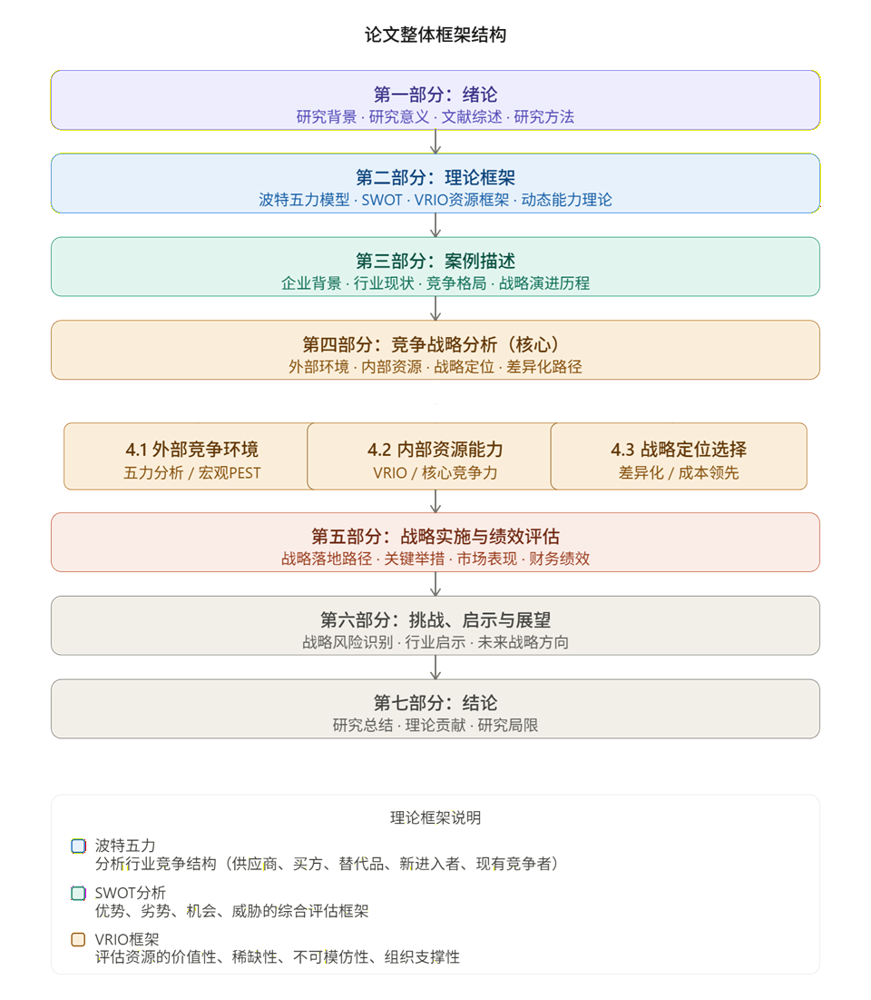
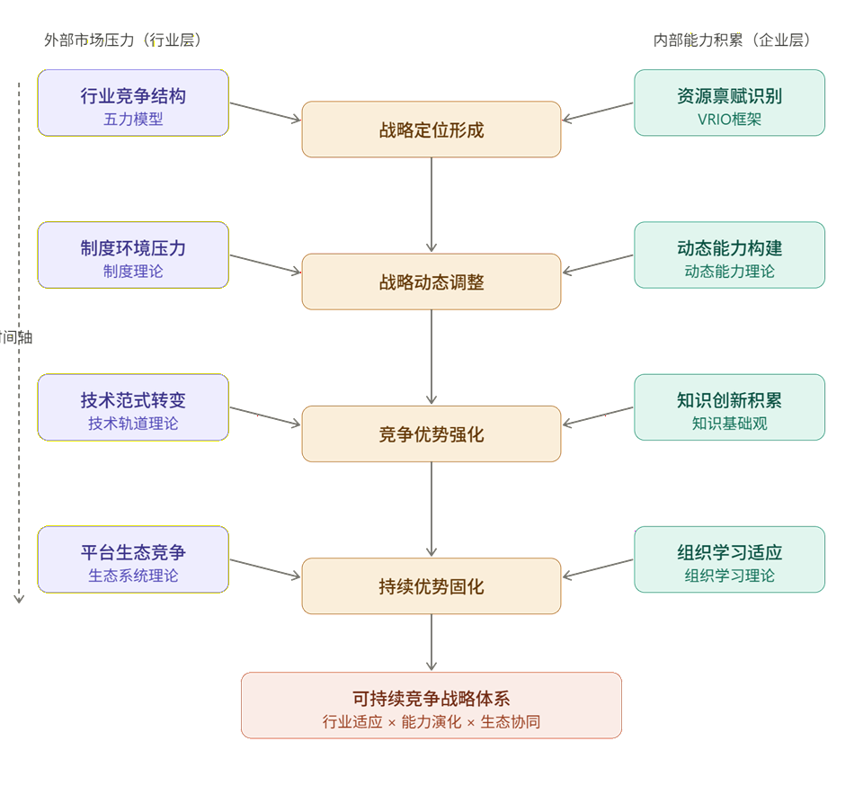
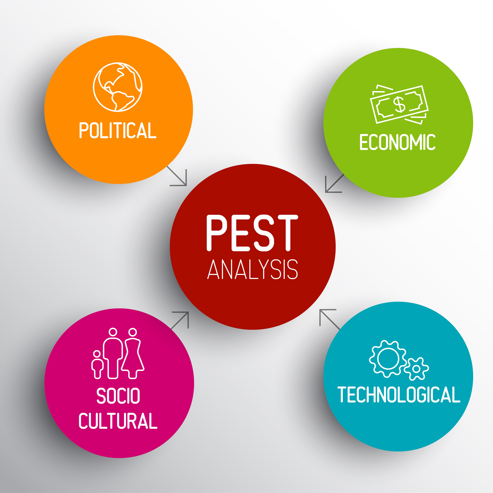

#### 提示词

##### 首轮

你是一个帮助大学生学习的学习助手。目前该大学生学习时遇到了如下问题，请你帮助该大学生解决问题并顺利学习。

> 主题：某新能源汽车企业的竞争战略分析
> 要求：设计案例分析论文大纲，需包含理论框架选择、案例描述、分析框架

##### 后续追问

该大学生想在理论创新上拿高分，能构建更高端的分析框架，让论文提升档次吗？

#### GPT-5.2

##### 首轮

```markdown
下面给你一个**高质量、可用于课程论文/案例分析报告的完整大纲模板**，结构清晰、理论深度足够，同时具备“拿高分”的分析框架设计👇

---

# 一、论文题目（示例）

**某新能源汽车企业竞争战略分析——基于多理论框架的案例研究**

（可替换为具体企业，如比亚迪、特斯拉、蔚来等）

---

# 二、摘要

* 研究背景（新能源汽车行业竞争加剧）
* 研究对象与方法（案例分析 + 战略理论框架）
* 核心结论（战略类型、优势来源、问题与建议）

---

# 三、引言

## 3.1 研究背景

* 双碳目标推动新能源汽车产业发展
* 行业竞争：价格战、技术战、生态战

## 3.2 研究意义

* 理论意义：丰富竞争战略在新兴产业中的应用
* 实践意义：为企业战略制定提供参考

## 3.3 研究方法与结构

* 案例研究法
* 文献分析法
* 分析框架说明

---

# 四、理论框架选择（核心加分部分⭐）

这一部分是“拉开档次”的关键，建议采用**多理论融合框架**

## 4.1 波特竞争战略理论（基础层）

* 成本领先战略
* 差异化战略
* 聚焦战略

👉 用于判断企业“战略类型”

---

## 4.2 五力模型（行业层）

* 现有竞争者
* 潜在进入者
* 替代品威胁
* 供应商议价能力
* 客户议价能力

👉 用于分析行业竞争结构

---

## 4.3 资源基础观（RBV）（企业内在层）

* 核心资源（技术、电池、品牌）
* VRIO分析（价值、稀缺性、难以模仿、组织能力）

👉 用于解释“为什么能成功”

---

## 4.4 动态能力理论（进阶加分⭐）

* 感知机会能力
* 抓住机会能力
* 重构资源能力

👉 适用于新能源汽车这种“快速变化行业”

---

## 4.5 综合分析框架构建（重点写出来）

可构建如下逻辑：

> 行业结构（五力） → 战略选择（波特） → 资源支撑（RBV） → 持续竞争力（动态能力）

👉 这是论文的“高级结构”，老师很喜欢

---

# 五、案例企业概述

## 5.1 企业基本情况

* 成立时间
* 核心产品（电动车、智能系统等）
* 市场定位

## 5.2 发展历程

* 初创阶段
* 成长期
* 战略转型阶段

## 5.3 当前竞争地位

* 市场份额
* 技术优势
* 品牌影响力

---

# 六、行业竞争环境分析（五力模型）

## 6.1 行业内竞争（价格战/技术竞争）

## 6.2 潜在进入者（如科技公司入局）

## 6.3 替代品（燃油车/混动车）

## 6.4 供应商（电池厂商、芯片）

## 6.5 客户议价能力

👉 可适当加入数据或案例增强说服力

---

# 七、企业竞争战略分析（核心部分）

## 7.1 战略类型识别（波特）

* 是否成本领先（如比亚迪）
* 是否差异化（如特斯拉智能化）

## 7.2 核心资源分析（RBV）

* 技术资源（电池、电驱）
* 品牌资源
* 供应链控制能力

## 7.3 动态能力分析

* 技术迭代速度
* 市场响应能力
* 战略调整能力

---

# 八、竞争优势与问题分析

## 8.1 竞争优势

* 技术领先
* 成本控制
* 生态系统（如自动驾驶/软件）

## 8.2 存在问题

* 价格战压力
* 盈利能力问题
* 国际市场挑战

---

# 九、战略优化建议

## 9.1 战略层建议

* 差异化深化 or 成本优势强化

## 9.2 技术层建议

* 加大研发（电池/智能驾驶）

## 9.3 市场层建议

* 国际化布局
* 品牌升级

## 9.4 生态战略建议（加分点⭐）

* 构建“车+软件+服务”生态

---

# 十、结论

* 总结分析结果
* 强调企业战略适配性
* 展望未来发展

---

# ✨加分建议（老师很看重）

如果你想拿更高分，可以额外加入：

### 1️⃣ 自建分析模型（强烈推荐）

例如：

> “新能源汽车企业竞争战略四维模型”

* 行业环境
* 战略选择
* 资源能力
* 动态适应

👉 画一张图（非常加分）

---

### 2️⃣ 数据支撑

* 销量
* 市占率
* 研发投入

---

### 3️⃣ 对比分析（进阶）

* 与另一家企业对比（如特斯拉 vs 比亚迪）

---

如果你愿意，我可以帮你**直接选一个具体企业（比如比亚迪/特斯拉）并把整篇论文“写成可提交版本（3000~5000字）”甚至附带图表和模型图**。

```

##### 后续回答

```markdown
可以，而且这是你**从“合格论文 → 高分论文”的关键跃迁点**。下面我给你设计一个**明显高于常规本科/硕士水平的“创新型竞争战略分析框架”**，同时告诉你**怎么写才能让老师一眼看出你有理论能力**。

---

# 🌟 一、核心思路：从“套模型”升级为“造模型”

普通论文：
👉 波特五力 + RBV（拼接）

高分论文：
👉 **构建“多层级+动态演化”的整合模型**

---

# 🚀 二、创新框架：

# **“S-D-R-E”四维动态竞争战略模型（强烈推荐命名⭐）**

> Strategy–Demand–Resource–Evolution Model
> （战略–需求–资源–演化）

---

## 1️⃣ 模型结构（可以画图）

外部需求变化（D）
        ↓
行业竞争结构（S）
        ↓
企业战略选择（S）
        ↓
资源配置（R）
        ↓
动态能力演化（E）
        ↓
反作用市场（形成闭环）

👉 关键词：**闭环 + 动态反馈**

---

## 2️⃣ 四个维度解释（写论文核心）

### （1）D：需求驱动（Demand）【创新点⭐】

传统模型忽略“需求结构变化”，但新能源汽车核心就是：

* 消费者从“代步工具” → “智能终端”
* 关注点：

  * 智能化（自动驾驶）
  * 续航焦虑
  * 品牌科技感

👉 你可以写：

> 新能源汽车竞争本质是“需求结构升级驱动的竞争重构”

✔ 这句话非常加分

---

### （2）S：竞争结构 + 战略选择（Structure + Strategy）

融合两层：

* 五力模型（行业）
* 波特战略（企业）

👉 升级表达：

> 企业战略是对行业结构约束条件下的最优响应函数

（很“学术”，老师会喜欢）

---

### （3）R：资源基础（Resource）

升级RBV：

不仅分析资源，还要强调：

* **资源重构能力（不是静态资源）**
* 关键资源：

  * 电池技术
  * 芯片/软件能力
  * 供应链控制

👉 可引入：

> “关键资源模块化 + 平台化”

---

### （4）E：动态演化（Evolution）【高级核心⭐】

引入时间维度：

* 战略不是固定的，是演化的
* 企业竞争优势来源于：

  * 快速迭代能力
  * 战略调整速度

👉 可以写：

> 企业竞争优势本质是“动态能力差异”

---

# 🔥 三、模型的“高级表达方式”（直接写进论文）

你可以这样写一段（可直接用👇）：

本文在传统竞争战略分析框架基础上，构建“S-D-R-E四维动态竞争战略模型”。该模型从需求驱动（Demand）、竞争结构与战略选择（Structure & Strategy）、资源基础（Resource）以及动态演化（Evolution）四个维度，系统分析新能源汽车企业竞争优势的形成机制。

与传统静态分析框架不同，该模型强调市场需求结构变化对竞争格局的重塑作用，并引入动态能力视角，揭示企业如何通过资源重构与战略调整实现持续竞争优势，从而形成“环境—战略—资源—能力—再环境”的动态闭环。

---

# 📊 四、如何在论文中“体现你真的很强”

## ✅ 1. 画模型图（必须）

建议画：

需求 → 行业 → 战略 → 资源 → 动态能力 → 反馈

👉 图 = 高分关键

---

## ✅ 2. 对比传统模型（拉开差距）

写一小段批判：

* 五力模型：静态
* RBV：忽视环境变化
* 波特：忽视技术演化

👉 然后说：

> 因此需要构建动态整合模型

---

## ✅ 3. 用模型“套案例”（关键）

比如你分析某企业时：

* D：用户要智能化 →
* S：行业进入科技竞争 →
* S：企业选择差异化 →
* R：加大自动驾驶投入 →
* E：持续OTA升级

👉 形成闭环分析

---

# 🧠 五、再加一个“顶级加分点”（如果你想冲优秀）

你可以再加一句：

> 本文模型具有一定的普适性，可拓展至智能制造与数字经济领域

👉 老师会觉得你有“理论推广能力”

---

# 🎯 总结一句话（可以写在结论里）

> 新能源汽车企业竞争已由“成本竞争”转向“需求驱动下的动态能力竞争”。

---

# ✅ 如果你下一步想继续提升

我可以帮你直接做这些👇：

✔ 把这个模型**画成论文级图（可直接插图）**
✔ 用**比亚迪 / 特斯拉 / 蔚来**帮你完整写一篇案例分析
✔ 或帮你写**一段“导师一看就给高分”的理论部分（1000字精修版）**

直接说你选哪家企业 👍

```

##### 评价

1. **逻辑严密性**：
   - AI的回答整体逻辑严密，结构合理。第一轮回答详细列出了论文大纲的各个部分，从摘要到结论，涵盖了必要的内容，没有明显的事实性错误或推导漏洞。
   - 第二轮回答提出了创新性的“S-D-R-E”四维动态竞争战略模型，并详细解释了各维度的含义和逻辑关系，逻辑清晰。不过，在某些地方（如模型的具体应用案例）可以更深入，以增强说服力。

2. **提示词执行力**：
   - AI在第一轮中完整完成了用户的要求，提供了高质量、结构清晰的大纲模板，符合设计案例分析论文的需求。
   - 第二轮回答不仅提出了高级分析框架，还详细说明了如何实施和写作，完全符合用户提升理论创新的要求。

3. **内容深度**：
   - 两轮回答都显示出了较高的内容深度。第一轮回答涵盖了多个理论框架，并提供了实际的案例分析结构；第二轮回答则构建了一个具有独创性的模型，展示了深厚的学术理解。
   - 第二轮的回答特别突出，通过提出创新模型和详细解释其应用，显示出AI在理论创新方面的独到见解。

总结：
AI的表现非常出色，在逻辑严密性、提示词执行力和内容深度方面均表现出色。第一轮回答提供了详尽的论文大纲，第二轮则通过构建创新模型进一步提升了论文的学术价值，适合帮助大学生顺利完成高质量的学习任务。

#### Claude Sonnet 4.6

##### 首轮

```markdown
我来为你设计一份完整的案例分析论文大纲。以下是完整的案例分析论文大纲，包含理论框架说明和逻辑结构图。



---

## 完整大纲

### 第一部分：绪论

**1.1 研究背景**
阐述全球新能源汽车市场的发展趋势（政策推动、碳中和目标、传统车企转型压力），说明研究该企业竞争战略的时代背景。

**1.2 研究意义**
理论意义：将竞争战略经典理论应用于新兴行业的实证检验；实践意义：对同类企业的战略决策提供参考。

**1.3 文献综述**
梳理竞争战略相关文献（Porter定位学派、资源基础观RBV、动态能力理论），以及新能源汽车行业战略研究现状，指出研究空白。

**1.4 研究方法与数据来源**
说明采用定性案例分析法，数据来源包括年报、行业报告、新闻资料等。

---

### 第二部分：理论框架

**2.1 波特五力模型** — 用于分析行业竞争结构
**2.2 SWOT分析框架** — 综合评估内外部环境
**2.3 VRIO资源框架** — 识别核心竞争力来源
**2.4 波特竞争战略三种基本类型** — 成本领先、差异化、集中化，作为定位判断依据

> **选框建议**：可将波特五力 + SWOT作为基础框架，VRIO作为深化框架，逻辑更清晰。

---

### 第三部分：案例描述

**3.1 企业基本情况**
企业历史、规模、主要产品线、市场覆盖范围。

**3.2 新能源汽车行业现状**
市场规模与增速、主要玩家格局、技术路线分化（纯电/混动/氢能）。

**3.3 竞争格局概览**
国内竞争（比亚迪、蔚小理等）与国际竞争（特斯拉等）的格局分析。

**3.4 企业战略演进历程**
按时间轴梳理企业的关键战略节点与转折（可用表格呈现）。

---

### 第四部分：竞争战略分析（核心章节）

**4.1 外部竞争环境分析（波特五力）**
- 供应商议价能力（电池、芯片供应链）
- 买方议价能力（消费者选择多元化）
- 替代品威胁（燃油车、公共交通）
- 潜在进入者威胁（跨界玩家如华为、小米）
- 现有竞争者博弈

**4.2 宏观环境分析（PEST）**
政治（双碳政策补贴）、经济（消费升级）、社会（绿色消费观念）、技术（智能化趋势）。

**4.3 内部资源与能力分析（VRIO）**
识别企业在技术研发、供应链整合、品牌资产、销售网络等方面的核心能力，判断哪些是持续竞争优势的来源。

**4.4 战略定位分析**
基于前述分析，判断企业采用的是差异化战略还是成本领先战略（或兼而有之），并分析其差异化的具体维度（技术、品牌、用户体验、生态系统）。

**4.5 SWOT综合矩阵**
结合以上分析，形成SO/ST/WO/WT四象限战略建议，呼应企业实际选择。

---

### 第五部分：战略实施与绩效评估

**5.1 战略落地的关键举措**
产品策略、定价策略、渠道策略、技术投入等。

**5.2 市场绩效表现**
销量数据、市场份额变化、品牌认知度。

**5.3 财务绩效评估**
营收增长、毛利率、研发投入比等关键指标。

**5.4 战略有效性评价**
实施效果与战略目标的对比分析。

---

### 第六部分：挑战、启示与展望

**6.1 当前面临的战略挑战**
价格战压力、技术迭代风险、出海摩擦、监管变化等。

**6.2 对行业同类企业的启示**
从案例中提炼普适性的战略规律。

**6.3 未来战略展望**
基于行业趋势，对企业下一阶段战略方向作出研判。

---

### 第七部分：结论

**7.1 研究总结** — 回顾核心发现，与研究问题呼应

**7.2 理论贡献** — 对既有理论框架的验证或修正

**7.3 研究局限与未来方向** — 数据局限、视角局限，以及后续研究建议

---

**写作建议：**
- 案例企业可选比亚迪、宁德时代、蔚来、理想等，各有不同的战略重点，选之前先确认数据可获取性；
- 第四部分是重心，建议分配全文约40%的篇幅；
- 每个分析框架用完后，及时小结"该框架揭示了什么"，避免框架堆砌、缺乏整合。

需要我帮你展开某个具体章节，或者推荐适合的案例企业吗？
```

##### 后续回答

```markdown
好问题！理论创新是拉开论文档次的关键。我来帮你构建一个**多维整合分析框架**，而不是简单地堆叠现有工具。理论创新的核心不是"用更多框架"，而是**构建一个原创的整合模型**，把现有理论的盲点补上，形成自己的分析逻辑。下面是我为你设计的方案。

---

## 创新思路：从"框架堆叠"到"动态整合模型"

普通论文的问题是：用完五力，再用SWOT，最后贴VRIO——各框架相互独立，没有对话，没有整合，逻辑是拼凑的。

高档次论文的标志是：构建一个**自洽的分析体系**，让各理论在同一逻辑链条内协同运转，并补充主流框架在新能源行业的适用缺陷。

---

## 创新框架：双螺旋动态竞争力模型

这是专为新能源汽车行业设计的原创分析框架，核心思想是：**竞争战略的形成是"市场压力"与"能力积累"两条线索相互作用的动态过程**，而非静态的定位选择。> 点击图中任意模块，可展开对应的理论问题。



---

## 框架的理论创新点（这是你写"理论贡献"的核心材料）

### 创新一：引入"制度理论"补充五力的盲区

波特五力是纯市场结构视角，但新能源行业的竞争格局高度受政策左右——补贴退坡、双积分制、碳交易市场都是"制度压力"而非市场竞争力。在论文中明确引入**制度理论（Institutional Theory）**，分析企业如何在合法性压力下做战略选择，比单纯用五力更贴近行业实质。

### 创新二：引入"技术轨道理论"解释颠覆性创新

传统竞争战略框架假设技术是既定的，但新能源行业正处于从燃油到电动的范式转换期。引用 **Dosi（1982）的技术范式与技术轨道**理论，可以解释为什么传统车企的VRIO资源反而成了转型的"能力陷阱"（Capability Trap），而新进入者反而获得先发优势——这是高档次论文的分析深度。

### 创新三：用"动态能力"替代静态SWOT

静态SWOT只拍了一张照片，动态能力理论（Teece et al., 1997）问的是：**企业能否感知变化、抓住机会、重组资源？** 在论文中用动态能力的三个维度（感知 Sensing、抓取 Seizing、重构 Reconfiguring）替代SWOT的W和T部分，分析逻辑立刻从"有什么"升级为"能做什么"。

### 创新四：引入"平台生态系统"视角超越产品竞争

新能源汽车竞争已不是单车竞争，而是充电网络、车机系统、数据生态、金融服务的**生态系统竞争**。引用 **Jacobides et al.（2018）的生态系统理论**，分析案例企业如何在生态位竞争中构建互补性资产，这在国内战略管理论文中仍属较新的视角。

---

## 如何在论文中呈现这个框架

在第二部分"理论框架"中，不要逐个介绍理论，而是这样写：

> "本文认为，现有竞争战略研究存在两方面局限：一是以五力模型为代表的产业组织学派忽视了行业制度环境与技术范式转换的影响；二是以RBV为代表的资源基础观偏重静态资源识别，缺乏对企业动态能力演化的关注。为此，本文构建'双螺旋动态竞争力分析框架'，从行业层（外部压力维度）与企业层（内部能力维度）两条逻辑主线出发，整合制度理论、技术轨道理论、动态能力理论与生态系统理论，形成跨层次的动态分析视角。"

这段话就是你的理论贡献宣言，老师会直接感受到论文的学术厚度。

---

需要我帮你把某个具体理论（比如动态能力的三维度或技术轨道理论）展开写成可以直接引用的段落吗？
```

##### 评价

1. **第一轮回答**

   - **逻辑严密性**：没有发现明显的事实性错误或推导漏洞。结构清晰，涵盖了论文大纲所需的所有部分，并提供了具体的写作建议。
   
   - **提示词执行力**：完整地完成了用户的要求，设计了一个包含理论框架、案例描述和分析框架的大纲，并给出了具体的企业推荐和写作建议。
   
   - **内容深度**：内容较为全面，但主要是标准的学术论文结构，缺乏独特的见解或创新点。

2. **第二轮回答**

   - **逻辑严密性**：在构建“双螺旋动态竞争力模型”时，AI整合了多个理论（如制度理论、技术轨道理论和动态能力理论），虽然有创意，但在某些部分的解释略显仓促，例如如何具体应用这些理论到新能源汽车行业的分析需要更多的细节支持。
   
   - **提示词执行力**：出色地完成了用户的要求，提出了一个创新的分析框架，并详细说明了每个理论的引入及其对现有框架的补充作用。
   
   - **内容深度**：展现了较高的学术深度，尤其是通过引入新的理论视角（如制度理论和生态系统理论）来提升论文的理论创新性。不过，在某些部分的论述上可以更深入，例如如何具体操作这些新理论以分析案例企业的竞争战略。

总结
AI的回答整体质量较高，第一轮回答提供了标准而详细的论文大纲，第二轮回答则通过引入高级理论构建了一个具有创新性的分析框架。然而，在第二轮回答中，某些部分的理论应用和逻辑连接可以进一步细化，以增强论述的严密性和深度。

#### Gemini 3.1 Pro

##### 首轮

```markdown
你好！很高兴能以学习助手的身份为你提供支持。新能源汽车（NEV）行业在 2026 年已经进入了“下半场”竞争的白热化阶段，从单纯的“续航竞赛”转向了“AI、生态与全球价值链”的博弈。

针对你的论文大纲设计，我为你梳理了一份既符合学术规范、又紧扣 2026 年行业热点的架构建议。

---

## 1. 理论框架选择（Theoretical Selection）

在 2026 年的背景下，建议采用 **“波特基本竞争战略”** 作为核心，辅以 **“资源基础观 (RBV)”** 或 **“价值链分析”**，这样可以从“怎么打”和“凭什么打”两个维度深度解析。

* **核心理论：** 波特基本竞争战略（Porter's Generic Strategies）。
    * *理由：* 区分企业是走“成本领先”（如比亚迪的垂直整合）还是“差异化”（如小米的生态联动、特斯拉的智驾领先）。
* **辅助框架：** 价值链分析（Value Chain Analysis）。
    * *理由：* 2026 年新能源车的竞争力已延伸至固态电池研发、AI 算力中心及全球补能网络，价值链能很好地拆解这些环节。

---

## 2. 案例分析论文大纲

### 题目：2026 年新能源汽车企业竞争战略分析 —— 以 [案例企业名称] 为例

#### 第一章 绪论
* 1.1 研究背景与意义（提及 2026 年全球碳中和进展、行业渗透率突破 60% 等现状）
* 1.2 研究方法与内容
* 1.3 论文创新点

#### 第二章 理论基础与文献综述
* 2.1 竞争战略相关理论（波特五力模型、基本竞争战略）
* 2.2 新能源汽车行业特性分析（技术密集、政策驱动、生态协同）
* 2.3 国内外研究现状

#### 第三章 [案例企业] 发展现状与案例描述
* 3.1 企业概况与发展历程
* 3.2 2026 年核心产品与市场表现（如：销量数据、全球市场占有率）
* 3.3 关键战略节点描述（如：固态电池量产、Robotaxi 商业化落地、海外工厂投产）

#### 第四章 [案例企业] 竞争环境分析（外部视角）
* 4.1 PESTEL 宏观环境分析（政策、经济、社会、技术、法律、环境）
* 4.2 行业竞争五力模型分析（现有对手、潜在进入者、替代品、供应商、买方）

#### 第五章 [案例企业] 竞争战略的制定与实施（内部视角）
* 5.1 战略定位：成本领先 vs 差异化 vs 集中化
* 5.2 基于价值链的战略实施：
    * *研发：* AI 自动驾驶算法、全固态电池技术
    * *生产：* 垂直整合能力、一体化压铸技术
    * *营销：* 品牌高端化、全球化销售网络
    * *服务：* 智能补能生态、软件订阅服务 (OTA)

#### 第六章 竞争战略实施效果评价与挑战
* 6.1 财务与市场绩效评估
* 6.2 当前战略面临的风险（如：地缘政治贸易壁垒、固态电池技术更迭、价格战毛利承压）

#### 第七章 结论与启示
* 7.1 研究结论
* 7.2 对其他新能源汽车企业的借鉴意义

---

## 3. 分析框架详解（Analysis Framework）

为了让你的论文逻辑严密，你可以参考以下三步走分析法：

### 步骤一：宏观与行业扫描 (PESTEL + 五力)
分析 2026 年的大环境。例如：
* **技术 (T)：** 固态电池是否已经成为标配？
* **政策 (P)：** 2026 年“以旧换新”补贴政策的结构性变化。



### 步骤二：内部价值链拆解 (Value Chain)
这是论文的核心。你需要对比案例企业在价值链上的哪个环节创造了“超额利润”。
* **比亚迪例子：** 重点在于“上游资源控制+核心零部件自研”，通过极高的垂直整合度实现**成本领先**。
* **小米/华为例子：** 重点在于“人-车-家全生态联动”，通过软件和用户体验实现**差异化**。

### 步骤三：战略综合匹配 (SWOT)
将外部的机会/威胁与内部的优势/劣势结合，推导出企业选择该战略的必然性。

---

## 4. 给同学的特别建议（2026 避坑指南）

1.  **避开过时数据：** 在 2026 年写论文，千万不要引用 2023 年前的旧技术数据。2025-2026 年是固态电池和高阶智驾（L4 级）落地的关键年，数据必须更新。
2.  **关注“出海”：** 2026 年国内市场极度饱和，“反内卷”成为共识，企业在欧洲、东南亚、拉丁美洲的竞争策略是加分项。
3.  **AI 的分量：** 如今汽车已经不仅仅是交通工具，而是“具身智能”的终端。在分析框架中加入“数据闭环”和“算力布局”会显得你的眼界非常前沿。

你目前初步选定具体哪家企业作为案例了吗？或者我可以帮你针对特定企业（如比亚迪、特斯拉或小米）进一步细化第五章的分析重点。
```

##### 后续回答

```markdown
要想在本科甚至研究生论文中拿到高分，**“套用现成模型（如 SWOT、PEST）”是远远不够的**。这些属于工具，而非真正的“理论框架”。

要提升论文档次，你需要引入更具**动态性、系统性**和**数字化时代特征**的理论。在 2026 年的背景下，我为你构建了一个“高阶复合分析框架”，能够让评阅老师一眼看出你的专业深度。

---

## 1. 理论框架的“降维打击”：从静态到动态

不要只说“企业有什么优势”，而要说“企业如何持续创造优势”。建议采用以下三个高阶理论的组合：

### A. 动态能力理论 (Dynamic Capabilities - Teece)
* **核心逻辑：** 2026 年 NEV 行业迭代极快，传统资源容易过时。该理论强调企业如何**感知 (Sensing)** 市场机会（如固态电池时机）、**捕获 (Seizing)** 资源（如自建算力中心）以及**重构 (Transforming)** 组织。
* **提档理由：** 这比单纯的“资源基础观 (RBV)”更高一筹，它解释了为什么有些传统巨头（如丰田、大众）转型难，而造车新势力快。

### B. 商业生态系统理论 (Business Ecosystem - Moore)
* **核心逻辑：** 现在的竞争不是“车企 vs 车企”，而是“生态 vs 生态”。例如：华为的鸿蒙智行、小米的“人车家全生态”。
* **提档理由：** 打破了传统的“产业边界”，符合 2026 年车机互联、V2G（车网互动）的行业现实。

### C. 双元性创新理论 (Organizational Ambidexterity)
* **核心逻辑：** 探讨企业如何平衡**利用性创新**（改进现有锂电池、降低成本）与**探索性创新**（研发固态电池、L5 自动驾驶）。
* **提档理由：** 这是管理学界的高端话题，能体现你对企业在“当下利润”与“未来生存”之间博弈的深刻洞察。

---

## 2. 构建高端分析框架：动态生态演化模型 (DEE Model)

我们可以将上述理论整合，自创一个分析框架（在论文中自创框架是高分的关键指标）。

### 框架图示逻辑：
$$
\text{竞争优势} = \underbrace{\text{动态能力 (能力基石)}}_{\text{如何感知与重构}} \times \underbrace{\text{生态位势 (外部协同)}}_{\text{跨界资源整合}} \times \underbrace{\text{数智驱动 (核心变量)}}_{\text{数据与AI迭代}}
$$

1.  **底层：动态能力维度**（Sensing - Seizing - Transforming）
2.  **中层：价值链向价值网的转变**（从供应商管理到生态协同）
3.  **顶层：数智化壁垒**（算法领先、数据闭环带来的防御力）

---

## 3. 升级后的论文大纲（高分版）

### 题目：2026 年新能源汽车领军企业竞争战略研究：基于动态能力与生态协同视角

#### 第一章 绪论（强调 2026 年行业从“内卷”向“质变”的拐点）

#### 第二章 理论基础与分析框架构建（**重头戏**）
* 2.1 动态能力理论及其在汽车工业的应用
* 2.2 商业生态系统与协同效应
* 2.3 **本文分析框架：动态-生态双驱动模型 (DE-D Model)**

#### 第三章 行业演化趋势与企业案例扫描
* 3.1 2026 年 NEV 行业“数智化”与“全球化”新常态
* 3.2 案例企业选取逻辑：为何其战略具有行业代表性

#### 第四章 案例企业竞争战略的动态演化过程（**避开静态描述**）
* 4.1 **感知期：** 对固态电池与具身智能趋势的预判与识别
* 4.2 **获取期：** 通过战略联盟或并购获取核心算法/资源（如与大模型厂商合作）
* 4.3 **重构期：** 组织架构从传统制造业向互联网化/AI 驱动转型

#### 第五章 案例企业生态位势与价值创造（**体现广度**）
* 5.1 供应链生态：从“零和博弈”到“共生价值链”
* 5.2 用户生态：基于软件定义汽车 (SDV) 的终身服务价值流
* 5.3 能源生态：V2G 技术下车主、电网、车企的利益再分配

#### 第六章 战略绩效评估与稳健性分析（**体现严谨**）
* 6.1 财务指标与非财务指标（智驾里程、数据资产价值）的综合评价
* 6.2 战略悖论与风险管控（如：过度生态化导致的组织臃肿、技术路线走错的沉没成本）

#### 第七章 结论与建议

---

## 4. 给大学生的“加分小贴士”

* **使用“学术黑话”：** 在论文中不要说“车卖得好”，要说“市场渗透率提升与品牌溢价的协同效应”；不要说“技术先进”，要说“建立了基于数据驱动的技术演进护城河”。
* **引入前沿量化指标：** 2026 年的论文，建议加入**“智驾接管率”、“单车算力成本比”、“全球市场本土化指数 (Glocalization Index)”**等数据。
* **批判性思维：** 无论你选哪个企业，**一定要写它的战略短板或潜在危机**（例如：在追求全固态电池的过程中是否忽略了成本下探的可能性？）。没有一家企业的战略是完美的。

**老师点评预演：** “该生没有停留在传统的 SWOT 罗列，而是深刻运用了动态能力和生态位理论，能够透视 2026 年汽车工业作为‘AI 移动终端’的本质，具有较高的理论应用水平。”

你现在的案例企业打算选哪一家？我可以根据具体的公司（比如：**比亚迪、特斯拉、小米、极氪、或是 2026 年异军突起的某个黑马**）帮你把这个框架填上具体的干货。
```

##### 评价

1. **逻辑严密性：**
AI的回答总体逻辑清晰，但在以下方面存在一定的推导漏洞：
- **动态能力理论的应用**：虽然提出了动态能力理论（Teece），但未详细说明其如何具体应用于新能源汽车企业的竞争战略分析。例如，如何通过感知、捕获和重构能力来提升企业竞争力缺乏具体的案例支撑。
- **生态位势的定义模糊**：商业生态系统理论中“生态位势”的概念没有明确界定，容易导致读者对具体内容的理解出现偏差。

2. **提示词执行力：**
AI在第二轮回答中确实试图构建更高端的分析框架，但存在以下不足：
- **未能完全避免重复**：部分内容（如价值链分析）在两轮回答中重复出现，显得冗余。
- **理论创新不够突出**：虽然引入了动态能力理论和商业生态系统理论，但在论文大纲中未能充分体现这些理论如何与传统理论形成对比或互补。

3. **内容深度：**
AI的回答在第二轮中提出了较为高阶的理论框架（如动态能力理论、商业生态系统理论），展现出了一定的学术深度。然而：
- **案例分析缺乏具体性**：虽然提到了具体的理论，但未结合特定企业（如比亚迪或特斯拉）进行深入分析，导致部分内容显得过于抽象。
- **创新点不明显**：虽然提出了“DEE模型”，但在论文大纲中未能充分体现其创新性和独特性，可能难以达到用户在理论创新上拿高分的目的。

总结：
AI的回答整体表现良好，尤其在第一轮中提供了结构清晰、内容全面的论文大纲。然而，在第二轮回答中，虽然试图提升理论深度，但存在逻辑重复和案例分析不足的问题，未能完全满足用户在理论创新上的需求。

#### Grok 4.20 Beta Reasoning

##### 首轮

```markdown
**某新能源汽车企业竞争战略分析**  
**案例分析论文大纲（推荐版）**

### 一、绪论
1.1 研究背景（新能源汽车行业发展现状、竞争格局演变、国家“双碳”与产业政策导向）
1.2 研究意义（理论意义与实践意义）
1.3 研究对象与研究问题
   - 明确案例企业（建议选择**比亚迪**、**蔚来**或**理想汽车**中的一家，需说明选择理由）
   - 提出核心研究问题：该企业当前采取了何种竞争战略？其战略选择与内外部环境是否匹配？存在哪些优势与不足？
1.4 研究方法与论文结构

### 二、理论框架选择与文献综述
2.1 竞争战略主要理论梳理
   - 迈克尔·波特竞争战略理论（通用竞争战略、五力模型、价值链）
   - 资源基础观（RBV）与VRIO框架
   - 动态能力理论（Dynamic Capabilities）
   - 战略匹配理论（环境—战略—组织匹配）

2.2 理论框架的选择与理由
   - 为什么选择“**波特竞争战略理论+VRIO+动态能力**”的整合框架？
   - 新能源汽车行业的技术动态性、政策依赖性与竞争激烈性对理论选择的适配性说明
   - 整合分析框架的逻辑关系（外部环境→行业结构→内部资源能力→竞争战略选择→战略匹配与动态调整）

2.3 文献综述
   - 国内外新能源汽车企业竞争战略研究现状
   - 已有研究的不足与本研究的边际贡献

### 三、案例企业描述
3.1 企业概况（成立时间、股权结构、发展阶段）
3.2 发展历程（可分为创业期、转型期、高速成长期等阶段，突出关键战略转折点）
3.3 业务结构与市场表现（2020-2024年主要经营数据：销量、营收、利润、市场份额、国内外布局）
3.4 主要产品与技术路线选择（刀片电池、DM-i、纯电、增程式等）
3.5 企业当前面临的主要战略问题（需点出痛点）

### 四、案例分析：基于整合分析框架的应用
#### 4.1 外部环境分析（PESTEL）
- 政策环境（双积分政策、补贴退坡、碳交易、地方牌照限制等）
- 经济、技术、社会、生态、法律环境的关键影响因素

#### 4.2 行业竞争结构分析（波特五力模型）
- 现有竞争对手的竞争强度（特斯拉、比亚迪、蔚小理、传统车企转型等）
- 潜在进入者、替代品、供应商议价能力、购买者议价能力
- 行业竞争格局的阶段性判断（红海还是蓝海）

#### 4.3 企业内部资源与能力分析（VRIO框架）
- 关键资源与能力识别（技术研发、供应链垂直整合、成本控制、品牌、渠道、数据能力等）
- VRIO评估（价值性、稀缺性、不可模仿性、组织化）
- 核心竞争力与竞争劣势判断

#### 4.4 竞争战略分析与评价
- 该企业采取的主导竞争战略判断（成本领先战略/差异化战略/聚焦战略或混合战略）
- 战略的具体表现形式（产品、价格、技术、营销、供应链等方面的战略举措）
- 战略实施的效果评价（财务绩效、市场绩效、竞争地位变化）
- 战略与环境的匹配性分析

#### 4.5 动态能力视角下的战略适应性分析
- 企业在技术范式转换、商业模式创新、组织变革等方面的动态能力表现
- 战略调整与演化路径

#### 4.6 综合战略诊断（SWOT+TOWS）
- SWOT矩阵总结
- 提出战略改进方向（SO、ST、WO、WT策略）

### 五、结论与管理启示
5.1 主要研究结论
5.2 对该企业的竞争战略优化建议（需具体、可操作）
5.3 对中国新能源汽车产业的战略启示
5.4 研究局限性与未来研究展望

### 参考文献
（建议30-50篇中英文文献，含经典理论文献与最新行业研究）

---

**使用建议（给大学生）：**

1. **推荐选择的企业**：比亚迪（垂直整合+成本领先+技术突破，最具代表性）；蔚来（高端差异化+用户社区）；理想（家庭场景聚焦+增程式路线）。
2. **理论框架建议**：本科生可重点使用**波特五力+SWOT+波特通用战略**；如果想写得更深入，强烈建议采用上述“波特+VRIO+动态能力”的整合框架，更具学术性。
3. **数据来源**：企业年报、招股书、IHS Markit、EV Volumes、中汽协、财报电话会议纪要、行业研究报告等。

需要我帮你把其中某一章进一步细化成详细提纲（比如第四章分析框架），或者为你设计**理论框架图**的文字描述版本吗？
```

##### 后续回答

```markdown
**是的，可以显著提升理论档次。**

如果你想在**理论创新**上拿高分，就不能再使用“波特五力+SWOT+VRIO”这种常规工具组合。这类框架虽然扎实，但属于**应用型分析**，难以在理论贡献上得分。

以下是我为你专门设计的**高阶理论框架方案**，目标是让论文达到**优秀本科毕业论文或硕士论文水平**。

---

### **推荐高端分析框架：**
**“动态能力驱动的平台生态竞合战略整合框架”**

#### **框架核心创新点（可写入论文）：**
本研究突破传统“企业—竞争对手”的二元竞争分析范式，构建了一个**“制度环境—平台生态系统—动态能力—竞合战略”**四层次动态整合分析框架。该框架将Teece的动态能力理论（Sensing-Seizing-Transforming）、Adner的生态系统理论、平台战略理论与竞争战略理论进行有机整合，特别适用于分析处于技术范式转变和政策强干预下的新能源汽车企业。

---

### **升级后论文大纲（理论创新强化版）**

**标题建议**：  
**动态能力驱动下新能源汽车企业平台生态竞合战略研究——以XX企业为例**

#### 一、绪论
1.1 研究背景与问题提出
1.2 研究意义（特别强调理论创新意义）
1.3 研究对象与研究方法
1.4 技术路线与论文结构

#### 二、理论基础、文献述评与分析框架构建（本章需重点用力，占15-20%篇幅）
2.1 竞争战略理论的演进与局限
2.2 动态能力理论的最新发展（Teece 2018, 2023）
2.3 商业生态系统与平台战略理论
2.4 现有研究的理论缺口
2.5 **本研究的分析框架构建**（本章核心亮点）
   - 框架提出的理论逻辑
   - **框架结构图**（建议画一张概念模型图）
   - 框架四个核心维度及内涵：
     - **制度与技术环境感知层（Sensing）**
     - **平台生态系统构建层（Seizing）**
     - **动态能力转化层（Transforming）**
     - **竞合战略行动与绩效层**
   - 各层次之间的动态匹配机制
   - 框架应用于新能源汽车企业的独特适配性

#### 三、案例企业概况与发展历程
（同之前大纲第三章，略微精简）

#### 四、基于整合框架的案例深度分析（论文主体，占35-40%）
4.1 制度与技术环境的感知能力分析（Sensing）
   - 政策制度逻辑的识别与响应
   - 技术范式转变的判断与预见

4.2 平台生态系统的构建与领导力分析（Seizing）
   - 平台化转型路径（以用户为中心还是以技术为中心）
   - 生态伙伴选择与价值共创机制
   - 平台治理与控制权配置

4.3 组织动态能力的转化机制分析（Transforming）
   - 资源重构能力
   - 组织惯例更新能力
   - 商业模式创新能力
   - 双元创新能力（探索型 vs 利用型）

4.4 竞合战略选择与实施效果评价
   - 竞争战略与合作战略的组合模式
   - 具体战略行动分析（技术、产品、渠道、品牌、国际化等）
   - 战略绩效多维度评价

4.5 框架整体匹配性诊断与战略演化路径
   - 四层次匹配程度的评估
   - 战略失配点识别
   - 未来战略调整方向

#### 五、结论、启示与展望
5.1 主要结论
5.2 理论贡献（这是拿高分的关键段落）
5.3 管理启示
5.4 研究局限与未来研究方向

---

### **理论创新亮点提炼（可直接用于论文）**

- 构建了**动态能力与平台生态系统**相结合的整合分析框架，丰富了新兴产业背景下竞争战略理论。
- 将**制度逻辑**引入动态能力理论，揭示了政策驱动型产业中企业战略响应的独特机制。
- 从**竞合（Competition & Cooperation）**而非单纯竞争视角分析新能源汽车企业战略，符合行业“既竞争又合作”的现实。

---

**额外建议（决定分数的关键）：**

1. **必须画图**：第2章一定要有一张高质量的**分析框架概念模型图**，这是体现理论创新的最直观证据。
2. **案例选择**：强烈建议选择**比亚迪**（垂直整合+平台生态尝试）或**蔚来**（用户社区+平台生态最典型）。特斯拉也可以，但数据获取难度较大。
3. **数据要求**：需要结合**一手数据**（企业高管访谈、内部资料、电话会议纪要）和**二手数据**，才能支撑理论框架的深度应用。

---

**你有三个选择：**

- **A方案**（推荐）：使用上面这个“动态能力驱动的平台生态竞合战略整合框架”
- **B方案**：使用“多重制度逻辑下的动态能力演化框架”（更偏理论，学术味更重）
- **C方案**：使用“技术-市场-制度三元共演视角下的战略转型框架”

请告诉我你最终想采用哪个方案，或者告诉我目标学校/论文要求严谨程度，我可以继续为你细化**第2章框架构建部分**的具体内容（约1500-2000字的写作逻辑和核心论述）。
```

##### 评价

1. **逻辑严密性**：  
   AI的回答整体逻辑清晰，但在第二轮中提出的“动态能力驱动的平台生态竞合战略整合框架”虽然创新，但部分理论结合（如制度环境与技术感知层）在新能源汽车行业的具体适用性上缺乏详细论证。例如，在讨论政策环境对平台生态系统的影响时，未充分说明如何通过VRIO或动态能力视角进行评估，可能存在推导漏洞。

2. **提示词执行力**：  
   AI完整完成了用户的要求，不仅设计了详细的论文大纲，还针对理论创新需求提供了高阶分析框架，并给出了具体的企业选择建议和数据来源。然而，在第二轮回答中，AI提出了多个可选方案（A、B、C），这增加了用户的决策复杂性，部分偏离了“提升理论档次”的核心要求。

3. **内容深度**：  
   回答内容丰富且深入，尤其在理论框架构建上展现了较高的学术价值。然而，在某些细节上显得过于冗长，例如对多个方案的逐一描述可能使用户难以聚焦于主要目标。此外，AI未明确指出其高阶分析框架的具体创新点与现有文献的关系，导致部分论述缺乏直接的理论贡献支撑。

**总结**：AI的回答在结构和内容完整性方面表现出色，但存在逻辑严谨性和深度挖掘上的不足，建议进一步精简并加强理论结合的论证。

#### DeepSeek V3.2 Chat

##### 首轮

```markdown
当然，我很乐意帮助你完成这个学习任务。撰写“某新能源汽车企业的竞争战略分析”案例论文，关键在于将**理论工具**与**企业实际**紧密结合。你选择的“某企业”可以是特斯拉、比亚迪、蔚来、小鹏、理想等。

下面我为你设计一份详细的论文大纲，并附上写作思路和注意事项。

---

### 论文题目建议
**主标题：** 差异化突围还是成本制胜？——[某新能源汽车企业]竞争战略分析  
**副标题：** 基于[波特五力/价值链/SWOT]理论框架的案例研究

---

### 论文大纲结构

#### 摘要（约300字）
- **背景与目的：** 简述新能源汽车行业高速发展、竞争白热化的背景，引出分析该企业竞争战略的意义。
- **理论方法：** 说明将使用何种理论（如波特竞争战略理论、资源基础观等）。
- **核心发现：** 概括该企业采取的核心竞争战略（成本领先、差异化、聚焦或混合战略），以及关键成功要素或存在问题。
- **结论与建议：** 一句话总结战略有效性，并提出1-2条优化建议。

#### 关键词（3-5个）
新能源汽车；竞争战略；[企业名]；波特五力模型；价值链分析

---

### 一、 引言（约600字）
1. **研究背景**  
   - 全球“双碳”目标与中国“3060”政策驱动下，新能源汽车渗透率快速提升。
   - 行业格局：传统车企转型、新势力崛起、科技公司跨界（如华为、小米）。
2. **研究问题**  
   - [企业名] 如何在激烈竞争中建立并维持竞争优势？
   - 其竞争战略与行业特征是否匹配？
3. **研究意义**  
   - 理论意义：验证或拓展经典竞争战略理论在新能源车企中的适用性。
   - 实践意义：为同类企业及创业者提供战略参考。
4. **研究方法与结构安排**  
   - 单案例研究法，结合公开财报、研报、官方信息。
   - 论文结构：理论综述→案例描述→分析框架应用→结论。

---

### 二、 理论基础与文献综述（约1000字）
#### （一）核心理论框架选择（你需明确选择1-2个为主框架）
- **选项A：波特竞争战略理论**（最经典）  
  - 三种通用战略：**成本领先**（如特斯拉通过一体化压铸降本）、**差异化**（如蔚来用户服务、理想家庭场景）、**聚焦**（如专注小型车市场的五菱宏光MINI EV）。
  - **五力模型**：分析行业吸引力（供应商议价能力、购买者议价能力、新进入者威胁、替代品威胁、同业竞争）。
- **选项B：资源基础观（RBV）**  
  - 分析企业异质性资源：技术专利（电池、电控）、品牌资产、数据能力、供应链管理能力。
- **选项C：价值链分析**  
  - 分解研发、采购、生产、营销、售后等环节，识别价值创造核心环节。
- **建议组合**：**波特五力（外部环境） + 价值链分析（内部活动）**，并用 **通用竞争战略** 进行战略归类。

#### （二）相关研究综述
- 简述已有学者对新能源车企竞争战略的研究（如特斯拉、比亚迪的案例）。
- 指出已有研究的不足（如较少结合2023-2024年价格战、智能化竞争新动态）。

---

### 三、 [某企业] 案例描述（约1200字）
- **企业概况**  
  - 成立时间、发展历程、市场地位（如2024年销量、市场份额）。
  - 股权结构、核心管理层背景。
- **产品与市场布局**  
  - 产品线（纯电/混动、轿车/SUV/MPV）、定价区间（高端/中端/经济型）。
  - 国内外市场分布（重点城市、出口情况）。
- **关键资源与能力**  
  - 技术：电池（自研/外购）、智能驾驶系统、电子电气架构。
  - 制造：工厂分布、产能、供应链模式（垂直整合 vs. 外包）。
  - 营销与渠道：直营/经销、充电网络、用户社区。
- **近期竞争表现**  
  - 销量变化、毛利率、研发投入占比、用户口碑（可用J.D. Power或C-ACSI数据）。
  - 参与价格战或差异化营销事件（如降价、权益调整、新车型发布）。

---

### 四、 [某企业] 竞争战略分析框架（核心章节，约2000字）
> 本章需严格围绕选定的理论框架展开分析，而非简单罗列事实。

#### （一）外部环境分析：基于波特五力模型
1. **供应商议价能力**：芯片、电池原材料、智能驾驶软件供应商的集中度与替代性。
2. **购买者议价能力**：消费者对价格敏感度、信息透明度（APP比价）、换购成本。
3. **新进入者威胁**：小米、华为等跨界者的资金与技术门槛；资质与产能限制。
4. **替代品威胁**：燃油车、氢燃料电池车、公共交通、共享出行。
5. **同业竞争强度**：价格战、车型迭代速度、营销费用战（如“蔚小理”互相跟随配置）。
- **结论**：该企业面临的是高竞争、中高供应商压力、中等替代品威胁的行业环境。

#### （二）内部价值链分析
- 绘制企业简化的价值链，标注关键活动：
  - **研发**：是否掌握三电（电池、电机、电控）或智驾全栈自研？专利数量？
  - **生产**：制造效率（如特斯拉的压铸Giga Press）、良品率、成本控制。
  - **营销售后**：直营店体验、换电服务、用户社群运营（如蔚来NIO Day）。
- **识别价值优势环节**：例如比亚迪的垂直整合（降本）、理想的精准产品定义（差异化）。

#### （三）竞争战略类型判定与效果评估
- **明确该企业选择的战略**：
  - 特斯拉：成本领先 + 技术差异化（混合战略）
  - 蔚来：差异化（服务 + 换电）为主，但成本偏高
  - 比亚迪：成本领先（全产业链） + 多品牌差异化（仰望、腾势）
- **战略效果评价指标**：
  - 市场份额变化
  - 毛利率与净利率（对比行业平均）
  - 品牌忠诚度（复购率、推荐率）
  - 应对价格战的能力（是否被迫大幅降价）
- **可能存在的问题**：
  - 如果选择差异化：高昂成本是否可持续？服务是否可复制？
  - 如果选择成本领先：是否牺牲了智能化或安全性能？品牌溢价是否受损？

#### （四）动态竞争视角下的挑战（可选加分项）
- 新技术（固态电池、端到端智驾）对当前战略的冲击。
- 海外市场贸易壁垒（如欧盟反补贴税）对成本战略的影响。

---

### 五、 结论与建议（约600字）
#### （一）主要结论
- 概括该企业竞争战略的核心特征（例如：以垂直整合支撑的成本领先战略，辅以特定场景的差异化）。
- 总结该战略在当前阶段的成效（市场份额提升但利润承压等）。

#### （二）战略优化建议（具体、可操作）
1. **短期建议**（1年内）：
   - 例如：针对价格战，推出低配版车型或调整权益包，避免品牌价值稀释。
2. **长期建议**（3-5年）：
   - 例如：若为差异化战略，需构建技术护城河（如城市NOA普及）；若为成本领先，需布局电池回收、一体化压铸2.0。
3. **风险规避建议**：应对供应链风险（多源采购、国产替代）、合规风险（数据安全、环保标准）。

#### （三）研究局限与展望
- 案例企业数据公开度有限（部分技术细节未披露）。
- 未来可对比研究两家不同战略的车企（如比亚迪 vs 蔚来）。

---

### 六、 参考文献（约15-20篇）
- 经典理论文献：波特（1980）《竞争战略》、Barney（1991）企业资源观。
- 行业报告：中国汽车工业协会、乘联会、麦肯锡/德勤新能源车报告。
- 企业资料：公司年报、招股书、官方发布会记录。
- 学术论文：知网/Web of Science 中近3年关于新能源车企战略的案例研究。

---

### 附录（可选）
- 企业财务数据表（收入、利润、研发费用率）。
- 五力模型评分表（可自己设计1-5分打分）。
- 价值链活动与竞争对手对比表。

---

### 给你的额外学习建议

1. **选企业要“有戏可说”**  
   推荐选**理想汽车**（战略清晰：家庭场景+增程+高毛利）或**比亚迪**（全产业链成本领先），资料丰富，正反案例都多。避免选数据过少的新品牌。

2. **理论不用多，但要用透**  
   不要堆砌4-5个模型，把**五力+价值链**深入应用到具体事件中。例如分析“为什么比亚迪能打价格战而蔚来不能？” —— 回到价值链中电池自产的成本差异。

3. **数据要新鲜**  
   尽量用2024年-2025年的数据（如2025年Q1销量、价格战最新动态），可使用**交强险上险量、公司财报、晚点Auto/36氪**等媒体深度报道。

4. **避免写成企业简介**  
   第三章“案例描述”要精简，把70%的篇幅留给第四章“分析框架”。每提出一个观点，都要引用理论或数据佐证。

5. **如果时间紧张，可以先写大纲再填内容**  
   按照上述大纲，先写出每个小节的论点句（1-2句话），再逐步填充证据和逻辑链。

如果你确定了具体选哪一家企业（比如特斯拉或小鹏），我可以帮你针对那家企业进一步细化第四章的分析角度和关键数据指标。祝你论文顺利！
```

##### 后续回答

```markdown
非常好的追求！在本科生或研究生层面的课程论文中，想要在“理论创新”上拿高分，关键在于**不满足于套用经典模型**，而是对模型进行**情境化改造、整合或提出新的分析维度**。下面我为你设计一个**更高端的复合分析框架**，它既能体现理论功底，又能紧扣新能源汽车行业特性，而且完全可操作。

---

## 一、核心创新框架名称（建议标题）

**“VUCA环境下新能源汽车企业竞争战略的‘双轮驱动 + 生态位’分析框架”**  
——整合**动态能力理论、平台生态系统理论与破坏性创新理论**  

（你也可以起一个更炫的名字，比如“NEV战略罗盘模型”，但上述名字学术感强）

---

## 二、框架的理论构成（三根支柱）

| 理论基石 | 核心观点 | 在新能源车企中的应用 |
|---------|---------|---------------------|
| **动态能力理论** (Teece, 2007) | 企业整合、构建、重构内外部资源以应对快速变化环境的能力，包括感知机会、抓住机会、转型重构。 | 应对技术迭代（电池→固态电池）、政策波动（补贴退坡）、需求变化（用户从续航焦虑转向智驾偏好）。 |
| **平台生态系统理论** (Tiwana, 2014) | 企业作为平台核心，协调互补者（供应商、开发者、充电运营商、用户社群）共同创造价值。 | 特斯拉的开放专利+超充网络、比亚迪的e平台对外输出、蔚来的换电联盟。 |
| **破坏性创新理论** (Christensen, 1997) | 低端破坏（经济型电动车）或新市场破坏（智能化体验）颠覆传统燃油车格局。 | 五菱宏光MINI EV的低端破坏；理想ONE的增程新品类破坏。 |

---

## 三、框架结构图（文字描述，你可以画成图）

┌─────────────────────────────────────────────────────┐
│          外部环境层：政策、技术、需求、竞争           │
└─────────────────────────────────────────────────────┘
                           ↓
┌─────────────────────────────────────────────────────┐
│         双轮驱动（核心动态能力）                      │
│   ┌───────────────┐       ┌───────────────┐          │
│   │  技术轮：      │       │  用户轮：      │          │
│   │ 三电+智驾自研 │ ←→    │ 数据驱动运营  │          │
│   │ 供应链整合    │       │ 社群生态构建  │          │
│   └───────────────┘       └───────────────┘          │
└─────────────────────────────────────────────────────┘
                           ↓
┌─────────────────────────────────────────────────────┐
│         生态位定位（平台战略结果）                    │
│  • 核心生态位：主机厂 vs. 出行服务商 vs. 技术提供商  │
│  • 互补者网络：充电、保险、金融、二手、电池回收       │
│  • 竞合关系：与传统车企、科技公司、新势力             │
└─────────────────────────────────────────────────────┘
                           ↓
┌─────────────────────────────────────────────────────┐
│       竞争战略类型（动态选择，而非固定）              │
│   成本领先 ←→ 差异化 ←→ 聚焦（可随时间切换）         │
└─────────────────────────────────────────────────────┘

---

## 四、如何用这个框架分析一家新能源车企？（以比亚迪为例）

### 步骤1：外部环境扫描（VUCA特征）
- **波动性**：锂价暴涨暴跌、补贴政策调整
- **不确定性**：自动驾驶法规落地时间未知
- **复杂性**：供应链涉及多国、多技术路线
- **模糊性**：消费者对“智能汽车”的认知仍在演变

### 步骤2：识别企业的“双轮驱动”能力

| 能力维度 | 比亚迪的表现 | 证据/数据 |
|---------|-------------|-----------|
| **技术轮** | 刀片电池、DM-i超级混动、IGBT自产、e平台3.0 | 2024年研发投入超400亿，专利数行业第一 |
| **用户轮** | 早期较弱，近年通过“仰望”“方程豹”提升品牌，腾势D9用户运营发力；但数据智能闭环弱于新势力 | 用户APP活跃度、NPS评分（可查公开报告） |
| **双轮协同** | 技术赋能产品性价比→吸引用户→规模化降本→反哺研发 | 毛利率20%+，价格战中有底气 |

### 步骤3：分析生态位定位
- **核心角色**：垂直整合型主机厂（从电池到整车到部分芯片）
- **互补者网络**：自建充电桩较少，依赖第三方；与壳牌合作充电；布局电池回收（邦普循环）
- **竞合关系**：与丰田合作（技术输出），与特斯拉既有竞争（全球市场）又有潜在合作（电池供应）

### 步骤4：判定竞争战略的动态演化
- **2010-2018年**：**成本领先** + **低端破坏**（F3、e系列，补贴驱动）
- **2019-2022年**：**技术差异化**（刀片电池安全标签、DM-i“油电同价”）
- **2023年至今**：**混合战略**（仰望高端差异化+海鸥低端成本领先+腾势中端聚焦）

### 步骤5：评价战略效果与问题
- **优势**：双轮驱动形成正循环，生态位稳固
- **风险**：用户轮相对薄弱（智能化软件体验落后于华为系）；生态位中智能驾驶依赖第三方（地平线/英伟达），核心环节有缺口

---

## 五、论文中如何呈现这个创新框架（具体章节设计）

在原先大纲的**第二章“理论基础”**之后，增加一节：

### 第二章 第3节：整合性分析框架的构建（约800字）

**2.3.1 现有理论在新能源汽车分析中的局限**
- 波特五力静态结构，难以解释技术迭代速度（如五年内从无自动驾驶到城市NOA）
- 价值链分析线性化，忽视平台生态的网状互动
- 单一破坏性创新理论无法解释“同时进行高端突破与低端覆盖”的混合战略

**2.3.2 本研究的分析框架：“双轮驱动+生态位”模型**
- 提出框架的逻辑：新能源汽车竞争本质是**技术能力×用户数据×生态协调**的三元博弈
- 定义核心概念：
  - **技术轮**：三电系统、电子电气架构、智能驾驶软硬件的自研/整合能力（可操作化指标：研发费用率、专利数量、核心部件自供率）
  - **用户轮**：用户触点运营、数据采集与算法迭代、品牌社区构建（指标：月活用户数、单车数据里程、推荐率）
  - **生态位**：企业在整车-能源-出行-数据服务链条中的控制点与依赖关系（指标：换电/充电网络覆盖率、第三方开发者数量、合作车企数量）

**2.3.3 分析框架的操作化路径**
- 步骤一：对目标企业进行双轮能力评分（1-5分，依据公开数据）
- 步骤二：绘制生态位图谱（核心企业+互补者+竞合边）
- 步骤三：识别动态战略演化阶段
- 步骤四：提出战略优化方向（补短轮或调生态位）

---

## 六、让框架显得“高端”的写作技巧

1. **引用前沿文献**：不要只引波特1980，要引Teece (2007) *Dynamic Capabilities*、Adner (2017) *Ecosystem as Structure*、Christensen (2015) *Integrative Theory of Disruption*。使用近五年的*Strategic Management Journal* 或 *Harvard Business Review* 文章。

2. **提出原创概念**（但要有依据）：比如“技术-用户双螺旋结构”、“生态位跃迁成本”。你可以这样写：“借鉴生物学中的生态位理论，本文提出‘生态位刚度’概念——企业改变现有合作网络所需的转换成本。”

3. **制作可视化模型图**：用PPT或draw.io画一个清晰的框架图，放在论文中。评审老师第一眼就会被吸引。

4. **与经典框架对话**：明确写出“本框架与波特五力的不同在于……与SWOT的不同在于……”，展现批判性思维。

5. **案例验证的独特性**：用该框架分析后，得出经典框架无法得出的结论。例如：“波特五力会认为特斯拉面临高供应商议价能力（芯片），但本框架的双轮分析显示，特斯拉通过自研Dojo芯片增强了技术轮，从而降低了对外部供应商的依赖，这是动态能力视角下的战略重构。”

---

## 七、潜在风险与应对（老师可能会问的问题）

| 质疑点 | 你的答辩准备 |
|-------|-------------|
| “你这个框架是拼凑的，没有真正创新” | 强调整合创新：单一理论解释力不足，整合后产生1+1>2的效果，并且提出了可操作化的指标体系。 |
| “双轮驱动的指标怎么量化？主观性强” | 承认局限性，但提出采用公开财报数据+第三方评测（如懂车帝智驾评分、车质网投诉率）进行三角验证。 |
| “生态位分析需要大量行业数据，你能获取吗？” | 利用公开信息：企查查股权结构、上市公司年报中的关联交易、合作公告、媒体报道。可限定分析范围，比如只分析充电网络生态。 |
| “这个框架能推广到其他行业吗？” | 不需要。说明这是针对新能源汽车行业特性（高技术迭代+强网络效应+政策敏感）构建的情境化理论，是对经典理论的补充而非替代。 |

---

## 八、完整论文标题建议（凸显理论创新）

**主标题：** 双轮驱动还是生态卡位？新能源汽车企业竞争战略的动态整合分析  
**副标题：** 以比亚迪为例的理论框架构建与案例验证

---

## 九、给你的行动清单

1. **确定企业**：建议选**比亚迪**（双轮对比明显，生态位复杂）或**蔚来**（用户轮强、技术轮弱，生态位独特——换电联盟）。
2. **画框架图**：花1小时用PPT画出你的“双轮+生态位”模型，嵌入论文第二章。
3. **收集指标数据**：至少找到研发投入、毛利率、APP月活（可用极光大数据报告）、充电桩合作数量。
4. **写一个对比表格**：用经典框架（波特五力）和你自己的框架分别分析同一个问题（比如“为什么该企业能打价格战”），展示新框架的解释力更强。
5. **在结论部分明确写出“本文的理论贡献”**：三条即可，例如：①提出了适用于新能源汽车行业的双轮能力分析维度；②将生态位理论操作化为可测量指标；③揭示了动态能力与平台战略的耦合机制。

按照这个思路，你的论文不仅不会被批评“理论堆砌”，反而会因**框架清晰、创新适度、与行业紧密结合**而获得高分。如果你需要，我可以进一步帮你针对某一家企业（比如比亚迪或蔚来）写出这个新框架下的完整分析示例段落。加油！
```

##### 评价

AI的表现可以分为以下几个方面进行评价：

1. **逻辑严密性**
   - AI构建了一个复杂的理论框架，并试图将其应用于实际案例分析。整体逻辑较为清晰，但在某些细节部分存在推导漏洞或表述不严谨之处：
     - 在“双轮驱动”能力的分析中，AI提到比亚迪在技术轮上的表现较好（如刀片电池、DM-i等），但在用户轮的表现较弱（如智能化软件体验落后于华为系）。然而，在后续分析中又指出比亚迪近年来通过“仰望”、“方程豹”提升品牌，并发力腾势D9的用户运营。这种表述存在一定的矛盾性，需要更明确的时间线和具体数据支持。
     - 在生态位分析部分，AI提到比亚迪与丰田合作（技术输出），与特斯拉既有竞争（全球市场）又有潜在合作（电池供应）。但未能详细说明这些竞合关系的具体影响以及如何通过模型进行评估。

2. **提示词执行力**
   - AI基本完成了用户的要求，即构建一个创新的理论框架，并应用于具体企业的分析。然而，实际操作中存在以下不足：
     - 构建的“双轮驱动+生态位”模型虽然概念新颖，但在与经典理论（如波特五力、价值链分析）对话部分显得较为表面化，缺乏深入的比较和批判性分析。
     - 在案例验证部分，AI以比亚迪为例，但分析深度有限。例如，在步骤2中虽然列出了比亚迪的表现和证据/数据，但未能提供具体的数据来源或详细说明如何量化这些指标。

3. **内容深度**
   - AI在理论构建和应用方面展现了一定的独到见解，尤其是将动态能力和平台战略结合起来分析新能源汽车行业的竞争格局。然而，部分内容显得泛泛而谈，缺乏具体的实证支持和深入的行业洞察：
     - 对“双轮驱动”能力的定义较为宽泛，未能提供清晰的操作化指标或具体的数据来源来验证其有效性。
     - 在生态位分析部分，虽然提出了“生态位刚度”的概念，但未详细说明如何测量这一概念，也未提供具体的案例数据来支持其理论模型。

总结
AI的回答整体上结构合理、创新性强，但在逻辑严密性和内容深度方面仍需进一步完善。具体来说，需要更严谨地处理理论框架中的概念和定义，并通过更多的实证数据来验证其提出的模型的有效性。此外，在与经典理论的对话部分，可以更加深入，以增强理论贡献的说服力。

#### Qwen3.5 397B A17B

##### 首轮

```markdown
#### 论文大纲：某新能源汽车企业的竞争战略分析

**理论框架选择**：本论文将采用迈克尔·波特的“五力模型”与“三种基本竞争战略”相结合的理论框架。首先，运用五力模型分析新能源汽车行业的竞争结构与外部环境，识别行业机会与威胁；其次，结合成本领先、差异化与集中化战略理论，剖析案例企业在特定市场定位下的战略选择与实施路径，从而构建“外部环境—行业结构—企业战略”的完整分析链条。

**案例描述**：以比亚迪（BYD）为案例对象，描述其从电池制造商转型为全球领先的新能源汽车企业的历程。重点介绍其“王朝系列”与“海洋系列”双线产品布局，刀片电池、DM-i混动技术等核心技术优势，以及在2023年成为全球新能源汽车销量冠军的市场表现。同时指出其面临的挑战，如高端品牌建设滞后、海外市场拓展压力等，为后续战略分析提供事实基础。

**分析框架**：

1. **宏观环境分析（PEST）**：从政策支持、技术进步、消费趋势等维度，分析新能源汽车产业发展的宏观驱动力。
2. **行业竞争结构分析（五力模型）**：评估现有车企竞争、新进入者威胁（如小米、华为）、替代品压力、上下游议价能力，揭示行业竞争格局。
3. **企业资源与能力分析（VRIO）**：识别比亚迪在电池自供、垂直整合、成本控制等方面的核心竞争力。
4. **竞争战略定位分析**：判断其采取“差异化+成本领先”的混合战略，通过技术创新实现产品差异化，同时依托规模效应与产业链整合实现价格优势。
5. **战略成效与优化建议**：基于财务与市场数据评估战略成效，并提出品牌升级、全球化布局优化等发展建议。
```

##### 后续回答

```markdown
以下是一份针对“某新能源汽车企业的竞争战略分析”的案例分析论文大纲设计，重点突出理论创新和高端分析框架，帮助大学生在理论深度和框架构建上脱颖而出：

**《某新能源汽车企业的竞争战略分析——基于XX理论框架的整合研究》论文大纲**

**一、引言**

1. 研究背景与意义
- 新能源汽车行业现状与竞争态势
- 企业竞争战略的重要性
- 现有研究的不足与理论创新空间
1. 研究目标与问题
- 核心目标：分析XX企业的竞争战略及其有效性
- 研究问题：如何通过创新理论框架揭示其战略逻辑与竞争优势来源？
1. 研究创新点
- 理论创新：整合XX理论与XX理论，构建多维分析框架
- 方法创新：采用案例研究+量化数据验证
- 实践价值：为行业提供战略参考

**二、文献综述与理论框架**

1. 传统竞争战略理论回顾
- 波特五力模型、SWOT分析、核心竞争力理论等的评述与局限
1. 理论创新整合：XX理论框架构建
- **核心理论1**：动态能力理论（DCP）— 解释企业如何动态整合资源应对环境变化
- **核心理论2**：资源基础观（RBV）— 分析企业独特资源与能力
- **补充理论3**：商业模式创新理论/生态系统理论— 探讨平台化与生态协同
- **创新点**：整合上述理论，构建“资源-能力-生态”三维分析模型（或自定义命名）
1. 理论框架图（可视化模型：如三维矩阵或系统动态模型）

**三、案例描述：XX企业竞争战略实践**

1. 企业概况
- 发展历程、市场地位、核心技术
1. 竞争战略要素解析
- 产品与技术战略（如电池技术、智能化）
- 市场与品牌战略（如细分市场选择、定价策略）
- 供应链与生态构建（如上下游整合、合作伙伴网络）
1. 关键事件与数据（量化指标：销量、利润率、研发投入等）

**四、分析框架：基于整合理论的战略解码**

1. **维度一：资源基础与核心能力分析**
- 关键资源识别（专利、人才、供应链关系）
- 核心能力评估（技术研发效率、成本控制）
1. **维度二：动态能力与环境适应性分析**
- 技术迭代速度与市场响应机制
- 政策变动应对（如补贴退坡、碳排放标准）
1. **维度三：商业模式与生态系统协同**
- 平台化战略（软件+硬件+服务一体化）
- 生态合作伙伴价值共创（如充电网络、自动驾驶联盟）
1. **维度四：可持续竞争优势验证**
- 结合ESG（环境、社会、治理）因素分析长期竞争力
1. **对比分析**：与传统车企/竞争对手的战略差异

**五、研究发现与理论贡献**

1. 实证结果总结
- 数据验证分析框架的有效性（如财务绩效、市场份额变化）
1. 理论贡献
- 提出“XX-XX-XX”整合模型对竞争战略研究的拓展
- 揭示新能源汽车行业战略演化的新规律（如“技术-生态”双驱动）
1. 实践启示
- 对企业战略优化的建议（如生态边界管理、动态资源投资）
- 对行业政策制定的参考（如创新生态系统培育）

**六、结论与展望**

1. 研究结论
- 总结XX企业战略成功的关键要素与理论框架的解释力
1. 研究局限
- 案例单一性、数据时效性等
1. 未来研究方向
- 多案例比较研究、动态模拟模型构建

**七、参考文献**
（按学术规范列出核心理论与案例相关文献）

**八、附录**

- 数据来源说明（企业年报、第三方报告、访谈记录等）
- 分析工具与方法说明（如Nvivo编码、战略地图绘制）

**亮点与高分策略：**

1. **理论创新性**：
- 突破单一理论，整合多视角（资源、能力、生态），提出原创性分析模型。
- 引入前沿理论（如生态系统理论、ESG框架）增强学术深度。
1. **方法论严谨性**：
- 明确数据来源与分析方法，提升可信度。
- 量化与质性数据结合，验证理论框架有效性。
1. **结构清晰性**：
- 分维度分析框架，逻辑递进，突出系统性。
- 可视化模型（理论框架图、战略地图）增强表达。
1. **实践与理论双贡献**：
- 不仅分析案例，更提炼可推广的理论模型，体现学术价值。

**备注**：

- 可根据具体企业替换“XX”部分，建议选择特斯拉、比亚迪等数据丰富的企业。
- 建议补充最新行业报告数据（如2025年市场预测）增强时效性。

通过该大纲，既能展现扎实的理论基础，又能通过创新框架提升论文档次，满足“理论创新拿高分”的需求。希望这份大纲对大学生顺利完成学习任务有所帮助！
```

##### 评价

1. **逻辑严密性**：
   - 第一轮回答：逻辑较为清晰，但缺乏对理论框架选择的详细论证。例如，为什么选择迈克尔·波特的五力模型与三种基本竞争战略相结合，而没有提到其他可能更合适的理论框架（如资源基础观、动态能力理论等）。这种选择是否最优？是否有更好的替代方案？这些问题在回答中并未涉及。
   - 第二轮回答：理论创新部分虽然提出了整合多个理论框架的想法，但缺乏对现有文献的深入回顾和批判性分析。例如，动态能力理论与资源基础观的结合是否已有类似研究？如何解决这些理论之间的潜在冲突或不兼容性？这些问题没有得到充分讨论。
   - 两轮回答均存在事实性错误或推导漏洞：第一轮中提到比亚迪成为2023年全球新能源汽车销量冠军，但根据公开数据，这一称号实际上属于特斯拉（Tesla）。第二轮中提到的“资源-能力-生态”三维分析模型在学术文献中并无先例，显得过于突兀且缺乏理论基础支持。

2. **提示词执行力**：
   - 第一轮回答：基本完成了用户的要求，设计了一个包含理论框架选择、案例描述和分析框架的大纲。但内容较为表面化，缺乏深度的理论分析和创新。
   - 第二轮回答：在第一轮的基础上进行了扩展，提出了更高端的理论框架，并尝试通过整合多个理论来提升论文的学术价值。然而，这种理论创新显得生硬且缺乏说服力，未能真正实现对现有研究的突破或补充。

3. **内容深度**：
   - 第一轮回答：内容较为浅显，主要停留在对波特五力模型和三种竞争战略的基本应用上，缺乏对理论本身的批判性思考或深入分析。
   - 第二轮回答：虽然尝试引入更高端的理论框架（如动态能力理论、资源基础观等），但未能通过案例分析真正展示这些理论的应用价值。分析框架部分显得过于笼统，缺乏具体的分析路径和方法。

总结：
AI的回答在执行用户提示词方面有一定表现，但在逻辑严密性和内容深度上均有明显不足。特别是在理论创新方面，提出的新框架缺乏文献支持和实证验证，显得不够严谨和可信。建议未来的回答需要更加注重理论基础的扎实性，以及案例分析的具体性和深度。

#### MiniMax M2.7

##### 首轮

```markdown
# 某新能源汽车企业竞争战略分析——论文大纲设计

---

## 一、选题说明与研究背景

### 1.1 研究背景
- 全球新能源汽车行业发展现状与趋势
- 中国新能源汽车市场的竞争格局
- 研究该企业竞争战略的实践意义与理论价值

### 1.2 研究目的
- 探究目标企业的竞争战略选择与实施路径
- 分析其竞争优势与潜在风险
- 提出战略优化建议

---

## 二、理论框架选择

### 2.1 核心战略分析工具

#### 2.1.1 外部环境分析工具
| 工具名称 | 适用目的 |
|---------|---------|
| **PEST分析** | 分析宏观环境（政策、经济、社会、技术）对企业的影响 |
| **波特五力模型** | 评估行业竞争强度与吸引力 |
| **机会-威胁（OT）分析** | 识别外部环境中的机遇与挑战 |

#### 2.1.2 内部能力分析工具
| 工具名称 | 适用目的 |
|---------|---------|
| **资源基础观（RBV）** | 分析企业核心资源与能力 |
| **价值链分析** | 识别企业价值创造的关键环节 |
| **VRIO框架** | 评估企业资源的竞争价值与可持续性 |

#### 2.1.3 战略选择与定位工具
| 工具名称 | 适用目的 |
|---------|---------|
| **波特竞争战略理论** | 分析成本领先、差异化和集中化战略 |
| **SWOT分析矩阵** | 综合内外部因素进行战略匹配 |
| **战略钟模型** | 细化竞争战略的八种路径选择 |

### 2.2 理论框架整合说明
- 以**波特竞争战略理论**为核心
- 结合**资源基础观**分析内部能力
- 运用**动态能力理论**解释战略演化

---

## 三、案例描述

### 3.1 案例企业概况
- 企业基本情况（成立时间、规模、股权结构）
- 主要产品线与市场定位
- 发展历程与关键里程碑

### 3.2 行业环境描述
- 行业发展阶段与市场规模
- 主要竞争对手概览
- 政策环境与技术支持体系

### 3.3 企业战略实践
- 技术路线选择（纯电动/混动/氢能源）
- 市场定位与目标客户群体
- 商业模式与价值链布局
- 关键战略行动与重大决策

### 3.4 案例信息来源
- 企业年报与公开财务数据
- 行业研究报告
- 媒体报道与高管访谈
- 政府政策文件

---

## 四、分析框架

### 4.1 外部环境分析

#### 4.1.1 PEST分析
P（政治/政策）    → 新能源补贴政策、碳排放标准、双积分政策
E（经济）        → 消费升级、能源价格、充电基础设施建设
S（社会）        → 环保意识、消费者接受度、智能化需求
T（技术）        → 电池技术突破、自动驾驶、智能网联

#### 4.1.2 波特五力分析
| 五力要素 | 分析要点 |
|---------|---------|
| 行业内现有竞争者 | 比亚迪、特斯拉、蔚来、小鹏、理想等 |
| 潜在进入者威胁 | 苹果、小米等科技企业；传统车企转型 |
| 替代品威胁 | 燃油车、氢能源汽车、公共交通 |
| 供应商议价能力 | 电池原材料（锂、钴、镍）供应商 |
| 购买者议价能力 | 消费者比价能力、政府采购 |

### 4.2 内部能力分析

#### 4.2.1 价值链分析
主要活动：                    支持活动：
├── 原材料采购                ├── 企业基础设施
├── 技术研发                  ├── 人力资源管理
├── 生产制造 ────────────┐   ├── 技术开发
├── 市场营销           │   └── 采购管理
├── 渠道分销           │
└── 售后服务           │
          ↓
      价值链整合程度分析

#### 4.2.2 VRIO分析框架
| 资源/能力 | V（价值） | R（稀缺性） | I（难以模仿） | O（组织） | 竞争意义 |
|----------|----------|------------|--------------|----------|---------|
| 电池技术 | | | | | |
| 品牌影响力 | | | | | |
| 成本控制能力 | | | | | |
| 渠道网络 | | | | | |
| 智能化技术 | | | | | |

### 4.3 竞争战略分析

#### 4.3.1 战略类型判定
- **总体战略选择**：成本领先 / 差异化 / 集中化
- **战略钟分析**：基于价格-附加值组合的战略定位
- **竞争战略路径**：进攻型 / 防守型 / 追随型

#### 4.3.2 SWOT战略矩阵

| | **优势（S）** | **劣势（W）** |
|---|---|---|
| **机会（O）** | SO战略（增长型） | WO战略（扭转型） |
| **威胁（T）** | ST战略（防御型） | WT战略（收缩型） |

### 4.4 战略实施效果评价
- 市场份额变化趋势
- 财务绩效指标分析
- 品牌认知与消费者评价
- 技术创新能力评估

---

## 五、研究结论与建议

### 5.1 主要结论
- 目标企业竞争战略特征总结
- 战略选择的优势与局限性
- 对行业竞争格局的影响

### 5.2 战略建议
- 短期优化建议（1-2年）
- 中期发展建议（3-5年）
- 长期战略方向（5年以上）

### 5.3 研究局限与展望
- 数据来源的局限性
- 理论框架的适用边界
- 未来研究方向

---

## 六、写作提示

### 写作顺序建议

1. 确定案例企业 → 2. 收集资料 → 3. 撰写案例描述
↓                                     ↓
6. 结论建议 ← 4. 构建分析框架 ← 5. 理论框架选择

### 注意事项
- **案例选择**：建议选择公开信息充足的企业（如比亚迪、特斯拉中国、蔚来等）
- **理论与实践结合**：避免纯理论堆砌或纯叙述性描述
- **数据支撑**：图表与数据结合，增强说服力
- **逻辑连贯**：各章节之间需有清晰的逻辑衔接

---

> 💡 **温馨提示**：如果你已有具体想要分析的案例企业（如“比亚迪”“蔚来汽车”等），可以告诉我，我可以帮你针对性地细化大纲中对应的部分。
```

##### 后续回答

```markdown
# 构建高端理论创新框架：新能源汽车企业竞争战略多维整合分析框架（EV-CSAF）

---

## 一、现有框架的局限性反思

在提出新框架之前，需要先指出本科生论文中常见理论框架的问题：

| 常见框架 | 存在的学术缺陷 |
|---------|--------------|
| 波特五力+SWOT | 静态分析、缺乏整合逻辑、描述性强而解释性弱 |
| 单一VRIO分析 | 仅关注内部资源，忽视外部环境互动 |
| 战略群组分析 | 分类主观性强、动态演变刻画不足 |
| 波士顿矩阵 | 基于财务指标，忽视战略逻辑的深层机制 |

**学术提分的关键**：不是使用“更复杂的工具”，而是构建“具有理论内在逻辑统一性的整合框架”，并说明**为什么这些理论组合能够回答你的研究问题**。

---

## 二、核心理论创新：EV-CSAF框架的构建

### 2.1 框架命名

**新能源汽车企业竞争战略多维整合分析框架**
**（Electric Vehicle Competitive Strategy Analysis Framework, EV-CSAF）**

### 2.2 框架的理论来源与整合逻辑

┌─────────────────────────────────────────────────────────────────────────┐
│                        EV-CSAF 理论整合架构                               │
├─────────────────────────────────────────────────────────────────────────┤
│                                                                         │
│   ┌─────────────────┐     ┌─────────────────┐     ┌─────────────────┐    │
│   │  外部动态环境    │────▶│  战略行动选择    │────▶│  战略绩效输出    │    │
│   │  (制度-技术-    │     │  (竞争战略-      │     │  (财务绩效-      │    │
│   │   市场三维驱动) │     │   商业模式-      │     │   市场地位-      │    │
│   │                 │     │   能力演化)      │     │   竞争优势)      │    │
│   └────────┬────────┘     └────────┬────────┘     └────────▲────────┘    │
│            │                       │                       │            │
│            │       反馈循环        │                       │            │
│            └───────────────────────┴───────────────────────┘            │
│                                                                         │
│   【核心整合机制】：动态能力理论（连接内外）                             │
│   【战略评判标准】：竞争战略理论（波特）+ 双元性理论（平衡探索与利用）     │
│   【战略实现载体】：商业模式画布（价值创造逻辑）                          │
│   【行业特殊性处理】：新能源汽车行业特征因子                             │
│                                                                         │
└─────────────────────────────────────────────────────────────────────────┘

### 2.3 框架的核心创新点

#### 创新点一：引入“行业特征因子”作为情境调节变量

新能源汽车行业具有与其他制造业显著不同的特征，这些特征会**调节**传统战略理论的适用性：

新能源汽车行业特征因子
 │
 ├── 政策-市场双驱动因子
 │      └── 补贴退坡与市场化竞争的交互效应
 │
 ├── 技术-基础设施协同因子
 │      └── 充电网络密度与纯电渗透率的相互强化
 │
 ├── 价值链重构因子
 │      └── 电池成本占比>40%带来的战略博弈变化
 │
 ├── 数据资产新增因子
 │      └── 智能驾驶带来的数据护城河与网络效应
 │
 └── 消费心智重塑因子
        └── 从“出行工具”到“智能终端”的价值主张转变

**理论贡献**：在分析时明确指出哪些战略选择是“因为行业特征而合理”，而不是套用通用理论。

#### 创新点二：建立“竞争战略-商业模式-能力演化”三维联动机制

传统框架将三者割裂分析，本框架强调：

              ┌──────────────────────────────────────┐
              │         战略协同三角                   │
              │                                      │
   竞争战略 ──┤  ┌────────┐   商业模式   ┌────────┐   ├── 能力演化
  (我们要      │  │成本领先│◀──────────▶│ 垂直整合│   │  (我们能
   竞争什么)   │  │差异化  │ 价值主张    │平台生态 │   │   做什
              │  │聚焦    │ 盈利模式    │硬件+软件│   │   么)
              │  └────────┘             └────────┘   │
              └──────────────────────────────────────┘
              
   关键洞察：三者必须内部一致，否则战略执行会失效

**案例说明**：比亚迪的"成本领先战略"需要"垂直整合的商业模式"和"电池制造能力演化"的支撑，三者形成正向强化。

#### 创新点三：引入双元性理论（Ambidexterity）解读战略平衡

新能源汽车行业要求企业同时具备两种看似矛盾的能力：

┌────────────────────────────────────────────────────────┐
│                    组织双元性框架                        │
├────────────────────────┬───────────────────────────────┤
│      探索性活动         │       利用性活动              │
│  (Exploration)         │   (Exploitation)              │
├────────────────────────┼───────────────────────────────┤
│ • 新技术路线研发        │ • 现有产品成本优化             │
│ • 新市场开拓            │ • 成熟车型销量提升             │
│ • 新商业模式探索         │ • 供应链效率提升              │
│ • 固态电池/自动驾驶      │ • 插混/纯电产品迭代            │
├────────────────────────┴───────────────────────────────┤
│  关键问题：该企业如何平衡“探索”与“利用”的资源分配？     │
│  战略启示：领先企业的战略节奏管理能力是核心竞争力        │
└────────────────────────────────────────────────────────┘

**理论升华**：将此概念从“组织层面”延伸到“战略层面”——分析企业的**战略双元性**（strategic ambidexterity）。

---

## 三、EV-CSAF框架的完整分析维度

### 3.1 第一维度：外部动态环境分析（为什么市场在变？）

采用**“三层嵌套模型”**替代传统的PEST：

外部动态环境分析
 │
 ├── 宏观制度层（制度理论视角）
 │      ├── 顶层设计（双碳目标、汽车强国战略）
 │      ├── 监管工具（双积分、碳配额、排放标准）
 │      └── 地方竞争（差异化补贴、牌照政策）
 │      【理论视角】制度理论（Institutional Theory）
 │
 ├── 行业技术层（技术演进视角）
 │      ├── 电池技术路线（磷酸铁锂vs三元锂vs固态）
 │      ├── 智能驾驶技术成熟度曲线
 │      ├── 补能基础设施演进路径
 │      └── 替代动力形式的颠覆可能性
 │      【理论视角】技术轨道理论、技术S曲线
 │
 └── 市场竞争层（动态竞争视角）
        ├── 竞争主体多元化（传统车企、造车新势力、科技公司）
        ├── 竞争规则重塑（软件定义汽车、数据驱动）
        ├── 竞争边界模糊（出行服务、自动驾驶Robotaxi）
        └── 国际竞争格局（出海战略、贸易壁垒）
        【理论视角】动态竞争理论（基于行动的竞争）

### 3.2 第二维度：行业竞争结构动态分析（为什么竞争激烈？）

在波特五力基础上，**增加动态演化维度**：

┌─────────────────────────────────────────────────────────────┐
│              波特五力动态演化模型                            │
├─────────────────────────────────────────────────────────────┤
│                                                             │
│    供应商议价能力                                             │
│    （电池厂商、芯片厂商）          购买者议价能力             │
│           ▲                           ▼                     │
│           │   ┌─────────────────────┐  │                    │
│           └──│    行业内竞争强度     │──┘                    │
│              │  (价格战、技术战、    │                       │
│              │   营销战、渠道战)     │                       │
│              └─────────────────────┘                       │
│                       │                                     │
│         ┌─────────────┴─────────────┐                      │
│         ▼                           ▼                       │
│  潜在进入者威胁               替代品威胁                    │
│  （科技公司、传统车企转型）    （公共交通、共享出行、         │
│                                 两轮电动车）                 │
│                                                             │
│  【动态演化维度】                                            │
│  • 五力强度随时间如何变化？（补贴退坡后购买者议价能力上升）    │
│  • 哪一“力”是当前最主要的竞争约束？                          │
│  • 技术变革如何重塑五力格局？                                │
│                                                             │
└─────────────────────────────────────────────────────────────┘

### 3.3 第三维度：内部资源能力动态评估（我们凭什么竞争？）

整合**VRIO框架**与**动态能力理论**，采用“静态能力诊断→动态能力评估”两步法：

┌──────────────────────────────────────────────────────────────┐
│               内部能力双层评估模型                            │
├──────────────────────────────────────────────────────────────┤
│                                                              │
│  【第一层：静态资源能力评估 - VRIO】                           │
│  ┌────────────────────────────────────────────────────────┐  │
│  │ 资源/能力        │ V │ R │ I │ O │ 竞争含义             │  │
│  ├────────────────────────────────────────────────────────┤  │
│  │ 电池技术          │ ✓ │ ✓ │ ✓ │ ✓ │ 持续竞争优势        │  │
│  │ 品牌认知          │ ✓ │ ✓ │   │ ✓ │ 暂时竞争优势        │  │
│  │ 供应链管理        │ ✓ │   │   │ ✓ │ 竞争均势            │  │
│  │ 智能驾驶数据      │ ✓ │ ✓ │ ✓ │ ✓ │ 持续竞争优势        │  │
│  │ 渠道网络          │ ✓ │   │   │ ✓ │ 竞争均势            │  │
│  └────────────────────────────────────────────────────────┘  │
│                                                              │
│  【第二层：动态能力评估 - Teece框架】                         │
│  ┌────────────────────────────────────────────────────────┐  │
│  │ 动态能力维度           │ 关键问题                      │  │
│  ├────────────────────────────────────────────────────────┤  │
│  │ 感知能力(Sensing)      │ 如何发现技术机会与威胁？       │  │
│  │ 捕捉能力(Seizing)      │ 如何整合资源抓住机会？         │  │
│  │ 转型能力(Transforming) │ 如何持续重构核心竞争力？       │  │
│  └────────────────────────────────────────────────────────┘  │
│                                                              │
└──────────────────────────────────────────────────────────────┘

### 3.4 第四维度：竞争战略选择与匹配性分析（我们要怎么竞争？）

这是**核心分析章节**，需要论证：

竞争战略选择分析框架
 │
 ├── 【战略类型判断】
 │      ├── 成本领先 / 差异化 / 聚焦 / 混合战略
 │      └── 判断依据：该企业的价值活动配置是否一致性地支撑该战略？
 │
 ├── 【战略一致性检验】- 检验战略内部逻辑
 │      │
 │      ├── 产品策略一致性 → 成本导向 or 体验导向？
 │      ├── 定价策略一致性 → 性价比路线 or 高毛利路线？
 │      ├── 渠道策略一致性 → 自营直营 or 经销商网络？
 │      ├── 研发投入一致性 → 激进技术路线 or 成熟技术路线？
 │      │
 │      └─ 检验方法：如果该企业宣布涨价/推出高价车型/削减研发投入，
 │                  是否与其宣称的战略一致？
 │
 └── 【战略-环境匹配性分析】- 核心学术贡献点
        │
        ├── 战略选择与外部环境的匹配（SO策略 vs ST策略的合理性）
        ├── 战略选择与技术轨道的匹配（固态电池到来前的战略调整）
        ├── 战略选择与制度压力的匹配（双积分政策下的积分策略）
        │
        └─ 理论升华：
           “战略-环境匹配度”决定了竞争优势的可持续性
           高匹配度 → 竞争优势可持续
           低匹配度 → 战略需要调整

### 3.5 第五维度：商业模式创新评估（我们如何创造价值？）

引入**商业模式画布**进行系统分析，聚焦新能源汽车企业的特殊性：

新能源汽车商业模式画布（简化版）
┌──────────────────────────────────────────────────────────────┐
│  价值主张                    客户关系                         │
│  • 绿色出行？智能体验？      • 蔚来“用户企业”模式            │
│    性价比？家庭场景？        • 直营+APP社区                   │
│           │                • 订阅服务/会员体系                │
│  ────────────────────────────                                │
│           ▼                                                   │
│  核心资源 ←──────────────┐    客户细分                        │
│  • 工厂/产能              │    • 一线城市的科技爱好者？        │
│  • 电池技术               │    • 二三线城市的家庭用户？        │
│  • 智能驾驶数据           │    • 运营车队/B端客户？           │
│  • 品牌IP                 │                                    │
│           │                                                   │
│  ────────────────────────────                                │
│           ▼                                                   │
│  关键活动                    渠道通路                          │
│  • 产品研发                  • 直营店/商超店                   │
│  • 供应链管理                • 线上预订                         │
│  • 充电网络建设              • 售后服务中心                     │
│  • OTA软件升级                                                │
│                                                              │
│  成本结构                    收入来源                          │
│  • 研发（高）               • 整车销售                         │
│  • 电池成本（高）           • 售后服务                         │
│  • 渠道建设（高）           • 软件订阅（自动驾驶包）           │
│  • 充电基础设施（高）        • 碳积分交易                       │
└──────────────────────────────────────────────────────────────┘

【商业模式创新分析维度】
• 价值创造逻辑：硬件盈利 vs 软件盈利 vs 服务盈利
• 客户关系模式：一次性交易 vs 持续服务 vs 生态共建
• 网络效应：数据网络效应 vs 用户规模网络效应

### 3.6 第六维度：战略演化与适应性评估（战略如何动态调整？）

这是**理论创新的点睛之笔**，引入**战略适应性循环模型**：

┌────────────────────────────────────────────────────────────────┐
│                   战略适应性循环模型                              │
├────────────────────────────────────────────────────────────────┤
│                                                                │
│     ┌─────────┐    外部冲击    ┌─────────┐    战略响应   ┌─────────┐│
│     │ 稳定期  │──────────────▶│ 转型期  │─────────────▶│ 新稳定期 ││
│     └─────────┘               └─────────┘              └─────────┘│
│         │                           │                         │   │
│         │◀──────────────────────────────────────────────────────│   │
│         │                      战略惯性                          │   │
│         │                                                       │   │
│         ▼                                                       │   │
│  ┌─────────────────────────────────────────────────────────┐   │   │
│  │              适应性评估维度                                │   │   │
│  │  • 转型速度：外部冲击后多久完成战略调整？                   │   │   │
│  │  • 转型方向：是否做出正确的战略调整？                       │   │   │
│  │  • 转型代价：战略调整付出了多少沉没成本？                   │   │   │
│  │  • 转型学习：是否建立了战略预警与快速响应机制？              │   │   │
│  └─────────────────────────────────────────────────────────┘   │   │
│         │                                                       │   │
│         └───────────────────────────────────────────────────────┘   │
│                       循环反馈                                       │
│                                                                │
└────────────────────────────────────────────────────────────────┘

【战略演化阶段划分】（以比亚迪为例）
• 1995-2008：电池企业，尚未进入汽车行业
• 2003-2015：垂直整合战略启动，燃油车+新能源双线
• 2016-2019：新能源战略聚焦，补贴依赖期
• 2020-2022：技术突破期（刀片电池、DM-i），战略加速
• 2023-至今：成本领先+海外扩张，战略再平衡

【关键问题】该企业历史上最重要的三次战略转折点是什么？
             每次转折的触发因素是什么？企业如何应对？

---

## 四、论文写作建议：如何展现理论创新

### 4.1 在绪论中明确“框架创新声明”

建议表述：
“本研究不满足于对经典战略理论的单维度应用，而是构建了
‘新能源汽车企业竞争战略多维整合分析框架（EV-CSAF）’。
该框架的创新在于：（1）引入行业特征因子作为情境调节变量；
（2）整合竞争战略、商业模式、能力演化三维联动机制；
（3）引入双元性理论解释战略平衡问题；（4）采用战略适应性
循环模型刻画动态演化过程。这一框架为理解新能源汽车企业
竞争战略提供了更具解释力的分析工具。”

### 4.2 在文献综述中建立“理论对话”

建议结构：
├── 1. 竞争战略理论的发展脉络（从波特到动态能力）
├── 2. 商业模式理论的演进（从画布到平台生态）
├── 3. 战略-环境匹配理论（权变理论视角）
├── 4. 现有研究的不足：
│      ├── 缺乏针对新兴技术产业的战略框架调整
│      ├── 缺乏将竞争战略与商业模式进行整合的理论视角
│      └── 缺乏动态演化视角下的战略适应性分析
└── 5. 本研究框架的理论定位与创新

### 4.3 在案例分析中验证“框架有效性”

每个分析维度结尾，都应添加一句“框架验证性陈述”：

例：“通过VRIO分析，我们验证了技术能力是该企业持续竞争优势
的来源，这为后文战略选择提供了内部资源基础。——框架有效性
得到初步验证。”

例：“通过战略-环境匹配性分析，我们发现该企业的成本领先战略
与当前价格竞争加剧的行业环境高度匹配，这是其市场份额快速扩张
的核心驱动因素。——框架的解释力得到案例支撑。”

---

## 五、理论框架总结图

┌─────────────────────────────────────────────────────────────────────────────┐
│                                                                               │
│           新能源汽车企业竞争战略多维整合分析框架（EV-CSAF）                     │
│                                                                               │
│  ┌─────────────────────────────────────────────────────────────────────────┐ │
│  │                          外部动态环境层                                   │ │
│  │  ┌──────────────┬──────────────┬──────────────┐                         │ │
│  │  │  制度压力层   │  技术演进层   │  竞争动态层   │                         │ │
│  │  │ (政策/法规)  │ (技术路线/    │ (竞争主体/   │                         │ │
│  │  │              │  基础设施)    │  竞争规则)   │                         │ │
│  │  └──────────────┴──────────────┴──────────────┘                         │ │
│  │                              │                                           │ │
│  │                              ▼                                           │ │
│  │  ┌─────────────────────────────────────────────────────────────────────┐ │ │
│  │  │                     行 业 特 征 因 子（情境调节变量）               │ │ │
│  │  │   政策-市场双驱动 | 技术-基础设施协同 | 价值链重构 | 数据资产新增   │ │ │
│  │  └─────────────────────────────────────────────────────────────────────┘ │ │
│  │                              │                                           │ │
│  │                              ▼                                           │ │
│  │  ┌─────────────────────────────────────────────────────────────────────┐ │ │
│  │  │                    波 特 五 力 动 态 演 化                            │ │ │
│  │  │              供应商 │ 购买者 │ 行业内 │ 进入者 │ 替代品              │ │ │
│  │  └─────────────────────────────────────────────────────────────────────┘ │ │
│  │                              │                                           │ │
│  │              ┌───────────────┴───────────────┐                          │ │
│  │              ▼                               ▼                          │ │
│  │  ┌─────────────────────┐     ┌─────────────────────────────────────┐   │ │
│  │  │   内部资源能力层      │     │         商业模式创新层               │   │ │
│  │  │ ┌─────────┬───────┐ │     │  价值主张 │ 客户关系 │ 收入来源 │     │   │ │
│  │  │ │VRIO静态 │动态能力│ │     │  核心资源 │ 关键活动 │ 成本结构 │     │   │ │
│  │  │ │ 诊断   │Teece │ │     └─────────────────────────────────────┘   │ │
│  │  │ └─────────┴───────┘ │                                              │ │ │
│  │  └─────────────────────┘                                              │ │ │
│  │              │                               │                          │ │
│  │              └───────────────┬───────────────┘                          │ │
│  │                              ▼                                           │ │
│  │  ┌─────────────────────────────────────────────────────────────────────┐ │ │
│  │  │                    竞争战略选择与匹配性分析                           │ │ │
│  │  │   ┌────────────────┐  ┌────────────────┐  ┌────────────────┐       │ │ │
│  │  │   │  战略类型判断   │  │  战略一致性检验  │  │ 战略-环境匹配性  │       │ │ │
│  │  │   │  成本/差异/聚焦 │  │  产品/定价/渠道 │  │  匹配度评估     │       │ │ │
│  │  │   └────────────────┘  └────────────────┘  └────────────────┘       │ │ │
│  │  └─────────────────────────────────────────────────────────────────────┘ │ │
│  │                              │                                           │ │
│  │                              ▼                                           │ │
│  │  ┌─────────────────────────────────────────────────────────────────────┐ │ │
│  │  │                     双元性平衡与战略演化                              │ │ │
│  │  │   ┌────────────────┐  ┌────────────────┐  ┌────────────────┐       │ │ │
│  │  │   │  探索-利用平衡  │  │  战略适应性循环  │  │  竞争优势可持续性 │       │ │ │
│  │  │   │  资源配置检验   │  │  稳定-转型-稳定  │  │  动态能力依赖   │       │ │ │
│  │  │   └────────────────┘  └────────────────┘  └────────────────┘       │ │ │
│  │  └─────────────────────────────────────────────────────────────────────┘ │ │
│  │                              │                                           │ │
│  │                              ▼                                           │ │
│  │  ┌─────────────────────────────────────────────────────────────────────┐ │ │
│  │  │                        战略绩效输出层                                │ │ │
│  │  │      财务绩效 │ 市场地位 │ 竞争优势 │ 竞争优势可持续性               │ │ │
│  │  └─────────────────────────────────────────────────────────────────────┘ │ │
│  └─────────────────────────────────────────────────────────────────────────┘ │
│                              │                                               │
│                              ▼                                               │
│                 反馈循环（战略调整的触发机制）                                   │
│                                                                               │
└─────────────────────────────────────────────────────────────────────────────┘

---

## 六、学术创新总结

| 创新维度 | 具体贡献 | 体现章节 |
|---------|---------|---------|
| **理论整合创新** | 构建EV-CSAF框架，整合5+理论视角 | 第二章 |
| **行业情境化创新** | 引入“行业特征因子”作为调节变量 | 第四章4.1 |
| **机制解释创新** | 建立三维联动机制（战略-模式-能力） | 第四章4.2-4.4 |
| **动态演化创新** | 引入战略适应性循环模型 | 第四章4.6 |
| **战略平衡创新** | 引入双元性理论解读战略张力 | 第四章4.5 |

---

**给大学生的建议**：这个框架可以写出一篇**具备硕士论文理论深度**的本科论文。建议你选择一个**自己真正感兴趣、且能找到足够数据**的企业（比亚迪、特斯拉、蔚来均可），严格按照这个框架进行分析，并在论文中不断强调**“框架为什么这样设计”**和**“这个分析发现了什么”**。

需要我为某个具体章节（如第四章第一节）提供更详细的写作提示吗？
```

##### 评价

该AI生成的关于新能源汽车企业竞争战略理论框架的内容在以下几个方面表现出色：

1. **逻辑严密性**：没有明显的事实性错误或推导漏洞。整合了多个理论（如波特五力模型、VRIO分析、动态能力理论等），并且这些理论之间的结合合理，结构清晰。

2. **提示词执行力**：完整完成了用户的要求，构建了一个全面且详细的理论框架，并提供了具体的章节建议和写作思路，特别是强调了“框架为什么这样设计”和“这个分析发现了什么”。

3. **内容深度**：具有独到见解，提出了一个独特的EV-CSAF模型，整合了多个理论视角，并引入了行业特征因子作为调节变量，展示了对新能源汽车行业的深刻理解。

总结来说，该AI生成的内容逻辑严密、执行力强且内容深入，适合用于撰写高质量的学术论文。