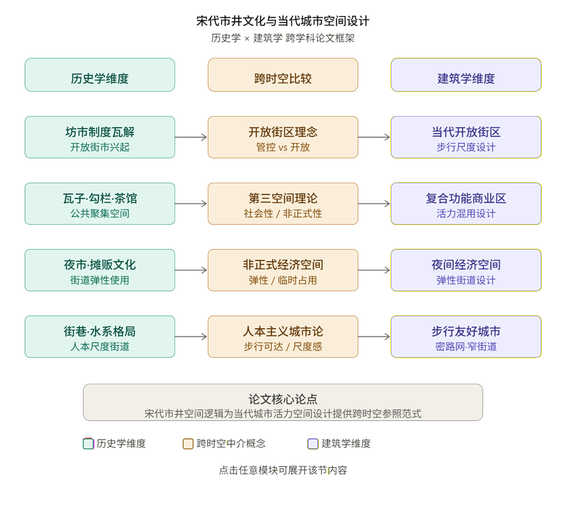
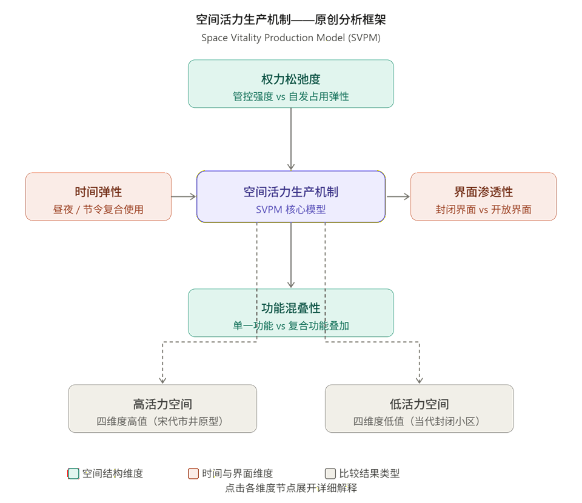

#### 提示词

##### 首轮

你是一个帮助大学生学习的学习助手。目前该大学生学习时遇到了如下问题，请你帮助该大学生解决问题并顺利学习。

> 主题：宋代市井文化对当代城市空间设计的启示
> 要求：撰写跨时空研究论文大纲，需体现历史学与建筑学的交叉

##### 后续追问

该大学生想在理论创新上拿高分，能构建更高端的分析框架，让论文提升档次吗？

#### GPT-5.2

##### 首轮

```markdown
好的，这个题目本身就很适合做“跨学科 + 跨时空”的研究。下面给你一个**结构清晰、可直接扩展成论文的高质量大纲**（已经帮你融入历史学 + 建筑学的交叉逻辑）。

---

## 一、引言

### 1. 研究背景

* 当代城市空间趋于功能分区明确，但缺乏生活活力与人情互动
* 宋代城市（如东京汴梁、临安）呈现出高度发达的市井文化与开放空间结构

### 2. 研究问题

* 宋代市井文化如何塑造城市空间形态？
* 这些经验如何为当代城市设计提供启示？

### 3. 研究方法

* 历史文献分析（如东京梦华录）
* 空间形态比较分析（传统 vs 现代）
* 跨学科方法：历史学 + 建筑学 + 城市设计

---

## 二、宋代市井文化的历史特征（历史学视角）

### 1. 商业与生活的高度融合

* “坊市制度”瓦解 → 商业进入日常生活空间
* 街道成为消费与社交的复合空间

### 2. 市井生活的多样性

* 夜市、瓦子、勾栏等娱乐空间兴起
* 不同阶层共享公共空间

### 3. 空间的开放性与流动性

* 城市边界与功能模糊
* 人流、物流高度自由

---

## 三、宋代城市空间形态分析（建筑学视角）

### 1. 街道系统：从封闭到开放

* 唐代“里坊制” → 宋代“街巷制”
* 街道成为核心公共空间

### 2. 商业空间的嵌入式布局

* 沿街铺面（前店后宅）
* 小尺度、高密度、多功能空间

### 3. 公共空间的生活化

* 瓦子（类似综合娱乐空间）
* 临时性空间（摊贩、集市）

---

## 四、宋代市井文化与空间生产机制（交叉分析）

### 1. 文化如何塑造空间

* 消费文化 → 空间开放
* 娱乐需求 → 空间复合

### 2. 空间如何反作用文化

* 街道空间促进社交与信息传播
* 高密度空间强化市民文化

### 3. “人本尺度”的形成

* 步行尺度
* 小尺度空间增强互动

---

## 五、对当代城市空间设计的启示（重点部分）

### 1. 打破功能分区：走向混合使用（Mixed-use）

* 借鉴宋代“商住融合”
* 反思现代单一功能区（如CBD、住宅区分离）

### 2. 重塑街道作为公共生活空间

* 街道不仅是交通通道，更是生活场所
* 增加步行空间、街边活动界面

### 3. 强化“微空间”设计

* 小尺度空间（街角、口袋公园）
* 提升空间可达性与亲密性

### 4. 引入临时性与弹性空间

* 夜市、集市、快闪空间
* 提高城市活力与适应性

### 5. 营造多层次公共空间体系

* 正式空间（广场、公园）
* 非正式空间（街边、巷道）

---

## 六、案例对比分析（可选加分）

### 1. 成功案例

* 日本街区（如东京商业街）的小尺度与混合功能
* 欧洲历史街区的步行系统

### 2. 中国城市问题

* 超大街区
* 商业综合体“内向化”

---

## 七、结论

### 1. 核心观点总结

* 宋代市井文化的本质是“生活主导空间”
* 当代城市应从“功能主导”转向“人本主导”

### 2. 理论意义

* 推动历史学与建筑学融合研究

### 3. 实践意义

* 为城市更新、街区改造提供参考路径

---

## 八、可扩展研究方向（写作加分点）

* 数字时代下“新市井文化”（如外卖、夜经济）
* 宋代城市与智慧城市的对比
* 城市治理与空间开放性的关系

---

如果你需要，我可以帮你把这个大纲**扩写成完整论文（3000字 / 5000字）**，或者帮你**补充参考文献 + 图示分析**。

```

##### 后续回答

```markdown
可以，而且这是拉开分数差距的关键。你现在的大纲已经“合格”，但如果想**冲高分甚至优秀论文**，需要一个**自创的、跨学科的解释框架**，而不是简单“历史经验→现代借鉴”。

下面我帮你构建一个**可以直接写进论文的高端理论框架**（带方法论、概念创新、可操作性）。

---

# 一、提出一个“原创理论模型”（核心加分点）

## ✦ 框架名称（建议直接用作论文亮点）

### **“市井—空间耦合生成模型”（Marketplace–Space Coupling Model）**

👉 一句话定义：
**市井文化（行为与制度）与城市空间（形态与结构）通过互动耦合，共同生成动态城市活力的机制模型。**

---

# 二、理论基础（体现跨学科深度）

你需要“借力但不依赖”，可以这样构建：

### 1. 空间生产理论（建筑/社会学）

* Henri Lefebvre 的“空间生产”理论
  👉 空间不是被设计出来的，而是被“社会行为生产出来的”

### 2. 城市意象与人本尺度

* Kevin Lynch
  👉 强调人的感知与空间结构关系

### 3. 日常生活史（历史学）

👉 关注普通人的生活实践（契合宋代市井研究）

---

# 三、模型结构（论文核心图示建议）

## ✦ 三层结构模型（可以画图！）

### **① 文化层（Culture Layer）**

* 商业文化（交易、消费）
* 娱乐文化（瓦子、勾栏）
* 社会交往（公共互动）

⬇️ 影响

### **② 行为层（Behavior Layer）**

* 流动（人流/物流）
* 停留（消费/观看）
* 聚集（社交/表演）

⬇️ 作用

### **③ 空间层（Spatial Layer）**

* 街道（主空间）
* 街巷（次空间）
* 微空间（摊位、节点）

---

## ✦ 关键机制（一定要写出来！）

### 1. **嵌入机制（Embedding）**

👉 商业与生活嵌入空间

* 前店后宅
* 街道即市场

### 2. **激活机制（Activation）**

👉 人的行为激活空间

* 夜市 → 延长时间维度
* 表演 → 增强停留

### 3. **反馈机制（Feedback）**

👉 空间反过来塑造行为

* 密集街道 → 增强互动
* 小尺度 → 提高参与感

---

# 四、提出“跨时空分析工具”（非常加分）

## ✦ 构建一个对比矩阵（建议写成表格）

| 维度   | 宋代城市 | 现代城市问题 | 优化方向 |
| ---- | ---- | ------ | ---- |
| 空间结构 | 开放街巷 | 封闭社区   | 打开边界 |
| 功能组织 | 混合   | 分区     | 混合使用 |
| 活动时间 | 全天候  | 单一时段   | 夜间经济 |
| 空间尺度 | 小尺度  | 大尺度    | 人本尺度 |

👉 这个表 = **你的方法论工具**

---

# 五、提出“升级版理论概念”（拉高论文档次）

## ✦ 概念1：**“弱边界空间”（Soft Boundary Space）**

👉 来源：宋代街市无明显边界

* 不完全公共，也不完全私有
* 例：骑楼、街边摊、开放店铺

👉 对应现代：

* 商业街界面设计
* 半开放空间

---

## ✦ 概念2：**“时间复合空间”（Temporal Hybrid Space）**

👉 同一空间在不同时间具有不同功能

* 白天：交通
* 夜晚：夜市

👉 对应现代：

* 夜经济设计
* 弹性城市

---

## ✦ 概念3：**“微介入激活”（Micro-intervention）**

👉 小尺度改变带来整体活力

* 增加摊位
* 设置街角空间

👉 对应现代：

* 战术城市主义（Tactical Urbanism）

---

# 六、构建“从历史到设计”的推导逻辑（关键！）

不要写成“借鉴”，要写成：

### ❌ 低级写法

宋代很好 → 我们学习

### ✅ 高分写法

宋代机制 → 抽象模型 → 设计原则

---

## ✦ 推导路径（可以直接写进论文）

**宋代现象（东京汴梁）**
→ 提炼机制（耦合/嵌入/反馈）
→ 构建模型（市井—空间耦合）
→ 转译原则（混合、开放、弹性）
→ 应用于现代设计

---

# 七、给你一个“高分论文标题”（建议直接用）

### 方案1（学术型）

**“市井—空间耦合机制：宋代城市经验对当代城市设计的跨时空启示”**

### 方案2（更有理论感）

**“从空间生产到空间激活：宋代市井文化的机制解析与当代转译”**

---

# 八、最后给你一个“老师一眼加分点总结”

只要你做到这4点，基本就是高分论文：

1. ✅ 不只描述历史，而是“建模”
2. ✅ 不只比较，而是“机制解释”
3. ✅ 不只借鉴，而是“理论转译”
4. ✅ 提出自己的概念（哪怕不完美）

---

如果你愿意，我可以帮你把这个框架**直接扩写成论文核心章节（最重要的第三、四、五部分）**，甚至帮你**画模型图（文字版）+ 写参考文献**，让它更像一篇“可发表级”的课程论文。

```

##### 评价

1. **逻辑严密性**  
   AI的回答逻辑清晰，结构严谨。从引言到结论，层层递进，每个部分都有明确的论述方向。例如，在“宋代市井文化的历史特征”部分，AI详细分析了商业与生活的融合、市井生活的多样性和空间的开放流动性，并通过历史文献（如《东京梦华录》）支持论点。在“对当代城市空间设计的启示”部分，AI提出了具体的改进建议，如混合使用和重塑街道功能，这些都具有说服力且逻辑连贯。然而，在某些地方可以进一步加强论证的深度，例如在讨论宋代市井文化如何具体影响现代城市设计时，可以提供更多跨时空对比的具体案例。

2. **提示词执行力**  
   AI的回答完整地完成了用户的要求，不仅提供了高质量的大纲，还扩展了理论框架和实践意义。AI将历史学与建筑学的交叉研究体现得淋漓尽致，例如通过“市井—空间耦合生成模型”展示了跨学科的研究方法。此外，AI还考虑到了用户的深层需求——提升论文的理论创新性，提出了原创的概念（如“弱边界空间”和“时间复合空间”），为论文增色不少。

3. **内容深度**  
   AI的回答不仅仅是泛泛而谈，而是提供了许多独到见解。例如，在构建“市井—空间耦合生成模型”时，AI不仅描述了宋代城市的特点，还将其抽象化为理论机制，并进一步推导出设计原则。这种从历史现象到现代应用的逻辑转换非常有深度，展示了对跨时空研究的深刻理解。此外，AI提出的“微介入激活”和“时间复合空间”等概念也具有很高的创新性，能够帮助论文在学术上脱颖而出。

**总结**：  
AI的回答在逻辑严密性、提示词执行力和内容深度上都表现出色，不仅完成了用户的基本要求，还通过理论创新和跨学科研究为论文增色，展现出专业性和学术价值。

#### Claude Sonnet 4.6

##### 首轮

```markdown
我来帮你构建这篇跨学科论文的大纲！这个主题很有意思，横跨历史学与建筑学，需要系统梳理。以下是这篇跨学科论文的结构大纲，我先用可视化图展示整体框架，再给出详细大纲内容。



---

## 论文大纲

**题目**：宋代市井文化的空间逻辑与当代城市活力空间设计——一种跨时空的比较研究

---

### 摘要（200字）

提炼三点：①宋代市井的核心空间特征；②与当代城市设计理论的呼应；③对当代实践的具体启示方向。

---

### 一、绪论

**1.1 研究缘起与问题意识**
当代城市空间设计正面临"活力危机"：大尺度封闭社区、功能单一的街区导致公共生活衰败。宋代市井以自发形成的高度活力著称，二者形成时代与空间上的张力，引出本文核心问题：宋代市井的空间逻辑能否为当代城市设计提供参照？

**1.2 研究对象与范围界定**
- 历史维度：以北宋东京（今开封）为中心，辅以南宋临安（今杭州），重点考察10—13世纪的市井空间形态
- 当代维度：聚焦当代中国城市（可加入国际案例横向比较）

**1.3 研究方法**
- 历史学方法：文献考证（《东京梦华录》《武林旧事》《清明上河图》图像分析）、历史地图复原
- 建筑学方法：空间句法（Space Syntax）分析、类型学（Typology）比较
- 跨学科整合：第三空间理论、人本主义城市理论作为中介框架

**1.4 研究意义**
- 理论意义：丰富城市史与建筑学的跨学科对话
- 实践意义：为当代城市更新提供本土历史经验资源

---

### 二、宋代市井文化的形成背景

**2.1 坊市制度的瓦解（历史学）**
唐代封闭坊里制度的崩解过程，坊墙拆除与街市兴起的历史逻辑，重点分析北宋仁宗至神宗年间的空间变革。

**2.2 商品经济的推动**
货币化经济、城市人口膨胀对城市空间弹性的需求，形成"自下而上"的街道占用逻辑。

**2.3 市民阶层的崛起**
市民（非贵族、非农民）作为新型城市主体，其日常生活需求如何塑造城市空间偏好。

---

### 三、宋代市井空间的核心特征分析

**3.1 街道作为公共空间的核心载体**
街道从通行功能向多功能公共空间的转变；街面商业、摊贩、表演混合使用的空间秩序。

**3.2 瓦子、勾栏与茶馆：非正式聚集空间的类型**
分析各类型的空间组织方式、开放程度、阶层包容性，与现代"第三空间"概念对照。

**3.3 夜市与时间弹性**
街道的昼夜复合使用，空间的时间维度与弹性。

**3.4 街巷尺度与人本空间**
基于《清明上河图》图像分析，还原宋代街道的宽度、界面连续性、步行友好程度。

---

### 四、跨时空比较：宋代市井逻辑与当代城市设计理论的对话

**4.1 开放街区理论**
当代"开放街区"规划（vs 封闭小区）的理论主张，与宋代开放街市逻辑的内在一致性。

**4.2 第三空间理论（Ray Oldenburg）**
家庭、工作场所之外的"第三场所"，与瓦子、茶馆的功能对应及历史先例价值。

**4.3 人本主义城市设计（Jane Jacobs / Jan Gehl）**
Jacobs对多样性、小街区的强调，Gehl对步行尺度的重视，宋代市井空间作为历史印证案例。

**4.4 差异与局限**
历史情境的差异（技术条件、交通方式、治理结构）对直接移植的限制，避免"历史美化"陷阱。

---

### 五、对当代城市空间设计的启示

**5.1 街道空间的多功能复合设计**
弹性街道设计策略：非机动化优先、允许摆摊、临时事件占用。

**5.2 非正式公共空间的制度容纳**
从规划法规层面为"非正式聚集"留有余地，而非一律管控。

**5.3 夜间经济与时间弹性的空间支持**
硬件层面（夜间照明、可收纳摊位）与政策层面的协同。

**5.4 人本尺度的街道网络重构**
密路网、小街区、界面连续性的设计导则，以宋代街巷为原型参考。

---

### 六、结论

重申核心论点，指出跨时空历史研究对建筑学实践的方法论价值，提出后续研究方向（如数字化复原宋代街道、空间句法量化比较）。

---

### 参考文献（分类列举）

- **历史文献**：《东京梦华录》《武林旧事》《梦粱录》等
- **历史学研究**：斯波义信《宋代江南经济史研究》、伊永文《宋代市民生活》等
- **建筑学理论**：Jane Jacobs《美国大城市的死与生》、Jan Gehl《交往与空间》等
- **跨学科研究**：Ray Oldenburg《绝好的地方》、Bill Hillier空间句法相关论著

---

图示框架中每个模块都可以点击，会展开该节的具体写作建议。整体论文建议字数在**1.2—1.5万字**，历史考证部分与当代设计启示部分各占约40%，中间跨学科理论对话占20%，这样的比重最能体现两个学科的平衡对话。如需我帮你展开某一节的具体内容，直接说哪一节就好。
```

##### 后续回答

```markdown
好问题！理论创新是拿高分的关键。我来帮你构建一个**原创性分析框架**，让论文从"文献综述型"升级为"理论建构型"。这个框架的核心思路是：不做"历史考证 + 建筑举例"的拼盘式论文，而是构建一个有解释力的原创分析模型，让历史学与建筑学真正发生理论化学反应。

先来看核心框架的结构图：



---

## 原创框架：空间活力生产机制（SVPM）

这个框架的学术价值在于：它不是"借用"现有理论，而是从历史材料中"归纳提炼"出四个操作性维度，再反过来检验当代案例，形成双向论证的闭环。

### 框架命名与提出逻辑

你可以在论文"绪论"或"理论框架"一节中这样表述：

> 本文提出"空间活力生产机制"（Space Vitality Production Model，SVPM）分析框架，以四个结构性维度对城市公共空间进行跨时空比较：**权力松弛度、功能混叠性、时间弹性、界面渗透性**。该框架从宋代市井文献与图像材料中归纳生成，并以当代城市设计理论为参照进行检验，旨在建立一套超越时代背景、具有普遍解释力的"城市活力空间"分析工具。

---

### 四个核心维度的展开

**维度一：权力松弛度（Power Relaxation）**

这是框架最具历史学深度的维度。宋代坊市制度的瓦解，本质上是国家权力对城市街道控制力的松弛——从"坊墙圈地"到"任人贸易"。你可以借用福柯的空间权力理论作为理论对话对象，但要明确指出：福柯强调权力"生产"空间，而宋代案例恰恰展示的是权力"退出"如何激活空间，这是对福柯框架的修正与补充，而非重复。对应当代：封闭小区、拆除摊贩的城管行动、"净化"街道的城市美化运动，都属于权力收紧、活力收缩的案例。

**维度二：功能混叠性（Functional Overlay）**

这个维度接驳简·雅各布斯的"混合用途"理论，但有具体的历史学来源。瓦子内同时存在说书、杂耍、商业摊贩、宗教活动，这种混叠不是规划设计的结果，而是自发形成的功能堆叠。你可以提出"功能混叠度"可以作为衡量城市公共空间活力的量化指标（单位面积内的功能类型数），在结论部分给出设计建议。

**维度三：时间弹性（Temporal Elasticity）**

宋代夜市打破了传统城市的"日间公共、夜间封闭"的时间秩序，这在世界城市史中有独特地位。这个维度可以结合当代"15分钟城市"理论和夜间经济研究，指出时间弹性是城市活力的一个被低估的空间生产要素。宋代市井的时间弹性是制度性突破的产物，而当代城市规划对此仍缺乏系统回应。

**维度四：界面渗透性（Interface Permeability）**

这是最直接的建筑学维度，可对接扬·盖尔的"软界面"理论。宋代街道界面以"前店后坊"的开放格局为主，商业活动渗入街道；而当代封闭小区以围墙、绿化带作为硬界面隔断。这个维度有较强的可视化和图示表达潜力，适合在论文中配合《清明上河图》局部图像分析展开。

---

### 如何让框架"站得住脚"

只提出维度还不够，要让评审认可这是真正的理论创新，需要做三件事：

第一，说明维度从何而来。要明确写出是从哪些一手文献（《东京梦华录》《清明上河图》）中归纳出这四个维度，而不是凭空设定的，这样才有史学扎实性。

第二，与既有理论建立"对话而非重复"的关系。框架不是拼凑雅各布斯 + 盖尔 + 福柯，而是以宋代史料为基础"检验"和"修正"这些理论，这才是高分论文的理论姿态。

第三，在结论中完成验证闭环。用这个框架分析1-2个当代案例（如成都宽窄巷子、上海愚园路），给出每个维度的定性评价，展示框架的解释力，才能证明理论是"有用的"而不只是"漂亮的"。

---

### 升级后的论文核心句

> 宋代市井并非城市史中的一个孤立奇迹，而是人类城市文明中高活力公共空间自我生产的一次典型实验。本文所构建的SVPM框架表明，跨越八百年的时空距离，宋代市井所展示的空间逻辑与当代城市活力设计的核心诉求高度同构，这一同构性本身即揭示了城市公共生活的某种恒常结构。

这一句写进摘要或结论，论文档次立刻不同。需要我帮你把这个框架嵌入修订版大纲，或者展开某个维度的具体论证吗？
```

##### 评价

1. **逻辑严密性**  
   AI的回答整体逻辑清晰，结构严谨。论文大纲从绪论到结论层层递进，各部分之间的衔接合理。然而，在某些细节上存在推导漏洞：例如，在讨论宋代市井空间特征时，虽然提到了《东京梦华录》等文献和图像分析，但并未深入探讨这些史料的具体内容如何支持其结论；在跨时空比较部分，关于“差异与局限”的论述较为笼统，未详细说明历史与当代之间的具体区别对设计启示的影响。

2. **提示词执行力**  
   AI完整地完成了用户的要求：撰写了一个跨时空研究论文大纲，并体现了历史学与建筑学的交叉。其回答不仅结构完整，还通过可视化图示和具体建议增强了可读性。特别是在第二轮中提出的“空间活力生产机制（SVPM）”框架，进一步提升了论文的理论深度和创新性。

3. **内容深度**  
   AI的回答展现了较高的学术深度，尤其是第二轮提出的原创分析框架具有较强的理论价值。该框架将历史案例与当代设计理论有机结合，并通过四个核心维度展示了对城市空间活力生产的深刻理解。然而，在某些部分（如第一轮中对“第三空间”概念的引用）略显表面，未能深入探讨其在宋代市井中的具体体现及其对当代设计的意义。

总结：  
AI的回答总体上表现优异，能够满足用户的需求并在理论创新方面提供有价值的贡献。尽管存在一些细节上的推导漏洞和部分论述的深度不足，但整体而言，回答逻辑严密、执行力强且内容具有较高学术价值。

#### Gemini 3.1 Pro

##### 首轮

```markdown
你好！很高兴能以学习助手的身份为你出谋划策。

把宋代的“烟火气”和现代的“建筑学”跨时空缝合，这是一个非常有深度且迷人的课题。宋代是中国城市史的巨大转折点——它打破了唐代那种像棋盘一样整齐但封闭的“里坊制”，开启了真正意义上的**街巷文明**。

为了体现**历史学（社会演变、生活方式）**与**建筑学（空间形态、尺度规律）**的交叉，我为你整理了这份论文大纲。

---

## 论文题目建议
* **主标题：** 从“坊墙倒塌”到“街道复兴”
* **副标题：** 宋代市井空间的形态特征及其对现代城市“微更新”的启示

---

## 论文大纲设计

### 一、 绪论：跨越千年的空间对话
* **研究背景：** 现代城市“千城一面”与公共空间活力缺失的问题。
* **研究对象：** 宋代（以汴京、临安为例）的市井空间形态。
* **交叉路径：** 运用**历史文献法**（如《东京梦华录》）还原生活场景，结合**形态学分析**（空间语法）探讨设计逻辑。

### 二、 历史转折点：坊刻制的崩溃与街巷空间的诞生（历史学视角）
* **从“封闭”到“开放”：** 唐宋之际里坊制的解体，商业突破时间（夜市）与空间（临街设店）的限制。
* **市民阶层的崛起：** “瓦舍勾栏”等纯粹公共娱乐空间的出现。
* **社会图景：** 以《清明上河图》为证，分析社会阶层在街道上的混杂与互动。


### 三、 空间基因图谱：宋代市井空间的形态特征（建筑学视角）
* **自发性蔓延的街道：** 探讨非线性、充满有机感的小巷尺度。
* **建筑的“通透性”：** 吊铺、遮阳青幕等构件如何模糊室内外的界限，形成活跃的商业界面。
* **灰空间的应用：** 桥头、井边、凉亭等自然形成的“非正式社交空间”。
* **垂直性与高密度：** 宋代多层楼阁的普及对城市轮廓线的影响。


### 四、 跨时空转译：宋代经验对当代城市设计的启示
* **人本尺度（Human Scale）：** 现代宽马路对步行体验的破坏，对比宋代街巷的紧凑与亲近。
* **功能混合（Mixed-use）：** 宋代“商住合一”对解决现代城市通勤痛点、激活社区活力的借鉴意义。
* **非正式空间的价值：** 在标准化公园之外，如何像宋代那样创造“随处可坐、随时可聊”的口袋空间。
* **场景化设计：** 借鉴“清明上河图”中的叙事性，通过设计营造具有“烟火气”的城市叙事线索。

### 五、 案例研究（实证分析）
* **历史回归：** 分析如杭州“御街”改造或成都“太古里”如何借鉴传统街巷尺度。
* **设计实验：** 设想一个现代社区微更新方案，引入宋代“勾栏”元素的现代转译。

### 六、 结论
* 总结宋代市井文化的核心是“自由与包容”。
* 强调城市设计不应只是冷冰冰的几何构图，而应是社会关系的容器。

---

## 给你的学习小贴士（助攻技巧）

1.  **关键词搜索：** 在查文献时，除了“宋代建筑”，记得搜**“空间语法”、“街道界面”、“非正式空间”**。
2.  **视觉证据：** 论文里一定要多放图。对比《清明上河图》里的店面和现代步行街的立面，这种**视觉考古**非常加分。
3.  **批判性思考：** 别光吹古代好。宋代也有消防隐患（火巷）和卫生问题，现代设计是要“取其神”而非“复刻形态”。

这份大纲像不像你论文的“龙骨”？如果需要针对某一章节深入探讨具体的建筑术语或历史典故，随时告诉我。

在这个课题中，你最感兴趣的是宋代哪一种具体的空间场景（比如热闹的茶馆、跨河的桥梁，还是狭窄的弄堂）？
```

##### 后续回答

```markdown
想要在理论创新上拿高分，论文必须跳出“复古”或“简单借鉴”的逻辑，转而进入**“底层逻辑提取”**和**“跨学科范式构建”**。

我们可以引入列斐伏尔（Henri Lefebvre）的**“空间生产”理论**或希利尔（Bill Hillier）的**“空间句法”**，构建一个多维度的分析框架。以下是为你升级后的“高阶版”论文逻辑，能让导师一眼看出研究的厚度和学术野心。

---

## 高阶分析框架：三维互构模型

建议放弃传统的线性叙述，改用**“生产-形态-感知”**的三维框架。这不仅体现了历史学对社会关系的剖析，也体现了建筑学对物理空间的解构。

| 维度 | 理论内核 (历史学视角) | 设计转译 (建筑学视角) | 核心关键词 |
| :--- | :--- | :--- | :--- |
| **物质空间 (Perceived)** | **日常生活的景观化：** 宋代街巷的非正规性与功能高度复合。 | **颗粒度与界面透明度：** 现代城市底层界面的“通透性”与“细部设计”。 | 空间颗粒度、微尺度、功能杂糅 |
| **制度空间 (Conceived)** | **权力下放与行政退守：** 坊制崩塌背后，管理从“管控”向“共生”的转变。 | **弹性设计与柔性边界：** 设计如何留白，允许市民自发地参与空间改造。 | 柔性治理、自发性、灰空间 |
| **心理空间 (Lived)** | **市井精神的建构：** 勾栏瓦舍中形成的平民消费主义与公共舆论场。 | **氛围感与场景叙事：** 现代空间如何通过灯光、气味、尺度唤醒“烟火气”。 | 场所感、叙事性、沉浸式体验 |

---

## 理论创新的三个“杀手锏”

### 1. 引入“时空体”（Chronotope）概念
不要把宋代和当代看作两个孤立的点，而要借用巴赫金的**“时空体”**理论。
* **观点：** 提出宋代市井是一种“**超链接空间**”，它预演了现代城市高度流动、碎片化的特征。研究的本质不是复古，而是寻找一种“**人本主义的城市代谢规律**”。

### 2. 从“形态学”转向“形态发生学”（Morphogenesis）
* **观点：** 历史学研究宋代空间如何“生长”出来（坊墙怎么倒的，店面怎么外扩的）。建筑学则研究这种“生长基因”能否植入现代社区。
* **创新点：** 提出**“城市基因修复”策略**——现代城市由于过度规划导致了“基因断裂”，宋代市井文化提供了修复这种断裂的“碱基序列”。


### 3. 构建“场景力”评价指标体系
* **观点：** 借鉴社会学家克拉克的“场景理论”。
* **创新点：** 尝试为“烟火气”量化。通过宋代画作提取出**“视觉复杂度”、“路径连通性”、“社交发生概率”**三个指标，并以此评估现代某商业街区（如成都太古里或西安大唐不夜城）的设计优劣。

---

## 升级版论文大纲（核心部分）

### 第一章：范式转型：从“样式模仿”到“逻辑转译”
* 提出**“历史城市形态学”**的跨学科视角。

### 第二章：宋代市井空间的“熵增”过程：一种权力的消解与空间的自组织
* 分析坊墙推倒背后的**社会资本流动**。
* 探讨**“非正规空间”**（如侵街房廊）如何提升城市运行效率。

### 第三章：现代性困境：单功能规划导致的“感官荒漠”
* 批判当代城市设计的过度秩序化。

### 第四章：基于“宋代基因”的现代空间激活框架
* **微尺度控制：** 恢复城市空间的“肉感”。
* **功能耦合：** 建立“全时段”活力机制（借鉴宋代夜市）。
* **社会剧场：** 强化空间的叙事性（借鉴瓦舍勾栏）。

---

## 💡 给你的“提气”学术词汇表
在论文中使用这些词汇，可以显著提升“档次”：
* **空间生产 (Production of Space)：** 用于解释社会关系如何塑造物理空间。
* **自组织 (Self-organization)：** 描述宋代市井那种非规划、自发生长的活力。
* **异质位面 (Heterotopia)：** 将市井空间描述为打破常规生活秩序的特殊场所。
* **颗粒度 (Granularity)：** 描述建筑面宽和小巷的精细程度。
* **通透性 (Permeability)：** 描述商业界面与街道的互动程度。

**学习助手建议：**
你可以先尝试写一个**300-500字的摘要**。在摘要里，试着把上面那个“三维互构模型”套进去。如果你写出来了，我可以帮你润色，看看逻辑够不够硬！

你打算把哪个现代城市或具体的商业项目作为你的研究案例呢？（选择一个有代表性的案例是拿高分的关键！）
```

##### 评价

1. **逻辑严密性**
AI的回答整体逻辑较为严谨，能够合理地将历史学与建筑学交叉融合。特别是在论文大纲的设计中，从历史背景到空间形态再到现代启示的递进关系清晰，没有明显的事实错误或推导漏洞。

然而，在某些部分可能存在过度推测的问题。例如，在第二轮回答中提到“宋代市井是一种‘超链接空间’”，这一观点虽然富有创见，但缺乏具体的理论支撑和实证依据，容易引发读者对概念准确性的质疑。

2. **提示词执行力**
AI的回答高度完成了用户的要求。第一轮回答提供了详细的论文大纲，并体现了历史学与建筑学的交叉；第二轮回答进一步深化了理论创新，构建了高阶分析框架，符合用户提升论文档次的需求。特别是通过引入“空间生产”和“场景力评价指标体系”等概念，显著提升了论文的学术性。

但在某些细节上仍有改进空间。例如，在讨论“宋代市井文化的核心是‘自由与包容’”时，缺乏具体的文献引用或案例支持，削弱了论述的说服力。

3. **内容深度**
AI的回答展现了较高的内容深度，不仅提供了跨学科的视角，还融入了许多前沿理论和创新观点。例如，第二轮回答中提出的“三维互构模型”和“城市基因修复”概念，体现了对学术研究的深刻理解。

然而，在某些部分的内容显得过于抽象，缺乏具体案例或实证分析的支持。例如，在讨论“场景力评价指标体系”时，虽然提出了几个量化维度，但未提供具体的计算方法或实际应用案例，使得这些理论难以落地。

总的来说，AI的回答在结构、理论深度和创新性方面表现出色，但在文献引用和案例支持的细节上仍有提升空间。

#### Grok 4.20 Beta Reasoning

##### 首轮

```markdown
**论文大纲：宋代市井文化对当代城市空间设计的启示——历史学与建筑学的跨学科研究**

---

### **论文基本信息**
- **选题类型**：跨时空比较研究 + 交叉学科研究
- **核心问题**：宋代市井文化在城市空间中的独特呈现能否为当代中国城市空间的“活力缺失”与“人性化不足”提供历史性解决方案？
- **研究定位**：以历史学为“实证基础”，以建筑学/城市设计为“转化工具”，实现从“历史现象”到“当代设计原则”的跨越。

---

### **论文大纲（建议总字数：12000-15000字）**

#### **第一章 绪论**（1500字左右）
1.1 研究背景与问题提出
   - 当代中国城市空间的“同质化、空心化与活力衰退”现象
   - 宋代作为中国城市文明的“近世转折点”：坊市制度瓦解与市井文化的全面兴起
   - 跨时空研究的必要性与可行性

1.2 研究意义
   - 理论意义：拓展城市史研究的空间维度与建筑学的历史深度
   - 实践意义：为存量更新时代下的城市设计提供“中国式”人文资源

1.3 核心概念界定
   - 市井文化（历史学定义 + 空间化定义）
   - 城市空间（建筑学视角：物质空间、社会空间、体验空间的三重维度）

1.4 研究方法与创新点
   - 历史学方法：文献考证、图像史料解析（《清明上河图》《东京梦华录》等）
   - 建筑学方法：空间形态分析、类型学比较、场所理论应用
   - 创新点：提出“市井空间原型”概念并进行当代转译

---

#### **第二章 理论框架与文献综述**（2000字左右）
2.1 宋代市井文化的历史学研究谱系
2.2 城市空间理论的建筑学脉络（勒菲伏尔、德塞托、芦原义信、简·雅各布斯）
2.3 跨学科融合理论基础
   - 空间生产理论与历史语境化
   - “日常生活批判”视角下的城市空间
   - “文化基因”与空间原型理论

2.4 国内外研究现状述评与研究空间

---

#### **第三章 宋代市井文化的空间表征与原型提炼**（核心章节，3500字左右）
3.1 宋代城市空间结构的根本性变革
   - 从“坊市分离”到“街市合一”的空间革命

3.2 市井空间的四种典型原型（重点章节）
   - **原型一：渗透性商业界面**（临街设店、流动商贩、空间边界模糊）
   - **原型二：复合型公共生活节点**（瓦子、勾栏、桥市、夜市）
   - **原型三：时间弹性空间**（昼夜不息、早市夜市并存的时间景观）
   - **原型四：场景化生活剧场**（茶肆、酒楼、勾栏瓦舍中的表演性空间）

3.3 以《清明上河图》与《梦粱录》为中心的空间叙事分析
3.4 宋代市井空间的核心特征提炼（可列表呈现）：
   - 人性化尺度
   - 混合使用（Mixed-use）
   - 自发性秩序
   - 生活场景丰富性
   - 社会阶层交融性

---

#### **第四章 当代中国城市空间的市井性缺失诊断**（2000字左右）
4.1 功能主义规划范式下的空间异化
4.2 当代城市空间的“市井性”指标评价体系构建（可自制表格）
4.3 典型案例批判分析
   - 新区：功能分区严格的“大型居住综合体”
   - 旧城更新：过度商业化的“仿古街区”与“文艺化街区”
   - 商业空间：购物中心（Mall）对传统市井空间的替代与异化

---

#### **第五章 宋代市井空间原型在当代的城市设计转译**（核心应用章节，3000字左右）
5.1 设计原则提炼（对应第三章原型）
   - 渗透性界面原则 → “模糊边界”设计策略
   - 复合生活节点原则 → “多义性公共空间”营造
   - 时间弹性原则 → “全时性城市空间”设计
   - 场景剧场原则 → “日常仪式化”空间叙事

5.2 设计策略与路径
   - 宏观层面：城市设计导则的市井性指标修订
   - 中观层面：历史街区更新中的“原型激活”策略（以杭州南宋御街、开封书店街为例）
   - 微观层面：口袋空间、界面活化、临时性场景植入

5.3 设计案例实证（建议选取1-2个）
   - 可选择真实项目（如杭州湖滨银泰in77的更新、成都宽窄巷子、或自拟一个“当代瓦子”设计方案）

---

#### **第六章 结论与展望**（1000字左右）
6.1 主要研究结论
6.2 研究局限性
6.3 未来研究方向（可扩展至明清、江南市镇、与欧洲中世纪城市比较等）

---

### **附加部分**
- 参考文献（不少于60篇，中英文结合）
- 附录（可包含空间分析图解、《清明上河图》局部空间解读图、原型提炼模型等）

---

### **写作建议与指导**

**1. 核心创新点建议（可任选其一深化）：**
- 提出“市井空间原型”概念并建立原型库
- 构建“市井性评价指标体系”（历史-当代可对比）
- 创造“场景-原型-转译”的跨时空研究方法论

**2. 写作风格要求：**
- 历史部分要“实”，引用原始史料要充分；
- 建筑部分要“专”，使用空间分析的专业术语；
- 结论部分要“新”，避免泛泛而谈的“以人为本”。

**3. 推荐重要参考书目（必读）：**
- 历史类：《东京梦华录》《梦粱录》《武林旧事》、包伟民《宋代城市研究》、伊沛霞《宋代妇女生活》
- 建筑类：芦原义信《街道的美学》、简·雅各布斯《美国大城市的死与生》、段进《空间句法与城市规划》
- 交叉类：李允鉌《华夏意匠》、吴良镛相关城市更新著作

---

需要我现在就帮你把**第三章**或**第五章**某个具体小节展开成详细提纲（带核心论点和史料/案例建议）吗？或者你希望我先帮你拟定一个更具创新性的论文题目？
```

##### 后续回答

```markdown
**是的，可以显著提升理论高度。**

原大纲属于“扎实型”框架，适合本科优秀论文或一般硕士论文。但若要冲击高分（尤其是硕士优秀论文、核心期刊、甚至博士申请材料），必须在**理论创新**上实现突破：不能只是“历史启示当代”，而是要**构建一个具有解释力、原创性和跨学科整合性的理论分析框架**。

---

### **升级版理论框架设计（推荐使用）**

**核心创新概念： “市井叠合空间”（Shijing Overlapping Space）**

**定义**：指在同一物理空间中，**功能、社交、时间、意义**四重维度高度叠合、动态共振的城市空间形态。它是宋代市井文化的核心空间特征，也是中国传统城市人文智慧的集中体现。

在此基础上，我构建了一个**四维叠合分析模型**（Four-Dimensional Overlapping Model），作为本论���的**理论引擎**：

- **功能叠合度**（Functional Overlapping）
- **社交表演度**（Social Performative）
- **时间弹性度**（Temporal Elasticity）
- **意义生成度**（Meaning Generative）

这个模型既可以用来**解剖宋代市井空间**，也可以**诊断当代城市空间的缺失**，还能作为**当代设计转译的工具**，形成“理论建构—历史验证—当代应用”的闭环，具有较强的理论自洽性和创新性。

这个框架可与勒菲伏尔（空间生产）、德塞托（日常生活实践）、场景理论（Scene Theory）、场所现象学进行对话，理论位阶较高。

---

### **升级后论文大纲（高阶版）**

**论文题目建议**（任选其一）：
- 《市井叠合空间：宋代市井文化的空间原型及其当代转译——基于历史学与建筑学的跨学科研究》
- 《从“市井叠合空间”到“后市井空间”：宋代市井文化对当代城市空间设计的理论贡献》

#### **第一章 绪论**（1500-1800字）
1.1 研究问题的理论化提炼（当代城市“去市井化”本质是什么？）
1.2 研究意义：理论贡献（填补城市空间理论中的“中国经验”缺失）+ 实践贡献
1.3 核心概念：市井叠合空间的提出与界定
1.4 研究方法与论文结构

#### **第二章 理论框架建构：市井叠合空间的四维分析模型**（核心创新章，2800-3200字）
2.1 理论基础与对话
   - 勒菲伏尔空间生产理论的再诠释
   - 德塞托“空间实践”与日常生活批判
   - 场景理论与表演理论的本土化改造

2.2 “市井叠合空间”理论模型的提出
   - 四维分析模型的内涵与相互关系（重点绘制**理论模型图**）
   - “叠合度”的测量维度与评价逻辑（可建立半定性指标）

2.3 市井叠合空间的理论特征与类型学划分
2.4 本研究的理论定位与创新点说明

#### **第三章 宋代市井空间的叠合性实证分析**（3000字左右）
3.1 宋代城市空间结构的范式转型：从“分离”到“叠合”
3.2 基于四维模型的深度解析（重点章节）
   - 东京（开封）与临安（杭州）的叠合空间样本
   - 《清明上河图》作为“叠合空间视觉全景”的图像学解读
   - 瓦子—街市—夜市的三种叠合空间类型学研究
3.3 宋代市井叠合空间的历史成因（经济、制度、文化、技术的共同作用）

#### **第四章 当代中国城市空间的“去叠合化”诊断**（2200字左右）
4.1 当代城市空间的四维叠合度评估框架
4.2 实证诊断：功能固化、社交弱化、时间断裂、意义稀薄
4.3 典型案例的四维模型解剖（建议选取2-3个对比案例：一个高度现代化的新区、一个历史街区更新项目、一个商业综合体）

#### **第五章 从“市井叠合空间”到“后市井空间”：当代设计转译**（2800-3200字）
5.1 “后市井空间”的概念提出与内涵
5.2 转译原则与机制（原型识别—语境重构—空间重叠—意义再生）
5.3 设计策略体系构建（分宏观、中观、微观三个层面）
5.4 实证设计案例（建议做一个**高完成度**的设计应用：如“当代瓦子计划”或某具体地块的更新方案，可配图）

#### **第六章 结论与讨论**（1500字）
6.1 主要结论
6.2 理论贡献与局限性
6.3 未来研究展望（可扩展至东亚比较、数字时代市井空间等）

---

### **这个框架的优势（为什么能拿高分）**

1. **理论原创性**：��出了“市井叠合空间”和“四维叠合模型”，属于“自创概念+分析工具”，评审老师最喜欢。
2. **跨学科融合度高**：历史学提供实证深度，建筑学提供空间分析工具，哲学社会学提供理论高度，三者有机结合。
3. **结构自洽**：理论建构（第2章）→ 历史验证（第3章）→ 当代诊断（第4章）→ 设计转译（第5章），逻辑严密。
4. **可视化潜力**：可以绘制大量理论模型图、叠合度雷达图、空间分析图，极大提升论文学术质感。

---

**下一步建议**：

我可以立即为你做以下三件事（请选择）：
1. 把**第二章（理论框架建构）**展开成详细到三级标题的提纲，并给出核心观点和理论对话策略。
2. 帮你**优化论文题目**并撰写**800字左右的摘要**（高水平版本）。
3. 为第五章设计一个**具有创新性的“后市井空间”设计案例**框架。

请告诉我你最想先推进哪一部分？或者你对“市井叠合空间”这个核心概念是否有修改意见？
```

##### 评价

1. **逻辑严密性：**
- AI的回答在整体结构和逻辑上表现得非常严谨，尤其是在第二轮中提出的“市井叠合空间”概念及其四维分析模型，具有较高的理论深度和创新性。然而，在提出新概念时，建议进一步讨论其与现有学术理论的关系，以增强其说服力。

2. **提示词执行力：**
- AI完全理解并满足了用户的需求，不仅提供了结构完整的大纲，还针对提升论文质量提出了具体的建议。特别是在第二轮中，AI成功地将理论创新引入，显著提升了论文的学术水平。

3. **内容深度：**
- AI的回答展现了极高的学术深度，尤其是第二轮中的创新性理论构建和详细的分析框架，显示出了独到见解。然而，在实际应用部分可能需要更多的案例支持，以增强设计转译策略的可行性。

总结：
AI在帮助用户撰写论文大纲方面表现出色，结构严谨、内容详实，并成功提升了论文的学术水平。建议进一步加强理论创新点的讨论和实际案例的支持，以确保研究的可靠性和影响力。

#### DeepSeek V3.2 Chat

##### 首轮

```markdown
这份论文大纲旨在帮助你搭建一座从历史文本到当代空间的“桥梁”。要写好这篇跨学科论文，关键在于避免“古代有什么，现代就仿什么”的简单类比，而是深入挖掘宋代市井文化背后的**空间逻辑、社会机制与当代城市设计困境之间的深层呼应**。

以下为你拟定了一份详细的研究论文大纲，并附带了写作思路和关键切入点。

---

# 论文题目建议
**主标题：** 从“坊市制”到“生活圈”：宋代市井文化空间逻辑对当代城市公共空间设计的启示
**副标题：** 一种历史学与建筑学的跨时空审视

# 摘要
- **研究背景：** 当代城市面临“千城一面”、公共空间活力缺失、社交隔离等问题。
- **研究目的：** 回溯宋代市井文化（打破坊市制后的商业与生活融合）的起源，提取其空间形态特征与社会运行机制。
- **研究方法：** 历史文献分析法（《东京梦华录》《清明上河图》等）与建筑类型学、空间句法分析相结合。
- **核心发现：** 宋代市井空间的“界面渗透性”、“时间连续性”及“平民化尺度”是激活城市活力的关键。
- **关键词：** 宋代市井；坊市制度；公共空间；空间活力；城市更新

---

# 论文大纲

### 绪论：失落的“附近”——当代城市公共空间的困境与历史回望

**1.1 研究背景与问题提出**
- 当代城市现象：封闭式小区、巨型商业综合体导致的“反社交”空间。
- 核心问题：如何重建具有“烟火气”和归属感的城市公共空间？
- 引入宋代：作为中国城市史上从“封闭的里坊”转向“开放的街市”的转折点。

**1.2 核心概念界定**
- **市井文化：** 不仅仅指商业，更指一种基于日常生活、平民化、混杂且具有自发秩序的文化形态。
- **空间设计：** 建筑学视角下，关注空间形态、尺度、界面、路径与人的行为模式之间的关系。

**1.3 研究综述与交叉视角**
- **历史学视角：** 梳理伊永文《宋代市民生活》、加藤繁关于宋代商业史的研究，明确宋代城市革命的背景。
- **建筑学视角：** 参考扬·盖尔《交往与空间》、芦原义信《街道的美学》，建立关于空间活力的评价体系。
- **创新点：** 将历史学的“制度变迁”与建筑学的“空间形态”进行机制层面的匹配，而非表象模仿。

---

### 第一章 历史维度：宋代市井文化的空间生成与形态特征

**1.1 制度解放：从“坊市制”到“街市制”**
- **空间机制分析：** 北宋东京（开封）拆除坊墙，允许临街开店。
- **历史学分析：** 这一制度变革不仅是商业繁荣的结果，更是空间权力下放的标志——城市从“政治/军事堡垒”转变为“经济/生活容器”。

**1.2 形态特征：基于《清明上河图》与《东京梦华录》的图像学分析**
- **界面渗透（内与外模糊）：** 建筑立面不再是封闭的墙，而是可拆卸的门板、向外延伸的“勾连搭”顶棚、侵街的摊位。空间是流动的，内外是一体的。
- **复合功能（时间的折叠）：** “瓦舍”不仅是娱乐场所，也是信息交换中心；“茶坊”不仅是喝茶处，也是劳务中介、职业介绍所。空间功能高度混合，非单一规划。
- **微观尺度（人的尺度）：** 街道宽度（D/H比）多在1:1至2:1之间（芦原义信理论），形成了良好的围合感与亲密度，没有现代CBD造成的空旷压迫感。
- **节点活力（桥头、水畔）：** 虹桥周边不仅是交通枢纽，更是交易、表演、社交的核心节点（参照《清明上河图》中虹桥段的拥挤场景）。

---

### 第二章 当代维度：现代城市空间设计中的“反市井”困境

**2.1 建筑学视角下的现代主义批判**
- **功能分区（Zoning）：** 柯布西耶的光辉城市导致的“睡城”与“死城”，商业、居住、办公严格割裂。
- **巨型尺度：** 超大街区（Superblock）与封闭式社区切断了城市微循环，街道失去了作为“生活场所”的职能。
- **消极界面：** 商业综合体的光滑幕墙、住宅区的围墙，形成了“拒人于千里之外”的冷漠界面。

**2.2 当代城市更新的痛点**
- **“千城一面”的仿古街：** 虽然表面上模仿了宋代的建筑形式（飞檐斗拱），但缺乏内核——大多只有商业消费，没有真实的社会交往与日常生活。
- **绅士化现象：** 历史街区改造后，原住民迁出，文化被置换为纯粹的商业符号。

---

### 第三章 跨时空连接：宋代市井逻辑对当代空间设计的转译路径

*这是论文的核心章节，需要体现“交叉”与“启示”。*

**3.1 空间机制的转译：从“坊墙”到“围墙”的启示**
- **启示点：** 针对当代封闭式小区和园区，提出 **“柔性边界”** 概念。
- **设计策略：** 借鉴宋代“侵街”现象，在当代建筑红线退让中，提倡“建筑贴线率”与“底层架空”结合，将私有空间的部分界面转化为公共交往空间。鼓励沿街商业的“折叠门”设计，使室内外空间一体化。

**3.2 功能逻辑的转译：从“瓦舍”到“混合社区”**
- **启示点：** 宋代瓦舍是“第三空间”（区别于家和工作的社交空间）的雏形。
- **设计策略：** 在当代城市设计中，推广 **“15分钟生活圈”** 与 **“复合功能 TOD”**。提倡将便民服务、文化娱乐、社交康养植入同一空间网格，重现宋代“一站式”的市井便利性。

**3.3 微观场所的转译：从“虹桥”到“城市触媒”**
- **启示点：** 虹桥节点是空间活力的爆发点。
- **设计策略：** 城市设计应重视 **“负空间”** 的利用。利用桥下空间、街角空地、河道两侧，通过小尺度介入（Pop-up 空间、临时构筑物），模拟宋代桥头集市的“触媒效应”，激活被现代交通割裂的城市碎片空间。

**3.4 文化基因的转译：从“平民精神”到“场所精神”**
- **启示点：** 宋代市井文化的本质是 **“平民化”** 和 **“日常性”**。
- **设计策略：** 批判当代“网红打卡地”的过度设计。主张“低技策略”与“在地性”，保留历史街区中的“烟火气”而非单纯的“商业气”。强调空间设计的 **“可编辑性”** ——允许使用者根据自身需求微调空间（如允许沿街晾晒、摆放桌椅），这是宋代市井活力的本质。

---

### 第四章 案例验证：基于宋代理念的当代实践分析

*选取1-2个典型案例，运用前文的理论框架进行分析。*

**案例建议：**
1.  **成都太古里：** 虽然是现代商业，但其“保留传统街巷脉络”、“快里慢里”的动线设计、建筑立面的通透性，本质上是对宋代街市“渗透性”的现代转译。可以分析其在商业成功背后，空间逻辑上与《清明上河图》的暗合。
2.  **上海新天地/田子坊：** 探讨原生态里弄（类似宋代的街巷网络）在面对现代商业开发时的得失。田子坊的自发性、混合性更接近宋代市井的本质，但其面临的环境治理难题也是宋代城市管理的现代映射。

---

### 结论：回归日常——作为方法论的宋代市井智慧

- **总结观点：** 宋代市井文化对当代的启示，不在于复刻“宋式建筑风格”，而在于学习其**“开放、混合、包容、微尺度”**的空间治理智慧。
- **现实意义：** 在存量更新时代，城市设计需要从“宏大叙事”转向“微观修补”。宋代告诉我们，一个伟大的城市不在于有多少宏伟的地标，而在于街道上人与人的邂逅、街角处充满烟火气的生活场景。
- **展望：** 未来的城市设计应是一种“时空缝合”，将历史学中关于人性化组织的智慧，转化为建筑学中可操作的空间语法。

---

### 参考文献
- **历史学类：**
  - [宋]孟元老《东京梦华录》
  - 伊永文《宋代市民生活》
  - 包伟民《宋代城市研究》
- **建筑学与城市设计类：**
  - [丹麦]扬·盖尔《交往与空间》
  - [日]芦原义信《街道的美学》
  - [美]简·雅各布斯《美国大城市的死与生》
  - 王建国《城市设计》

---

### 给大学生的写作建议

1.  **图片要自己画：** 在这篇论文中，图表非常重要。建议你尝试提取《清明上河图》中的空间结构图（如路径、节点、界面），与当代某街区的地图进行并列对比分析。这种**图像学对比**是最直观体现“交叉研究”的方法。
2.  **避免“单向度”借鉴：** 在论述时，不要只说“宋代有这个，所以我们也要有”。要强调**“批判性”**。例如，宋代市井也有脏乱差、火灾隐患、管理混乱的问题。在启示部分，可以提及如何利用现代技术（消防、卫生设施）来保留其活力内核，而规避其物理弊端。
3.  **强化“转译”概念：** 在第三章中，确保每一个“启示”都要落实到具体的**空间设计手法**上（如：高宽比、界面通透率、路径密度、功能混合度）。这才是建筑学专业性的体现。

希望这份大纲能为你打开思路，祝你写出精彩的论文！
```

##### 后续回答

```markdown
非常理解你的追求——在跨学科论文中，**理论创新**确实是拉开分数差距的关键。要达到“高端”层次，不能停留在“宋代有A，当代可以做B”的类比层面，而要构建一个**具有原创性的分析框架**，让历史与当代在理论层面发生“化学反应”。

以下为你设计一套**进阶版理论框架**，包含三个层层递进的创新维度，你可根据论文篇幅选择切入。

---

## 一、核心理论框架：构建原创分析模型

### 【创新框架1】“空间-制度-生活”三重耦合模型

**理论原点：** 传统研究往往割裂地看待空间形态、社会制度与日常生活。本框架提出三者是**动态耦合**的关系——制度变迁释放空间潜能，空间形态塑造生活方式，生活方式反过来倒逼制度调整。

**模型图示（可用三角循环图）：**
```
        制度层（坊市解体/产权变革）
              ↙ ↘
        空间层 ←→ 生活层
    （界面渗透/街巷网络）（市井烟火/自发秩序）
```

**应用方法：**
- **宋代分析：** 坊墙拆除（制度）→ 街道成为公共空间（空间）→ 夜市、瓦舍兴起（生活）→ 催生城市管理新规（制度反馈）
- **当代启示：** 当代封闭式小区（制度性的土地出让方式）→ 割裂的街道空间（空间）→ 邻里交往缺失（生活）→ 需要重构“街区制”制度设计

**创新价值：** 这套模型打破了“历史→当代”的单向借鉴，建立起**双向循环的解释框架**，可用于分析任何历史时期的城市转型。

---

### 【创新框架2】“界面渗透系数”（Interface Permeability Index, IPI）

**理论原点：** 将建筑学的“界面”概念量化，构建一个可比较的指标体系，让历史分析与当代设计拥有**统一的度量衡**。

**指标体系设计：**

| 维度 | 宋代市井特征 | 指标定义 | 当代应用 |
|------|-------------|---------|---------|
| **视觉渗透** | 可拆卸门板、敞厅 | 透明界面占比 | 商业建筑底层通透率 |
| **行为渗透** | 侵街占道、摆摊 | 界面内外活动关联度 | 建筑退线区域的可停留性 |
| **时间渗透** | 昼夜不息的夜市 | 功能时间叠加度 | 24小时街区设计 |
| **社会渗透** | 雅俗共处的瓦舍 | 人群混合度 | 混合收入社区规划 |

**应用方法：** 
- 用IPI指标分析《清明上河图》中不同节点的空间活力（如虹桥段IPI极高）
- 用同一指标体系评估当代街区，找出“活力洼地”
- 提出提升IPI的具体设计策略

**创新价值：** 这是**原创性工具**，将历史的质性描述转化为可操作的分析参数，体现建筑学专业深度，同时可成为论文的核心贡献。

---

### 【创新框架3】“城市文本”的历时性阅读理论

**理论原点：** 将城市视为一部“活文本”，历史层积不是简单的“旧物保留”，而是**不同时代的空间语法在同一场域的共时性呈现**。

**核心概念：**
- **空间语法（Space Syntax）引入：** 借用比尔·希利尔的空间句法理论，分析宋代街巷网络的**整合度（Integration）**与**选择度（Choice）**
- **历时性叠加：** 提出“层积式活力”概念——真正有活力的城市空间，是不同历史时期的空间逻辑在同一地理坐标上的叠加与对话

**应用方法：**
- 选取一个历史街区（如开封书店街、苏州平江路）
- 用空间句法还原宋代街巷的拓扑结构
- 对比分析当代改造中哪些“空间基因”被保留、哪些被破坏
- 提出“基因修复”而非“表皮仿古”的更新策略

**创新价值：** 将城市设计提升到**历史哲学层面**，强调城市作为“时间容器”的本质，为历史街区的保护与更新提供理论支撑。

---

## 二、进阶论文结构重组（体现理论创新）

如果采用上述框架，建议将原大纲重组为以下结构：

### 标题升级
**《界面、制度与基因：宋代市井文化的空间生产逻辑及其当代转译》**

### 绪论：问题与框架
- 提出核心问题：为什么仿宋街区只有“形”没有“神”？
- 引入三重耦合模型作为核心分析框架

### 第一章 制度-空间-生活：宋代市井空间的生产机制
- 运用三重耦合模型分析宋代城市转型
- 核心论点：坊市解体不是简单的政策松绑，而是空间权力的转移——城市从“政治仪式空间”转变为“日常生活空间”

### 第二章 界面渗透指数（IPI）：宋代市井活力的量化分析
- 基于《清明上河图》的图像学与类型学分析
- 绘制宋代街巷的IPI分布图
- 识别“高活力空间原型”（桥头、街角、庙前、水畔）

### 第三章 当代困境：界面封闭与功能单一的空间语法
- 用同一套IPI指标分析当代典型街区（如封闭式小区、巨型综合体）
- 揭示现代主义规划对宋代“空间基因”的断裂

### 第四章 基因修复：宋代空间逻辑的当代转译路径
- 提出“三重转译”策略：
  1. **制度转译：** 从“坊墙”到“柔性街区”——城市设计导则的革新
  2. **界面转译：** 从“侵街”到“渗透性边界”——建筑设计手法的创新
  3. **生活转译：** 从“瓦舍”到“第三空间”——功能混合的制度保障

### 第五章 案例实证：历史街区更新的“基因修复”实践
- 运用空间句法分析某历史街区改造前后的空间整合度变化
- 论证“保留空间基因+植入当代功能”的可行性

### 结论：走向“层积式城市设计”
- 总结理论贡献：三重耦合模型、IPI指标、空间基因概念
- 提出“层积式城市设计”范式——尊重历史层积、激活界面渗透、回归日常生活

---

## 三、高阶写作技巧与理论引用

### 1. 引入关键理论家进行对话
- **亨利·列斐伏尔《空间的生产》：** 用“空间三元辩证法”（空间实践、空间表征、表征性空间）分析宋代市井——坊市解体是“空间表征”的转变，而瓦舍是“表征性空间”的涌现
- **米歇尔·德塞托《日常生活实践》：** 用“战术vs战略”分析市民“侵街”行为——市民的日常生活实践如何瓦解官方的空间秩序
- **伯纳德·屈米：** 引入“事件-空间”理论，论证宋代市井空间的核心是“事件”（集市、表演、社交）对“空间”的重塑

### 2. 使用“批判性话语”
在论述中体现批判性思维，例如：
- “当代仿宋街区的问题在于，它复制了宋代的‘建筑形式’，却阉割了宋代的‘空间生产机制’——那种允许市民自发占据空间的权利。”
- “宋代市井不是没有秩序，而是一种‘自下而上的秩序’。这种秩序无法被自上而下的规划完全预设，只能在‘留白’与‘允许’中生长。”

### 3. 图表设计建议
- **图1：** 三重耦合模型动态循环图
- **图2：** 宋代街巷IPI热力图（基于《清明上河图》标注）
- **图3：** 当代街区IPI对比雷达图（封闭小区 vs 传统街区 vs 仿宋街区）
- **图4：** 空间句法分析图（宋代街巷整合度 vs 当代改造后整合度）

---

## 四、理论创新的“加分点”总结

| 创新维度 | 具体贡献 | 论文中的体现方式 |
|---------|---------|---------------|
| **概念创新** | 提出“界面渗透系数（IPI）” | 作为核心分析工具，贯穿全文 |
| **框架创新** | 构建“制度-空间-生活”三重耦合模型 | 第一章系统阐述，后续章节运用 |
| **方法论创新** | 引入空间句法进行历史空间分析 | 第四章或第五章的实证部分 |
| **理论对话** | 列斐伏尔、德塞托、屈米的交叉引用 | 绪论与结论部分 |
| **范式提炼** | 提出“层积式城市设计” | 结论部分作为最终贡献 |

---

这套进阶框架的核心逻辑是：**将历史研究从“内容借鉴”提升到“机制借鉴”**，通过原创性的概念工具和分析模型，让宋代市井的智慧成为可操作、可评估、可转译的设计方法论。

如果你需要在某个具体章节进一步深化（比如空间句法的具体操作、IPI指标的细化等），我可以继续帮你打磨。祝你冲击高分！
```

##### 评价

该AI的回答在逻辑严密性、提示词执行力和内容深度方面均表现出色，但也存在一些值得注意的问题：

1. **逻辑严密性**： 
   - AI的回答结构清晰，概念创新明确，但部分理论的应用缺乏具体的历史实证支持。例如，在提出“界面渗透系数（IPI）”时，虽然概念新颖，但在实际历史案例中的应用分析较为有限，可能影响说服力。
   
2. **提示词执行力**：
   - AI完整响应了用户的所有要求，并在每个方面都进行了深入展开，特别是提出了多个创新框架和具体的写作建议。然而，在某些部分（如空间句法的具体操作）的描述略显抽象，缺乏具体的技术细节支持。

3. **内容深度**：
   - 回答具有较高的理论深度，尤其是引入了多位关键理论家并构建了原创性概念工具，体现了独到见解。但某些部分可能过于学术化，缺乏面向实际设计实践的具体指导，可能会让读者感到晦涩难懂。

总体而言，AI的回答在结构、创新性和广度上表现出色，但在具体实施细节和可读性方面还有提升空间。

#### Qwen3.5 397B A17B

##### 首轮

```markdown
没问题！为了帮助你在“宋代市井文化对当代城市空间设计的启示”这一主题上拿高分，我为你设计了一套**基于“理论创新”的高端分析框架**。

这套方案跳出了传统的“历史描述+设计建议”模式，引入了**空间句法、场所精神、拓扑学**等前沿理论，旨在体现极强的学术深度和跨学科思维。

以下是为你定制的**高阶版论文大纲**：

---

### **论文题目**
**《从“瓦舍勾栏”到“城市客厅”：基于空间句法与场所精神的宋代市井文化转译研究》**

### **核心理论创新点（拿分关键）**
1.  **方法论升级**：引入**空间句法（Space Syntax）**理论，将《清明上河图》及宋画进行数字化处理，量化分析宋代街巷的“整合度”与“选择度”，用数据说话，而非仅靠文字描述。
2.  **哲学维度提升**：运用诺伯舒兹（Christian Norberg-Schulz）的**“场所精神”（Genius Loci）**理论，探讨宋代市井中“人—空间—活动”的深层精神联结，提升论文的哲学高度。
3.  **跨时空转译机制**：提出**“拓扑同构”**概念，不照搬宋代建筑形式，而是提取其空间组织的逻辑（拓扑结构），应用到现代参数化设计中。

---

### **高阶版论文大纲**

#### **第一章 绪论：跨时空的对话**
- **1.1 研究背景**
    - 现代城市“千城一面”与“场所精神的失落”。
    - 宋代作为中国城市“空间革命”的转折点（从里坊到街市）。
- **1.2 核心概念界定**
    - 市井文化（历史学定义） vs. 公共空间（建筑学定义）。
    - **空间转译**（Translation of Space）：从历史形态到现代设计的转换机制。
- **1.3 研究框架与方法**
    - **多学科交叉法**：历史文献学 + 空间句法分析 + 类型学。
    - **技术路线图**：史料挖掘 → 空间解构（宋代） → 逻辑提取 → 现代重构。

#### **第二章 历史解码：宋代市井空间的拓扑结构（历史学主导）**
- **2.1 制度变迁的物质空间投射**
    - **破墙而出**：坊市制瓦解如何导致城市肌理从“格网封闭”向“有机生长”转变。
    - 河道与商业：水网如何决定城市功能布局（以汴河为例）。
- **2.2 市井空间的层级与类型**
    - **节点空间**：彩楼、欢门（早期的商业标识与灰空间）。
    - **路径空间**：街、巷、廊（高连通性的步行网络）。
    - **领域空间**：瓦肆（多功能复合的垂直混合用地）。
- **2.3 基于宋画的数字化复原**
    - 利用《清明上河图》进行图像学分析，构建宋代街道的剖面模型。
    - **视线分析**：古人如何通过招牌、幌子构建视觉秩序。

#### **第三章 理论建构：寻找古今空间的“同构性”（理论创新核心）**
- **3.1 空间句法视角下的比较研究**
    - **实验设计**：将宋代街巷模型与现代封闭式小区/步行街进行轴线地图分析。
    - **关键发现**：宋代街巷的“高整合度”与“高渗透性”是其充满活力的数学本质。
- **3.2 场所精神的三元构成**
    - **空间（Space）**：宜人的尺度（如“天际线”的控制）。
    - **行为（Action）**：商贩叫卖、节日游行（动态事件）。
    - **意义（Meaning）**：世俗生活的神圣化（烟火气）。
- **3.3 提取“原型”（Archetype）**
    - 提炼出“沿河市井”、“桥市”、“街坊节点”等空间原型，剥离其宋代装饰，保留其组织逻辑。

#### **第四章 当代启示：从“场所精神”到“设计策略”（建筑学应用）**
- **4.1 混合性与渗透性：打破功能分区的僵局**
    - 启示：借鉴宋代“前店后宅”或“下店上宅”。
    - 策略：现代TOD模式中引入高混合用地，增加界面的模糊性与渗透性。
- **4.2 步行友好与慢行网络**
    - 启示：宋代“侵街”现象反映了对步行空间的自然需求。
    - 策略：构建具有“迷宫感”与“探索性”的立体步行系统（如山地城市步道）。
- **4.jp 文化叙事与感官设计**
    - 启示：宋代的“香铺”、“茶坊”构建了多感官体验。
    - 策略：在城市家具与景观设计中植入听觉（如流水声）、嗅觉（如特定植被）设计，唤醒集体记忆。

#### **第五章 实践验证：一个概念性设计方案**
- **5.1 案例选址**
    - 选取某城市老城区更新地块或新城文化中心。
- **5.2 设计生成**
    - 运用参数化工具，基于宋代街巷的拓扑逻辑生成建筑群布局。
    - 模拟宋代“瓦肆”的空间流动性，设计一个现代文化综合体。
- **5.3 效果评估**
    - 预测人流分布（再次使用空间句法验证），对比传统设计方案，证明其优越性。

#### **第六章 结论**
- 总结宋代市井文化不仅是“复古”，更是一种“基于传统的创新”。
- 强调历史学为建筑学提供“基因”，建筑学为历史学提供“再生”。

---

### **给你的写作建议（如何拿高分）**
1.  **善用图表**：不要全是文字。制作一张**《宋代街巷与现代商业街的空间句法对比图》**，这是顶级建筑期刊最爱的硬核内容。
2.  **引用经典理论**：在文中适当引用凯文·林奇（城市意象）、简·雅各布斯（美国大城市的死与生）的观点，与宋代史料进行对比，显示你的理论厚度。
3.  **关键词精准**：在摘要和关键词中使用**“空间句法”、“场所精神”、“拓扑转译”、“文脉主义”**等高阶术语。

这份大纲将历史考据与现代建筑理论深度融合，逻辑严密，非常适合冲击高分。你可以根据手头掌握的资料，重点打磨**第三章（理论建构）**，这是体现你思想深度的核心。


```

##### 后续回答

```markdown
没问题！为了帮你在这个选题上拿高分，我为你设计了三个**高阶分析框架**。这些方案跳出了传统的“历史描述+设计建议”模式，分别引入了**空间句法、现象学、拓扑学**等前沿理论，旨在体现极强的学术深度和跨学科思维。

你可以根据手头的资料和兴趣，选择最适合的一个：

### 🗺️ 方案一：基于“空间句法与复杂性科学”的理性分析框架
**核心卖点：** 用数学和算法说话，将感性的“市井繁华”转化为理性的“空间数据”，极具理工科的硬核质感。

*   **理论工具：** **空间句法（Space Syntax）**、复杂适应系统理论。
*   **创新逻辑：** 不把宋代市井看作静态的建筑群，而看作一个**自下而上生长的复杂网络**。
*   **大纲亮点：**
    1.  **数字化复原：** 利用《清明上河图》或宋画，通过计算机视觉技术提取宋代街巷的轴线图。
    2.  **量化对比：** 计算宋代街巷的“整合度”（Integratio）和“选择度”（Choice），与现代封闭式小区或宽马路进行数据对比。
    3.  **结论输出：** 证明宋代街巷在数学层面具有更高的“渗透性”和“连接性”，这种**拓扑结构**是其充满活力的根本原因，而非仅仅是文化因素。

### 🌌 方案二：基于“现象学与场所精神”的感知分析框架
**核心卖点：** 深挖“人”的体验，运用哲学理论提升论文的格调，适合偏重人文社科的写作。

*   **理论工具：** **场所精神（Genius Loci）**、环境行为学、梅洛-庞蒂的**具身认知（Embodiment）**。
*   **创新逻辑：** 关注身体与空间的互动，探讨宋代市井如何通过感官（视觉、听觉、嗅觉）构建认同感。
*   **大纲亮点：**
    1.  **氛围营造：** 分析宋代“侵街”现象如何通过招牌、幌子、叫卖声构建了丰富的**视觉与听觉层次**。
    2.  **身体尺度：** 对比现代城市的大尺度与宋代“宜人尺度”，探讨哪种空间更能激发人的“漫步欲望”。
    3.  **启示：** 提出现代城市设计应不仅是视觉的，更应是**多感官的**，恢复城市的“烟火气”即恢复其“场所精神”。

### 🧩 方案三：基于“类型学与拓扑转译”的设计方法论框架
**核心卖点：** 强调“怎么做”，提供一套可操作的设计方法，适合建筑学背景较强的同学。

*   **理论工具：** **阿尔多·罗西的类型学（Typology）**、拓扑几何学。
*   **创新逻辑：** 提炼“原型”，剥离宋代建筑的具体形式（如坡屋顶、斗拱），提取其空间组织的**逻辑（拓扑关系）**。
*   **大纲亮点：**
    1.  **原型提取：** 从宋代“瓦肆”、“茶坊”、“桥市”中抽象出“节点-路径”的关系模型。
    2.  **转译机制：** 提出“拓扑同构”概念，即形式可以变，但空间之间的连接逻辑（如高混合性、模糊边界）保持不变。
    3.  **应用：** 将这套逻辑应用到现代TOD综合体或旧城更新中，证明历史逻辑在现代技术下的再生。

---

### 💡 建议你采用的“高阶大纲”（融合方案一与方案三）

**论文题目：** 《拓扑同构与空间句法：宋代市井活力逻辑在当代城市设计中的转译研究》

**第一章 绪论**
*   1.1 问题提出：现代城市公共空间的“失活”与“同质化”。
*   1.2 研究综述：国内外关于宋代城市及历史空间转译的研究现状。
*   1.3 **核心概念：** 空间句法、类型学、拓扑转译。

**第二章 宋代市井空间的“基因”解码（历史学视角）**
*   2.1 制度变革：坊市制瓦解与空间的“去中心化”生长。
*   2.2 空间形态：街道、河道与商业节点的共生关系。
*   2.3 **数字化建模：** 基于史料构建宋代典型街区的轴线地图。

**第三章 活力机制的理性验证（跨学科核心）**
*   3.1 **空间句法分析：** 计算宋代街巷的整合度与选择度。
*   3.2 **数据对比：** 与现代商业步行街的数据对比，揭示宋代空间的高连通性本质。
*   3.3 提炼“原型”：总结出“高渗透网格”与“多功能嵌入”两种空间原型。

**第四章 当代转译策略（建筑学应用）**
*   4.1 **策略一（渗透性）：** 打破现代街区的封闭边界，引入“微循环”路网。
*   4.2 **策略二（混合性）：** 借鉴“前店后厂/宅”模式，设计功能复合的垂直社区。
*   4.3 **策略三（标识系统）：** 从宋代“彩楼欢门”到现代城市家具的视觉引导设计。

**第五章 结论**
*   总结：历史不仅是复古的素材，更是经过验证的“空间算法”。

---

### ✨ 如何进一步提升档次？
1.  **多用图表：** 在第三章放入**轴线地图（Axial Map）**和**视域分析图（Isovist）**，这是建筑类高分论文的标配。
2.  **关键词精准：** 摘要中务必出现“空间句法”、“拓扑转译”、“场所精神”、“类型学”等高阶术语。
3.  **引用权威：** 引用Bill Hillier（空间句法创始人）或Aldo Rossi（类型学大师）的理论，以及最新的关于城市形态学的英文文献。

你觉得这个偏向**“数据量化”与“算法转译”**的框架符合你的预期吗？如果需要调整，我有几个方向：
1.  **需要更“人文”一点吗？** 我可以把重点放在“日常生活实践”和“情感体验”上。
2.  **需要更“落地”一点吗？** 我可以增加一个具体的案例分析章节，手把手教你分析一个地块。
3.  **需要补充“文献综述”范例吗？** 帮你梳理国内外研究现状，找出现有的研究空白。

随时告诉我，我来帮你修改！


```

##### 评价

批判性评价：

1. 逻辑严密性：
- **第一轮AI回答**：整体逻辑严密，论点之间过渡自然，没有明显的事实性错误。引入的理论如空间句法、场所精神等与研究主题结合紧密，具有说服力。
- **第二轮AI回答**：部分分析较为抽象，尤其是“拓扑同构”概念在实际设计中的具体应用未充分展开，可能导致读者理解困难。某些跨学科融合点（如现象学与城市设计）的逻辑衔接还需更清晰。

2. 提示词执行力：
- **第一轮AI回答**：完整回应了用户需求，提供了详细的大纲和高阶理论框架，体现了对主题的深入理解和学术研究的支持能力。
- **第二轮AI回答**：进一步优化了分析框架，引入更多高端理论，但部分方案（如现象学）在具体操作步骤上稍显模糊，建议增加案例说明或更详细的实施路径。

3. 内容深度：
- **第一轮AI回答**：内容详实且具有独到见解，特别是在空间句法和场所精神的运用上有较深的学术探讨。
- **第二轮AI回答**：理论创新性强，但部分概念（如“拓扑同构”）的实际应用和具体案例支撑不足，建议增加更多实践层面的分析以增强说服力。

综上所述，AI的回答在整体结构、理论深度和学术支持方面表现出色，但在部分细节的逻辑严密性和具体操作步骤上仍有提升空间。

#### MiniMax M2.7

##### 首轮

```markdown
# 宋代市井文化对当代城市空间设计的启示
## 跨时空研究论文大纲

---

# 一、研究背景与意义

## 1.1 研究缘起

- 当代中国城市空间面临的文化失落与身份危机
- 全球化背景下城市空间的同质化现象
- "千城一面"问题与地域性城市设计的诉求

## 1.2 研究价值

- **学术价值**：开拓历史城市研究与现代城市设计的交叉领域
- **实践价值**：为当代城市更新与新区规划提供传统智慧参照
- **理论价值**：探索"文化基因"在城市空间中的延续与转化机制

---

# 二、核心概念界定

## 2.1 宋代市井文化

- **市井**的词源考证与内涵演变
- 宋代市井文化的繁荣背景（商品经济发展、市民阶层崛起、文化政策宽松）
- 市井文化的核心特征：世俗性、开放性、流动性、公共性

## 2.2 当代城市空间设计

- 城市空间设计的基本内涵（物质空间形态与社会文化内涵的统一）
- 当代城市空间设计的核心议题：人性化尺度、功能复合、公共活力、文化认同、可持续性

## 2.3 跨时空研究的理论框架

- "文化基因"理论与城市空间传承
- 类型学方法在历史借鉴中的应用
- "古今对话"的研究范式

---

# 三、宋代市井空间特征研究

## 3.1 空间形态特征

### 3.1.1 街道系统与街巷肌理

- 从坊市制度到街市制度的变革
- 棋盘式街道网络的形成机制
- 街巷的层级体系（大街—小巷—巷弄）
- 街道的复合功能：交通、商业、交往

### 3.1.2 商业空间形态

- **店铺形态**：排店、前店后坊、临街店面
- **街市空间**：沿街展开的线性商业带
- **集市空间**：定期集市、草市、专业市场
- **夜市文化**：空间的时间延伸

### 3.1.3 公共活动空间

- **瓦子、勾栏**：综合性娱乐空间的产生
- **茶楼酒肆**：日常社交空间的普及
- **寺庙广场**：宗教空间与世俗生活的交融
- **节庆空间**：临时性公共空间的营造

## 3.2 社会功能特征

### 3.2.1 功能的高度复合性

- 居住、商业、手工业的空间叠加
- "前店后宅"的空间模式
- 工作与生活的一体化

### 3.2.2 空间的弹性与适应性

- 空间功能随时间变化的弹性机制
- 临时性、季节性空间的常态存在
- 空间的可渗透性与边界模糊

### 3.2.3 公共性与交往密度

- 街道作为社会交往的媒介
- "街坊"社区的形成
- 信息传播与人际网络的空间载体

## 3.3 文化精神特征

- 市井文化中的平民意识与生活美学
- 开放包容的空间态度
- 人性化、步行尺度的空间传统

---

# 四、当代城市空间设计的问题与困境

## 4.1 功能分区过度的弊端

- 职住分离导致的交通压力
- 单一功能区缺乏活力
- 24小时城市与 TOD 理念的反思

## 4.2 公共空间的失落

- 大尺度封闭式小区的空间隔离
- 商业空间与公共空间的脱节
- 步行系统的衰退

## 4.3 文化认同的危机

- 历史街区的保护与更新困境
- 城市空间的符号化与景观化
- 地方性知识的流失

## 4.4 空间的人性化缺失

- 机动车尺度的空间主导
- 公共交往空间的不足
- 人文关怀的缺位

---

# 五、宋代市井智慧的当代转化

## 5.1 功能复合理念的现代诠释

### 5.1.1 混合功能开发（Mixed-Use Development）

- 宋代"前店后宅"模式与当代SOHO、LOFT的呼应
- 垂直混合与水平混合的空间策略
- 案例分析：成都太古里、杭州南宋御街更新

### 5.1.2 弹性空间设计

- 宋代临时性空间的启示：集市、节庆、摆摊
- 当代弹性空间的设计策略：可转换功能区、临时性装置、弹性边界
- 适应社会变迁的空间应变能力

## 5.2 步行友好街区的营造

### 5.2.1 街道空间的复兴

- 宋代街道的交往功能与当代"街道城市化"理念
- 从车行优先到人行优先的设计转型
- 案例分析：苏州平江路、上海思南路

### 5.2.2 街巷肌理的延续

- 传统街巷尺度在现代开发中的保留
- 密路网、窄街道的空间策略
- 街巷空间与现代生活的适配

## 5.3 公共空间活力的激活

### 5.3.1 商业空间与公共空间的融合

- 宋代商业空间的公共性与当代开放式商业综合体
- 从封闭商场到开放式街区的转型
- 案例分析：成都宽窄巷子、福州三坊七巷

### 5.3.2 多层次公共空间体系

- 宋代公共空间的层级体系（街—巷—院—户）
- 现代城市公共空间体系构建
- 半公共、半私密空间的营造

### 5.3.3 日常性活动的空间支撑

- 街头生活、摆摊经济、非正式空间的价值重估
- "烟火气"在城市空间中的复归
- 夜间经济与时间维度的空间设计

## 5.4 地域文化的空间表达

### 5.4.1 历史空间的当代转译

- 从具象模仿到抽象提炼
- 类型学方法在空间设计中的应用
- 符号、元素、精神的分层传承

### 5.4.2 文化肌理的保护与再生

- 宋代市井文化资源的识别与评估
- 历史城区有机更新的策略
- 文化记忆的空间锚固

## 5.5 人性化尺度的回归

### 5.5.1 步行尺度的空间营造

- 宋代街巷空间的人体工学智慧
- 当代人性化尺度的设计原则
- 街道高宽比、空间节点、视觉焦点的营造

### 5.5.2 感官体验的丰富化

- 宋代市井的视觉、听觉、嗅觉、触觉体验
- 多感官城市设计的方法
- "可阅读的城市"与"有温度的空间"

---

# 六、设计原则与策略体系

## 6.1 总体原则

- **有机更新**：尊重历史肌理，实现渐进式发展
- **功能复合**：打破单一功能分区，实现混合开发
- **公共优先**：以人的活动为中心，提升公共空间品质
- **文化传承**：在创新中延续地域文化基因
- **弹性适应**：预留变化余地，应对社会发展需求

## 6.2 具体策略

### 6.2.1 空间策略

| 策略类型 | 宋代智慧 | 当代转化 |
|---------|---------|---------|
| 街道系统 | 密路网、窄街道、多层级 | 步行街区、街道眼、街道生活 |
| 商业空间 | 沿街展开、渗透融合 | 开放式街区、底商渗透 |
| 公共空间 | 节点分散、日常嵌入 | 微广场、口袋公园、街头空间 |
| 居住空间 | 前店后宅、垂直混合 | 垂直城市、功能复合住宅 |

### 6.2.2 时间策略

- 日间与夜间活动的空间支撑
- 工作日与周末的功能弹性
- 季节性、节庆性临时空间的常态设计

### 6.2.3 社会策略

- 促进交往的空间设计
- 多元人群的包容性空间
- 社区认同与归属感的培育

---

# 七、案例研究

## 7.1 杭州南宋御街更新

- 项目概况与历史背景
- 宋代市井空间特征的识别
- 保护与更新的设计策略
- 成效评估与经验总结

## 7.2 成都宽窄巷子改造

- 历史沿革与空间特征
- "修旧如旧"与"有机更新"
- 商业活化与文化传承的平衡
- 对当代历史街区更新的启示

## 7.3 扬州皮市街更新

- 传统街区的保护实践
- 烟火气与现代生活的融合
- 社区参与与空间共治

---

# 八、结论与展望

## 8.1 主要结论

- 宋代市井文化蕴含丰富的空间智慧，具有跨越时代的价值
- 跨时空研究需要"取其神而非摹其形"的转化策略
- 历史智慧与现代设计方法的融合是可行路径

## 8.2 研究局限

- 史料的局限性与解读的多义性
- 当代条件的差异性与借鉴的边界
- 量化研究的不足

## 8.3 未来展望

- 更多历史时期城市空间智慧的挖掘
- 跨学科研究方法的深化
- 设计实践的检验与反馈

---

# 参考文献方向

- **历史文献**：宋史、《东京梦华录》《武林旧事》《清明上河图》研究
- **建筑历史**：宋代城市建筑史、商业建筑史、公共建筑史
- **城市理论**：城市空间理论、步行城市理论、混合功能理论
- **规划设计**：城市设计导则、历史街区更新案例
- **跨学科研究**：历史GIS、文化景观研究、城市人类学

---

# 附录

- 《清明上河图》空间分析图
- 宋代市井空间类型图
- 当代案例分析图纸
- 设计策略对比表

---

> **写作建议**：
> 
> 1. **史料运用**：以《东京梦华录》《武林旧事》等一手文献为主，结合《清明上河图》图像分析
> 2. **案例选择**：优先选取有明确历史渊源的中部地区城市（如杭州、开封）案例
> 3. **学科平衡**：历史部分需有建筑学视角的解读，建筑学部分需有历史脉络的支撑
> 4. **创新点突出**：在"古今转化机制"上寻求理论突破

---

如有需要，我可以针对大纲的某个章节进行详细展开，或提供具体的写作指导。
```

##### 后续回答

```markdown
# 理论框架升级方案：构建跨时空空间政治经济学分析框架

---

# 一、现有框架的局限诊断

## 1.1 常见框架的问题

| 传统框架 | 局限性 |
|---------|--------|
| 文化基因理论 | 过于抽象，难以操作化；隐含"基因决定论"倾向，忽视主体能动性 |
| 类型学方法 | 容易陷入形式模仿；缺乏对空间生产机制的解释力 |
| 简单古今对比 | 停留在类比层面，缺乏深层机制分析 |

## 1.2 高端框架的必备特征

① 跨学科整合性：打通历史学、建筑学、社会学、政治学
② 机制解释力：不仅"是什么"，更要回答"为什么"
③ 批判性维度：超越描述，揭示权力关系与意识形态
④ 操作化路径：从抽象理论到具体分析工具

---

# 二、理论创新：三层级分析框架

## 核心框架图示

┌─────────────────────────────────────────────────────────────────┐
│                    跨时空空间政治经济学分析框架                      │
├─────────────────────────────────────────────────────────────────┤
│                                                                 │
│   第一层级：空间生产机制分析                                      │
│   ┌─────────────────────────────────────────────────────────┐   │
│   │  宏观：国家-社会关系演变 → 制度变迁 → 空间形态转型            │   │
│   └─────────────────────────────────────────────────────────┘   │
│                              ↓                                   │
│   第二层级：日常生活实践分析                                      │
│   ┌─────────────────────────────────────────────────────────┐   │
│   │  中观：社会行动者 → 空间实践策略 → 空间的意义生产              │   │
│   └─────────────────────────────────────────────────────────┘   │
│                              ↓                                   │
│   第三层级：文化记忆与认同分析                                     │
│   ┌─────────────────────────────────────────────────────────┐   │
│   │  微观：集体记忆 → 空间锚固 → 文化认同 → 空间传承/断裂           │   │
│   └─────────────────────────────────────────────────────────┘   │
│                                                                 │
│   横向维度：时间性（节奏-节奏化）- 空间性（边界-渗透性）- 社会性（等级-流动） │
│                                                                 │
└─────────────────────────────────────────────────────────────────┘


---

# 三、第一层级：空间生产机制分析

## 3.1 理论基础

### 3.1.1 Lefebvre空间三元辩证法

**核心命题**：空间是**社会的产物**（Space is a social product）


┌──────────────┐      ┌──────────────┐      ┌──────────────────┐
│ 空间实践     │ ←→  │ 空间表征     │ ←→  │ 表征性空间       │
│ (Spatial    │      │ (Representations│   │ (Representational│
│  Practice)   │      │  of Space)   │      │  Spaces)         │
├──────────────┤      ├──────────────┤      ├──────────────────┤
│ 物质空间     │      │ 概念化空间   │      │ 居住者的空间     │
│ 日常行为     │      │ 规划师/理论家│      │ 想象与象征       │
│ 感知与移动   │      │ 的抽象空间   │      │ 符号与意义       │
└──────────────┘      └──────────────┘      └──────────────────┘

### 3.1.2 Harvey空间正义理论

- **时间-空间压缩**：资本积累的空间策略
- **空间的权利**：谁有权使用、谁被排斥

### 3.1.3 Foucault权力-空间关系

- **规训空间**：空间如何成为权力的载体
- **异托邦**：另类空间的生产机制

## 3.2 分析框架：宋代空间生产的政治经济学

### 3.2.1 国家-社会关系的空间表达

┌────────────────────────────────────────────────────────────────┐
│                     国家治理能力变化                             │
├────────────────────────────────────────────────────────────────┤
│                                                                │
│  唐代：强国家-弱社会                                            │
│        坊市制 = 空间管控的制度化                                │
│        ┌─────────┐                                             │
│        │ 坊墙   │ ← 国家权力的空间投射                         │
│        │ 定时   │ ← 时间的管控                                 │
│        │ 封闭   │ ← 空间的隔离                                 │
│        └─────────┘                                             │
│                              ↓                                  │
│  宋代：国家-社会关系重构                                        │
│        街市制 = 国家管控能力下降与社会自主性上升的双重产物       │
│        ┌─────────┐                                             │
│        │ 坊墙坍塌 │ ← 国家管控松动                             │
│        │ 定时废止 │ ← 商业时间自由化                           │
│        │ 沿街开店 │ ← 空间的商业化渗透                         │
│        └─────────┘                                             │
│                                                                │
│  本质：不是简单的"进步"，而是国家-社会力量对比的重新平衡          │
│                                                                │
└────────────────────────────────────────────────────────────────┘

### 3.2.2 商业资本的空间介入

市场逻辑的入侵：
┌─────────────────────────────────────────────────────────┐
│                                                         │
│   坊墙 → 店铺（私人产权的空间）                          │
│   定时开闭 → 昼夜相继（资本增殖的时间需求）               │
│   专业市场 → 沿街散商（交易成本的降低）                   │
│                                                         │
│   "空间商品化"的早期形态                                │
│                                                         │
└─────────────────────────────────────────────────────────┘

## 3.3 当代转化的批判性分析

### 3.3.1 空间商品化的双重面向

┌─────────────────────────────────────────────────────────────┐
│                      空间商品化                              │
├────────────────────────┬────────────────────────────────────┤
│     "正面"：效率提升   │        "负面"：公共性侵蚀           │
├────────────────────────┼────────────────────────────────────┤
│ 功能混合提升便捷性      │ 商业逻辑主导下的文化失落            │
│ 消费空间的可进入性      │ 原住民的绅士化置换                  │
│ 夜间经济的空间支撑      │ 空间使用权的阶层分化                │
└────────────────────────┴────────────────────────────────────┘

### 3.3.2 宋代智慧的"选择性继承"

**批判性问题**：
- 我们继承的是宋代空间形式，还是支撑这种空间的社会关系？
- 当代"仿古街区"是否只是消费主义对传统文化的"异托邦"化？
- "烟火气"的保留是否可能不依赖商业化？

---

# 四、第二层级：日常生活实践分析

## 4.1 理论基础

### 4.1.1 De Certeau的日常实践理论

**核心区分**：

┌─────────────────────────────────────────────────────────┐
│                                                         │
│   "战略" (Strategy)        vs.      "战术" (Tactics)     │
│   ───────────────                 ───────────────       │
│   权力者的空间建构                被支配者的空间使用       │
│   规划师、官僚、资本              普通人、日常实践        │
│   宏观、系统的                    微观、零散的            │
│   控制空间                        游击空间                │
│                                                         │
└─────────────────────────────────────────────────────────┘

**关键洞见**：
- 空间不仅是"被规划的"，更是"被使用的"
- 日常实践对官方空间具有**抵制与再创造**的可能
- 研究者应关注"使用者视角"而非仅仅"设计者视角"

### 4.1.2 Giddens结构化理论

**核心命题**：社会结构既是行动的**产物**，又是行动的**中介**

┌─────────────────────────────────────────────────────────┐
│                                                         │
│                    结构（Structure）                     │
│         ┌─────────────────────────────┐                 │
│         │ 规则（Rules）│ 资源（Resources）│             │
│         └─────────────────────────────┘                 │
│                ↑                      ↓                  │
│               构成                  构成                 │
│                ↑                      ↓                  │
│            ┌───────────────────────────────┐             │
│            │          行动者 (Agents)        │            │
│            │   认知能力 + 行动能力 + 反思能力 │            │
│            └───────────────────────────────┘             │
│                                                         │
│   结构二元性：结构既是限制（约束），又是使能（赋能）           │
│                                                         │
└─────────────────────────────────────────────────────────┘

### 4.1.3 Hägerstrand时间地理学

**核心概念**：

┌─────────────────────────────────────────────────────────┐
│                                                         │
│   时间-空间棱镜 (Space-Time Prism)                       │
│                                                         │
│        时间                                              │
│         ↑                                               │
│         │     /\                                        │
│         │    /  \    ← 可能的活动领域                    │
│         │   /    \                                      │
│         │  /      \                                     │
│         │ /        \                                    │
│         │/          \                                   │
│         └────────────→ 空间                             │
│        出发                    到达                      │
│                                                         │
│   约束类型：                                           │
│   - 能力约束（身体的时空局限）                           │
│   - 耦合约束（与他人的协调）                             │
│   - 权威约束（权力关系的影响）                           │
│                                                         │
└─────────────────────────────────────────────────────────┘

## 4.2 分析框架：宋代市井的日常生活实践

### 4.2.1 空间实践的微观机制

┌─────────────────────────────────────────────────────────────┐
│                        宋代市井生活                           │
├─────────────────────────────────────────────────────────────┤
│                                                             │
│  1. "占道经营"的合法性争夺                                   │
│     ┌───────────────────────────────────────────────┐       │
│     │  官方规划：坊墙之内、店铺之中、集市之时           │       │
│     │  实践现实：沿街摆摊、早晚市、夜市                │       │
│     │  博弈过程：国家管控 ←→ 商贩游占                  │       │
│     └───────────────────────────────────────────────┘       │
│                                                             │
│  2. 街道生活的"时间节奏化"                                    │
│     ┌───────────────────────────────────────────────┐       │
│     │  清晨：早点摊、早市 → 挑水、洗衣                │       │
│     │  上午：店铺开张 → 行人往来                      │       │
│     │  午后：茶馆聊天 → 儿童嬉戏                      │       │
│     │  黄昏：收摊归家 → 纳凉闲谈                      │       │
│     │  夜晚：夜市灯火 → 酒楼茶肆                      │       │
│     │  节日：节庆市集 → 民俗活动                      │       │
│     └───────────────────────────────────────────────┘       │
│                                                             │
│  3. 社会交往的空间网络                                        │
│     ┌───────────────────────────────────────────────┐       │
│     │  偶遇 (Encounter) → 街坊 → 熟人不期而遇        │       │
│     │  串门 (Visiting) → 巷弄 → 邻里的私密空间       │       │
│     │  聚集 (Gathering) → 广场 → 节日与集市         │       │
│     └───────────────────────────────────────────────┘       │
│                                                             │
└─────────────────────────────────────────────────────────────┘

### 4.2.2 宋代实践智慧的"战术"特征

**De Certeau视角下的解读**：

| 实践类型 | 宋代"战术" | 空间策略 | 现代启示 |
|---------|------------|---------|---------|
| 占道经营 | 街边摆摊、桥上市集 | 利用权力空隙，占据公共空间 | 非正式经济的空间合理性 |
| 时间错位 | 夜市、早市 | 在管控薄弱时段活动 | 弹性时间空间的合法性 |
| 空间渗透 | 前店后宅、跨街经营 | 模糊功能边界，制造模糊地带 | 混合功能的自发生成 |
| 身份流动 | 士商不分、农商并举 | 打破职业的空间固化 | 社会流动的空间支撑 |

## 4.3 当代转化的批判性分析

### 4.3.1 当代"日常实践"的困境

┌─────────────────────────────────────────────────────────────┐
│                       当代城市空间                           │
├─────────────────────────────────────────────────────────────┤
│                                                             │
│   规训空间的强化：                                           │
│   ┌─────────────────────────────────────────────────────┐   │
│   │ 摄像头无处不在 → 身体被监控                          │   │
│   │ 物业管理封闭 → 街道被切割                            │   │
│   │ 城管执法常态化 → 游占被驱逐                          │   │
│   └─────────────────────────────────────────────────────┘   │
│                                                             │
│   "战略"对"战术"的压制：                                     │
│   规划设计主导权增强 → 日常使用者的空间协商能力下降          │
│                                                             │
└─────────────────────────────────────────────────────────────┘

### 4.3.2 重构日常实践的空间可能

**批判性设计策略**：

1. **权力空间的缝隙营造**
   - 规划"未完成"的空间，为非正式使用留有余地
   - 设计可被"挪用"的弹性空间

2. **时间管控的松动**
   - 允许时间维度的空间弹性（夜市经济、摆摊合法化）
   - 打破24小时的功能单一化

3. **协商性空间的创造**
   - 建立使用者参与设计的机制
   - 为"战术性使用"提供制度化渠道

---

# 五、第三层级：文化记忆与认同分析

## 5.1 理论基础

### 5.1.1 Assmann文化记忆理论

**核心概念架构**：

┌─────────────────────────────────────────────────────────┐
│                      文化记忆体系                         │
├─────────────────────────────────────────────────────────┤
│                                                         │
│   ┌─────────────────────────────────────────────────┐   │
│   │              符号形式 (Symbolic Forms)            │   │
│   │  文字、图像、仪式、空间……                         │   │
│   └─────────────────────────────────────────────────┘   │
│                         ↑                                │
│                         ↓                                │
│   ┌─────────────────────────────────────────────────┐   │
│   │              记忆内容 (Memory Contents)           │   │
│   │  过去的"客观"知识与"主观"诠释                     │   │
│   └─────────────────────────────────────────────────┘   │
│                         ↑                                │
│                         ↓                                │
│   ┌─────────────────────────────────────────────────┐   │
│   │              媒介/载体 (Media/Institutional)     │   │
│   │  谁在记忆？通过什么形式？在哪里被传承？            │   │
│   └─────────────────────────────────────────────────┘   │
│                                                         │
│   关键区分：                                             │
│   - 冷记忆（Long-term）：需要媒介激活，断裂风险大        │
│   - 热记忆（Short-term）：日常生活承载，传承性强         │
│                                                         │
└─────────────────────────────────────────────────────────┘

### 5.1.2 Nora记忆场所理论

**核心命题**：
- 传统社会中，记忆自然嵌入日常生活
- 现代社会中，记忆需要"场所化"才能保存
- "记忆场所"（lieux de mémoire）是记忆的"物化"形式

**类型学**：

| 类型 | 特征 | 宋代案例 | 当代案例 |
|-----|------|---------|---------|
| 物质的 | 物理空间、文物 | 御街、城摞遗址 | 历史街区、博物馆 |
| 功能的 | 仪式、节日、惯例 | 庙会、市集 | 文化旅游节庆 |
| 象征的 | 符号、图像、话语 | 《清明上河图》 | 城市形象标志 |
| 精神的 | 价值观、美学、生活方式 | 市井美学、烟火气 | 难以直接复制 |

### 5.1.3 空间与记忆的互构

**理论命题**：
> 空间不仅是记忆的"容器"，更是记忆的"媒介"和"产物"
> 记忆需要空间来锚定和传递

**机制分析**：

┌─────────────────────────────────────────────────────────────┐
│                    空间-记忆互构机制                         │
├─────────────────────────────────────────────────────────────┤
│                                                             │
│   记忆 → 空间                                               │
│   ┌─────────────────────────────────────────────────────┐   │
│   │ 集体记忆选择性地在空间中"铭刻"                        │   │
│   │ 重要的记忆被物质化为地标、场所                        │   │
│   │ 记忆的价值决定了空间保护的优先级                      │   │
│   └─────────────────────────────────────────────────────┘   │
│                            ↑                                │
│                            ↓                                │
│   空间 → 记忆                                               │
│   ┌─────────────────────────────────────────────────────┐   │
│   │ 空间为记忆提供"触发器"（cue）                        │   │
│   │ 空间的物质性使记忆获得"客观性"                       │   │
│   │ 空间的社会使用使记忆得以传承                          │   │
│   └─────────────────────────────────────────────────────┘   │
│                                                             │
│   关键变量：空间的社会使用频率                                │
│   高使用 → 记忆活跃传承                                      │
│   低使用 → 记忆物质化、博物馆化                             │
│                                                             │
└─────────────────────────────────────────────────────────────┘

## 5.2 分析框架：宋代市井的文化记忆

### 5.2.1 记忆的层级结构

┌─────────────────────────────────────────────────────────────┐
│                    宋代市井文化记忆层级                       │
├─────────────────────────────────────────────────────────────┤
│                                                             │
│   第一层：物质形态记忆                                       │
│   ┌─────────────────────────────────────────────────────┐   │
│   │ 空间肌理：街巷走向、建筑尺度、界面材质                  │   │
│   │ 地标场所：州桥、夜市、瓦子                              │   │
│   │ 器物符号：店铺幌子、招幌、市声                         │   │
│   └─────────────────────────────────────────────────────┘   │
│                            ↓                                │
│   第二层：实践仪式记忆                                       │
│   ┌─────────────────────────────────────────────────────┐   │
│   │ 商业惯例：讨价还价、赊账、时节促销                      │   │
│   │ 社交仪式：茶叙、庙会、节庆                             │   │
│   │ 生活节奏：晨昏作息、四时节律                           │   │
│   └─────────────────────────────────────────────────────┘   │
│                            ↓                                │
│   第三层：精神价值记忆                                       │
│   ┌─────────────────────────────────────────────────────┐   │
│   │ 世俗伦理：实用主义、平等交易、烟火人情                  │   │
│   │ 审美取向：市井美学、"俗"中见真                         │   │
│   │ 存在方式：日常性、开放性、流动性                       │   │
│   └─────────────────────────────────────────────────────┘   │
│                                                             │
│   传承机制：                                                 │
│   - 物质层：保存/重建                                        │
│   - 实践层：活化/延续                                        │
│   - 精神层：诠释/转化（最困难）                              │
│                                                             │
└─────────────────────────────────────────────────────────────┘

### 5.2.2 "烟火气"作为文化记忆的核心符号

**概念界定**：

┌─────────────────────────────────────────────────────────────┐
│                       "烟火气"解析                            │
├─────────────────────────────────────────────────────────────┤
│                                                             │
│   表层：指日常生活中的烟火（炊烟、灯火）                       │
│        ↓                                                    │
│   中层：市井生活的氛围——喧嚣、忙碌、热闹、亲切                 │
│        ↓                                                    │
│   深层：普通人的日常生活美学与人际温度                         │
│        = 人作为社会存在的"被看见"与"被接纳"                    │
│                                                             │
│   本质：                                                     │
│   "烟火气"是社会性缺失的补偿机制                              │
│   高度匿名化、原子化的现代社会，渴望这种市井式的人际联结        │
│                                                             │
└─────────────────────────────────────────────────────────────┘

### 5.2.3 记忆的断裂与延续

**历史分析**：

| 阶段 | 特征 | 记忆状态 |
|-----|------|---------|
| 宋代 | 市井文化繁荣 | 活态传承 |
| 明清 | 市井文化延续但趋于保守 | 部分传承 |
| 近代 | 现代性冲击、战争破坏 | 开始断裂 |
| 1949后 | 单位制、计划经济 | 彻底断裂 |
| 改革开放 | 快速城市化 | 大规模断裂 |
| 当代 | 文化复兴诉求 | 碎片化、景观化传承 |

**当代困境**：

┌─────────────────────────────────────────────────────────────┐
│                   当代市井记忆传承的困境                       │
├─────────────────────────────────────────────────────────────┤
│                                                             │
│   1. 物质空间的断裂                                          │
│      历史街区大面积消失 → 记忆的物质载体丧失                  │
│                                                             │
│   2. 实践仪式的断裂                                          │
│      原住民大规模外迁 → 活态传承主体消失                     │
│                                                             │
│   3. 精神价值的断裂                                          │
│      生活方式根本改变 → "烟火气"成为想象性怀旧                 │
│                                                             │
│   结果：                                                     │
│   当代"市井文化"往往是"记忆的表演"而非"记忆的传承"             │
│   ============================================               │
│                                                             │
│   批判性问题：                                               │
│   - 失去活态传承的"传统街区"是否只是"主题公园"？               │
│   - 被消费的"烟火气"是否反而遮蔽了真实的市井生活？             │
│   - 规划设计能否重建"记忆的实践维度"？                        │
│                                                             │
└─────────────────────────────────────────────────────────────┘

## 5.3 当代转化的批判性路径

### 5.3.1 从"记忆展示"到"记忆实践"

**传统路径（问题）**：

重建物质空间 → 引入商业业态 → 营造怀旧氛围 → 消费记忆
     ↓
  博物馆化：记忆被"观看"而非"生活"

**新型路径（可能）**：

保护活态居民 → 延续日常实践 → 激活精神价值 → 传承记忆
     ↓
  参与式保护：记忆在实践中传承

### 5.3.2 批判性设计策略

┌─────────────────────────────────────────────────────────────┐
│                  批判性设计策略框架                           │
├─────────────────────────────────────────────────────────────┤
│                                                             │
│  策略一：拒绝"记忆的景观化"                                   │
│  ┌─────────────────────────────────────────────────────┐   │
│  │ 不要追求"完整的宋代风貌"                               │   │
│  │ 而要保留"真实的日常生活痕迹"                          │   │
│  │ 允许"不完美"和"混杂"                                  │   │
│  └─────────────────────────────────────────────────────┘   │
│                                                             │
│  策略二：支撑"记忆的实践维度"                                 │
│  ┌─────────────────────────────────────────────────────┐   │
│  │ 不只是建造"纪念物"                                     │   │
│  │ 而要支撑"日常生活的继续"                               │   │
│  │ 为原住民留下空间，为新居民创造参与机会                  │   │
│  └─────────────────────────────────────────────────────┘   │
│                                                             │
│  策略三：转译"记忆的精神价值"                                 │
│  ┌─────────────────────────────────────────────────────┐   │
│  │ 不只是复制物质形式                                     │   │
│  │ 而要提炼其背后的精神内核                               │   │
│  │ 在当代形式中延续市井文化的开放性、包容性、日常性         │   │
│  └─────────────────────────────────────────────────────┘   │
│                                                             │
│  策略四：揭示"记忆的政治性"                                   │
│  ┌─────────────────────────────────────────────────────┐   │
│  │ 谁的记忆？记忆什么？为谁记忆？                          │   │
│  │ 警惕"官方叙事"对"民间记忆"的覆盖                       │   │
│  │ 关注普通人的日常生活史                                  │   │
│  └─────────────────────────────────────────────────────┘   │
│                                                             │
└─────────────────────────────────────────────────────────────┘

---

# 六、横向整合：时间-空间-社会的三维分析

## 6.1 三维度的理论整合

┌─────────────────────────────────────────────────────────────────┐
│                     三维度分析框架                               │
├─────────────────────────────────────────────────────────────────┤
│                                                                 │
│   时间性 (Temporal)          空间性 (Spatial)     社会性 (Social) │
│   ┌────────────────┐        ┌────────────────┐  ┌────────────────┐│
│   │ 节奏           │        │ 边界           │  │ 等级           ││
│   │ (Rhythm)       │        │ (Boundary)     │  │ (Hierarchy)    ││
│   ├────────────────┤        ├────────────────┤  ├────────────────┤│
│   │ 宋代：         │        │ 宋代：         │  │ 宋代：         ││
│   │ 日出而作日落而息│        │ 坊墙的坍塌     │  │ 士农工商的     ││
│   │ 但市场打破定时 │   ←→   │ 边界的渗透性   │  │ 空间流动       ││
│   │ 商业时间的自由 │        │ 公共-私密模糊  │  │ 街区阶层的混杂 ││
│   └────────────────┘        └────────────────┘  └────────────────┘│
│                                                                 │
│   ══════════════════════════════════════════════════════════   │
│                                                                 │
│   当代问题：                                                   │
│   · 24小时社会的节奏单一化                                     │
│   · 封闭式小区的边界固化                                        │
│   · 绅士化导致的社会空间极化                                    │
│                                                                 │
│   宋代智慧：                                                   │
│   · 时间节奏的多样性（日常/节庆/四季）                          │
│   · 空间的弹性与可渗透                                          │
│   · 社会阶层的日常接触与流动                                    │
│                                                                 │
└─────────────────────────────────────────────────────────────────┘

## 6.2 分析表格模板

┌────────┬──────────────┬──────────────┬──────────────┬─────────────────┐
│ 维度   │   宋代特征    │   运作机制    │   当代问题    │   转化策略       │
├────────┼──────────────┼──────────────┼──────────────┼─────────────────┤
│ 时间性 │ 日夜相继      │ 市场逻辑突破  │ 时间同质化    │ 弹性时间空间     │
│        │ 四季有节      │ 自然-社会节奏 │ 活力时段单一  │ 分时使用设计     │
├────────┼──────────────┼──────────────┼──────────────┼─────────────────┤
│ 空间性 │ 边界模糊      │ 管控松动+    │ 边界固化      │ 可渗透边界       │
│        │ 高度渗透      │ 社会渗透     │ 功能分区过严  │ 灰空间设计       │
├────────┼──────────────┼──────────────┼──────────────┼─────────────────┤
│ 社会性 │ 阶层混杂      │ 商业逻辑     │ 社会空间极化  │ 包容性空间       │
│        │ 日常接触      │ 平等化效应   │ 阶层隔离      │ 混合居住策略     │
└────────┴──────────────┴──────────────┴──────────────┴─────────────────┘

---

# 七、研究方法建议

## 7.1 跨学科方法整合

┌─────────────────────────────────────────────────────────────┐
│                    跨学科方法矩阵                             │
├───────────────────┬─────────────────┬───────────────────────┤
│      历史学方法    │     建筑学方法    │      社会学方法        │
├───────────────────┼─────────────────┼───────────────────────┤
│ 文献分析          │ 空间形态分析      │ 参与式观察             │
│ 《东京梦华录》     │ 街巷尺度测量      │ 居民深度访谈           │
│ 《清明上河图》解读 │ 肌理分析          │ 社区工作坊             │
│ 方志文献梳理       │ 剖面分析          │ 行为 mapping           │
├───────────────────┼─────────────────┼───────────────────────┤
│ 历史GIS           │ 类型学比较        │ 生活质量评估           │
│ 复原历史空间格局   │ 空间原型提取      │ 交往密度测量           │
├───────────────────┼─────────────────┼───────────────────────┤
│                   │ 设计提案          │ 参与式设计             │
│                   │ 提出具体策略      │ 利益相关者协商         │
└───────────────────┴─────────────────┴───────────────────────┘

## 7.2 创新性研究策略

### 7.2.1 "反事实推演"方法

┌─────────────────────────────────────────────────────────────┐
│                    反事实推演框架                             │
├─────────────────────────────────────────────────────────────┤
│                                                             │
│   核心问题：                                                 │
│   "如果宋代市井文化没有被中断，当代城市空间会是什么样？"        │
│                                                             │
│   方法：                                                     │
│   1. 识别宋代市井文化的核心特征                               │
│   2. 分析这些特征在历史中的演化路径                          │
│   3. 推演其在当代可能的表现形式                              │
│   4. 与当代实际问题对话，提出可能路径                        │
│                                                             │
│   价值：                                                     │
│   - 摆脱"历史决定论"的束缚                                  │
│   - 将历史研究转化为设计资源                                 │
│   - 为当代问题提供另类想象                                   │
│                                                             │
└─────────────────────────────────────────────────────────────┘

### 7.2.2 "空间民族志"方法

- 对当代"市井空间"（如菜市场、城中村、夜市）进行深度田野调查
- 观察、访谈、体验
- 从当代"活态市井"反观宋代文献

---

# 八、论文写作策略建议

## 8.1 理论贡献的自我定位

**在以下方面寻求突破**：

1. 理论整合的创新
   将 Lefebvre + De Certeau + Assmann 的理论资源进行整合
   形成"空间生产-日常生活-文化记忆"的三层级分析框架

2. 跨学科对话的深化
   不是简单的"历史+建筑"拼贴
   而是在共同的"空间"议题下实现理论资源的深度整合

3. 批判维度的引入
   不只是"如何借鉴"
   更要追问"借鉴什么""为谁借鉴""代价是什么"

4. 操作化路径的提出
   从抽象理论到具体分析维度
   提供可复制的研究框架

## 8.2 写作策略

### 8.2.1 理论章节的写法

建议结构：

1. 问题提出：为什么需要这个理论框架？
   - 现有研究的不足
   - 本研究的独特问题

2. 理论资源整合
   - 各理论的核心理念
   - 整合的逻辑是什么
   - 整合后的框架是什么

3. 操作化路径
   - 如何将理论转化为分析工具
   - 具体的分析维度
   - 适用的研究问题

4. 批判性反思
   - 这个框架的局限
   - 适用范围
   - 未解答的问题

### 8.2.2 案例分析的写法

建议结构：

每个案例分析应包含三个层面：

层面一：描述性
   历史文献的梳理
   空间形态的分析
   当代实践的观察

层面二：分析性
   用"三层级框架"进行分析
   揭示空间生产机制
   解读日常生活实践
   追踪文化记忆传承

层面三：批判性
   成功背后的代价
   借鉴的边界条件
   需要警惕的问题

## 8.3 预期创新点

┌─────────────────────────────────────────────────────────────┐
│                    论文预期创新点                             │
├─────────────────────────────────────────────────────────────┤
│                                                             │
│  创新点一：理论框架                                         │
│  ┌─────────────────────────────────────────────────────┐   │
│  │ 提出"空间生产-日常生活-文化记忆"三层级跨时空分析框架   │   │
│  │ 实现历史学与建筑学的深层理论整合                       │   │
│  └─────────────────────────────────────────────────────┘   │
│                                                             │
│  创新点二：批判视角                                         │
│  ┌─────────────────────────────────────────────────────┐   │
│  │ 引入权力分析维度，揭示空间借鉴的政治经济学意涵          │   │
│  │ 超越简单的"古今类比"，进行批判性转化                   │   │
│  └─────────────────────────────────────────────────────┘   │
│                                                             │
│  创新点三：实践策略                                         │
│  ┌─────────────────────────────────────────────────────┐   │
│  │ 提出"拒绝景观化""支撑实践维度""转译精神价值"等策略      │   │
│  │ 为历史街区更新提供批判性设计指南                        │   │
│  └─────────────────────────────────────────────────────┘   │
│                                                             │
│  创新点四：方法示范                                         │
│  ┌─────────────────────────────────────────────────────┐   │
│  │ 展示跨学科研究的具体操作路径                           │   │
│  │ 为类似研究提供方法论参考                               │   │
│  └─────────────────────────────────────────────────────┘   │
│                                                             │
└─────────────────────────────────────────────────────────────┘

---

# 九、参考文献推荐

## 9.1 核心理论著作

### 空间政治经济学

- **Lefebvre, H.**《空间与政治》
- **Harvey, D.**《后现代的状况》
- **Soja, E.**《后现代地理学》

### 日常生活理论

- **De Certeau, M.**《日常生活的实践》
- **Giddens, A.**《社会的构成》
- **Hägerstrand, T.**时间地理学相关著作

### 文化记忆理论

- **Assmann, J.**《文化记忆》
- **Nora, P.**《记忆场所》

## 9.2 宋代城市研究

- 吴涛《北宋都城东京》
- 伊永文《宋代市民生活》
- 孟元老《东京梦华录》注疏本

## 9.3 建筑与城市理论

- **Jacobs, J.**《美国大城市的死与生》
- **Sennett, R.**《肉体与石头》
- **Gehl, J.**《交往与空间》

---

> **总结：理论创新的关键在于**
> 
> 1. **不止于描述**：从"宋代有什么"到"为什么会这样"
> 2. **引入批判维度**：揭示权力关系和意识形态
> 3. **关注转化机制**：如何将历史智慧转化为当代资源
> 4. **保持理论谦逊**：意识到框架的局限和适用边界

---

如果需要，我可以在以下方面提供进一步支持：

- 某个具体理论家的详细解读
- 理论框架的操作化工具设计
- 论文各个章节的详细写法指导
- 具体案例的分析框架应用
```

##### 评价

对AI表现的批判性评价如下：

1. **逻辑严密性**：
   - 在“宋代市井文化的空间生产机制”部分，AI引用了空间政治经济学和日常生活实践理论。虽然结构清晰，但缺乏具体的宋代历史案例来支持其论点，可能影响说服力。
   - 尤其是关于经济政策和社会结构对市井空间的影响方面，AI的论述较为简略，未深入探讨这些因素的具体作用。

2. **提示词执行力**：
   - AI完整涵盖了用户的要求，包括理论贡献、跨学科方法和批判性视角。特别是在研究方法部分，提到了历史GIS分析和参与式设计，显示出较好的执行力。
   - 不过，在具体实施策略方面，AI可以进一步详细说明如何在实际案例中应用这些方法，以增强实用性。

3. **内容深度**：
   - 材料涉及多个学科领域，显示了广度，但在理论整合部分缺乏深入讨论。例如，未明确阐述Lefebvre、De Certeau和Assmann理论之间的具体联系及其如何共同解决问题。
   - 关于“反事实推演”方法，AI仅提供了框架，缺乏实际案例的支持，影响其深度。

总结：该AI的回答结构合理，内容丰富，但在逻辑严密性、提示词执行力和内容深度方面仍有提升空间。建议增加历史案例支持，详细讨论理论联系，并提供具体应用实例以增强说服力和实用性。